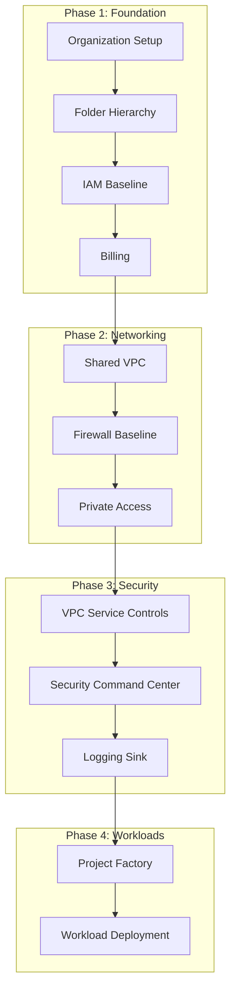
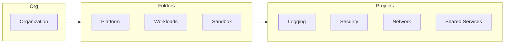
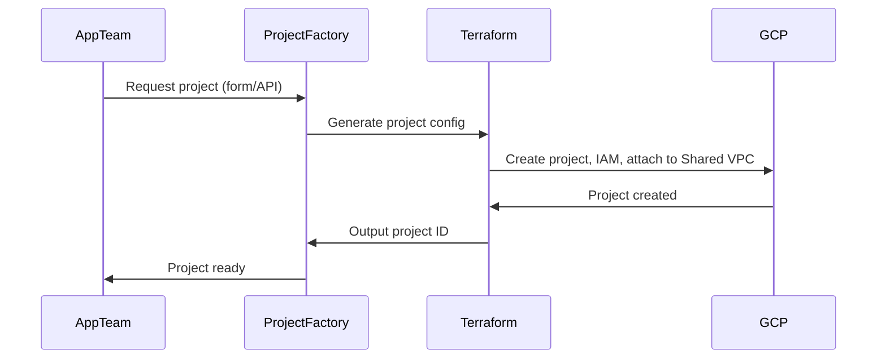

# GCP Landing Zone Best Practices

## Overview

A **landing zone** is a well-architected, secure, scalable foundation that enables workloads to land on GCP with governance, networking, and security built in from day one.

---

## Landing Zone Workflow

---

## Core Principles

| Principle | Description |
|-----------|-------------|
| **Separation of duties** | Central team owns foundation; app teams own workloads |
| **Least privilege** | IAM at folder/project level; avoid org-level broad roles |
| **Defense in depth** | Network + IAM + VPC SC + Binary Auth |
| **Automation first** | Terraform/Pulumi for all foundation; no manual drift |
| **Environment parity** | Dev/stage/prod share same patterns; different isolation |

---

## Landing Zone Components

---

## Design Scenarios

### Scenario A: Single Business Unit

- **Use case**: One team, limited blast radius
- **Structure**: Org → Environment folders (dev/stage/prod) → Projects
- **Network**: Single Shared VPC or per-project VPC

### Scenario B: Multi-BU, Central Platform

- **Use case**: Platform team provides shared services; BUs own apps
- **Structure**: Org → Platform folder + BU folders → Projects
- **Network**: Shared VPC host project; service projects attach

### Scenario C: Regulated / Multi-Tenant

- **Use case**: Strong isolation (compliance, tenants)
- **Structure**: Org → Tenant/Environment folders → Projects
- **Network**: Per-tenant VPCs; VPC SC per perimeter
- **Security**: VPC SC, Binary Auth, CMEK

---

## Workflow: New Project Onboarding

---

## Checklist: Landing Zone Readiness

- [ ] Organization created with appropriate org policy
- [ ] Folder hierarchy defined (platform vs workloads)
- [ ] Billing accounts linked; budget alerts set
- [ ] Central logging project with org-level sink
- [ ] Shared VPC (or design decision documented)
- [ ] IAM baseline: groups, roles, conditions
- [ ] VPC Service Controls perimeter (if required)
- [ ] Security Command Center enabled
- [ ] Project factory / automation in place

---

## Next Steps

- [02-folder-design.md](./02-folder-design.md) — Folder structure and choices
- [04-network-design.md](./04-network-design.md) — Network design
- [07-security-design-zerotrust.md](./07-security-design-zerotrust.md) — Security baseline
