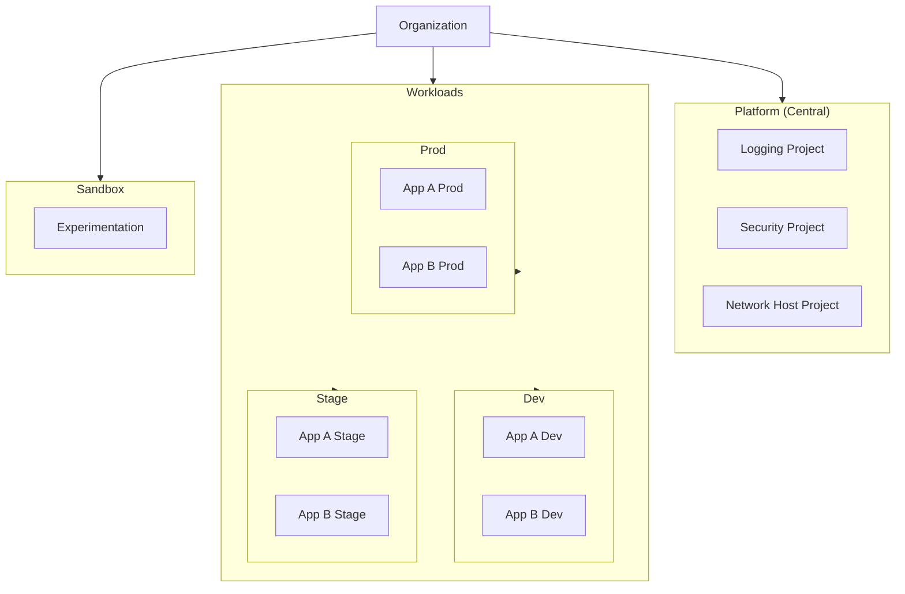
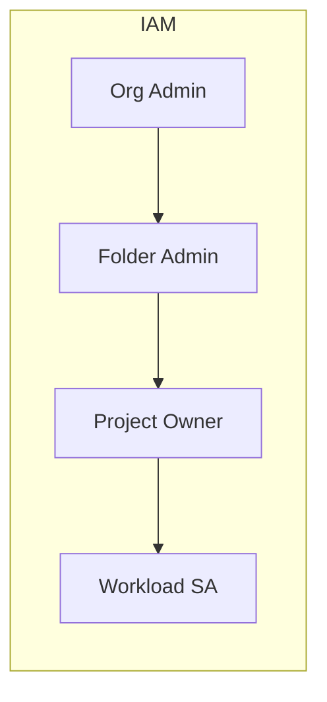
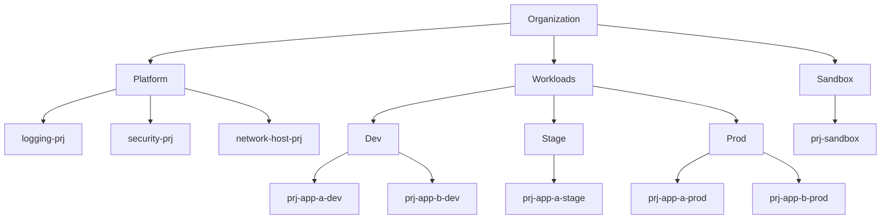

# GCP Folder Design

## Overview

Folders provide logical grouping, policy inheritance, and IAM boundaries. A clear folder design is essential for governance and cost allocation.

---

## Resource Hierarchy



---

## Folder Design Choices

### Choice 1: By Environment (Recommended for most)

```
Organization
├── Platform
│   ├── logging
│   ├── security
│   └── network
├── Dev
│   ├── project-app-a-dev
│   └── project-app-b-dev
├── Stage
│   ├── project-app-a-stage
│   └── project-app-b-stage
├── Prod
│   ├── project-app-a-prod
│   └── project-app-b-prod
└── Sandbox
```

**When to use**: Standard dev/stage/prod; environment-based policies.

---

### Choice 2: By Business Unit

```
Organization
├── Platform
├── BU-Finance
│   ├── Dev
│   ├── Stage
│   └── Prod
├── BU-Marketing
│   ├── Dev
│   └── Prod
└── BU-Engineering
    ├── Dev
    ├── Stage
    └── Prod
```

**When to use**: Cost allocation by BU; BU-specific policies.

---

### Choice 3: By Product / Team

```
Organization
├── Platform
├── Product-Core
│   ├── dev
│   ├── stage
│   └── prod
├── Product-Analytics
│   ├── dev
│   └── prod
└── Product-Data
    ├── dev
    └── prod
```

**When to use**: Product-centric ownership; team autonomy.

---

## Decision Matrix

| Factor | By Environment | By BU | By Product |
|--------|----------------|-------|------------|
| Cost allocation | By env | By BU | By product |
| Policy inheritance | Env-based | BU-based | Product-based |
| IAM complexity | Lower | Medium | Medium |
| VPC SC perimeters | Per env | Per BU | Per product |
| Best for | Most orgs | Large enterprises | Product-led orgs |

---

## Folder Naming Conventions

| Element | Convention | Example |
|---------|------------|---------|
| Folder | `lowercase-with-hyphens` | `platform`, `prod-apps` |
| Project | `{env}-{app}-{purpose}` | `prj-prod-app-a`, `prj-dev-data` |
| Max depth | 4–5 levels | Org → Folder → Subfolder → Project |

---

## IAM at Folder Level

- **Platform folder**: Central SAs, logging, security roles
- **Environment folders**: Environment-specific roles (e.g., prod approvers)
- **Project level**: Application-specific SAs, workload identity



---

## Diagram: Full Hierarchy Example



---

## Next Steps

- [04-network-design.md](./04-network-design.md) — Network design
- [09-centralized-logging-iam.md](./09-centralized-logging-iam.md) — Central logging project
