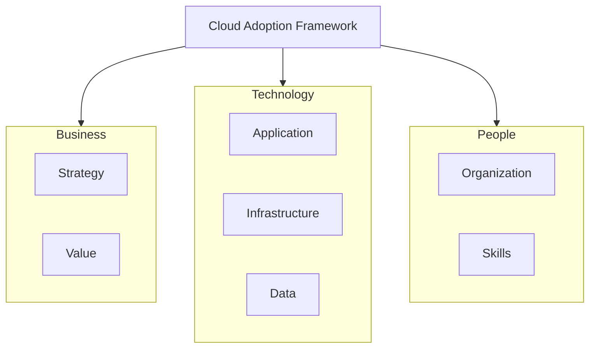

# GCP Cloud Adoption Framework (CAF)

## Overview

The Google Cloud Adoption Framework aligns strategy, readiness, and execution. Use it to guide landing zone design and migration.

---

## CAF Perspectives

---

## CAF Maturity Model

| Stage | Focus | Outcomes |
|-------|-------|----------|
| **Tactical** | Quick wins, POCs | Learn GCP; prove value |
| **Strategic** | Standardize, scale | Landing zone; governance |
| **Transformational** | Optimize, innovate | FinOps; platform engineering |

---

## CAF → Landing Zone Mapping

| CAF Area | Landing Zone Component |
|----------|------------------------|
| Organization | Folder hierarchy, IAM |
| Billing | Billing accounts, budgets |
| Networking | Shared VPC, firewall |
| Security | VPC SC, Security Center |
| Operations | Logging, monitoring |
| Development | CI/CD, Artifact Registry |

---

## Readiness Checklist

- [ ] Executive sponsorship
- [ ] Cloud strategy documented
- [ ] Skills assessment (cloud, security, ops)
- [ ] Compliance requirements mapped
- [ ] Landing zone design approved
- [ ] Migration waves defined
