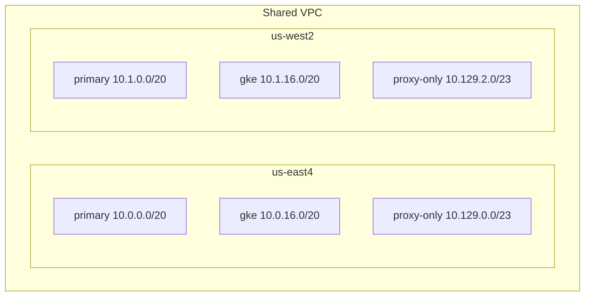
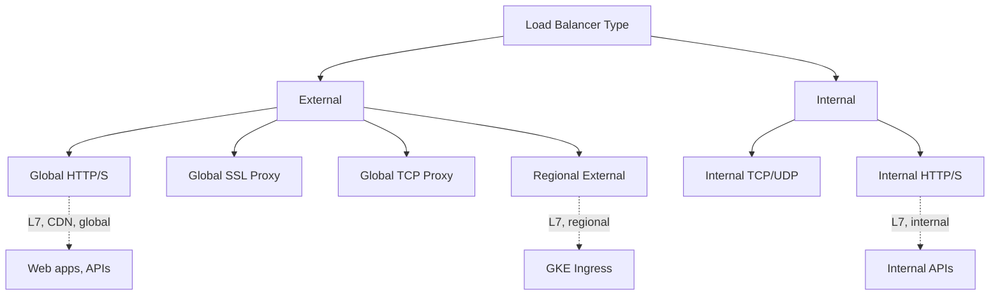
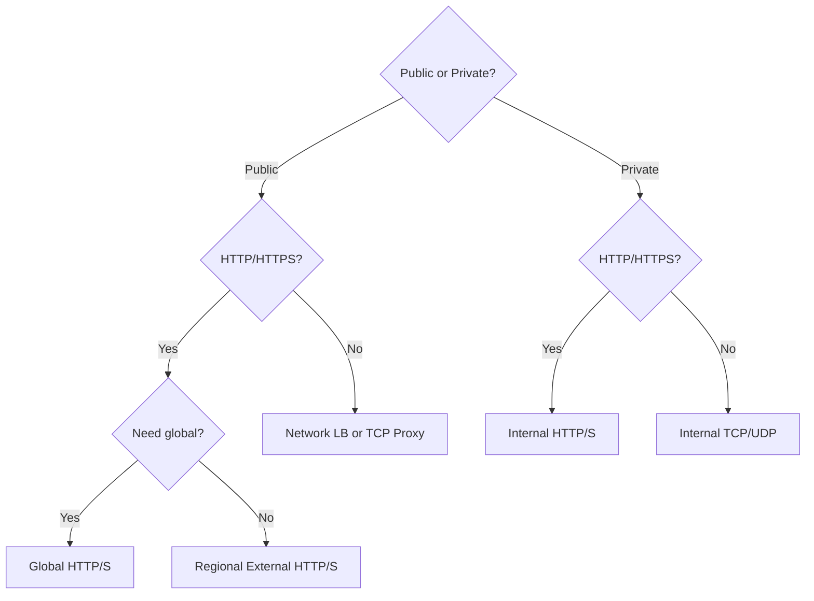
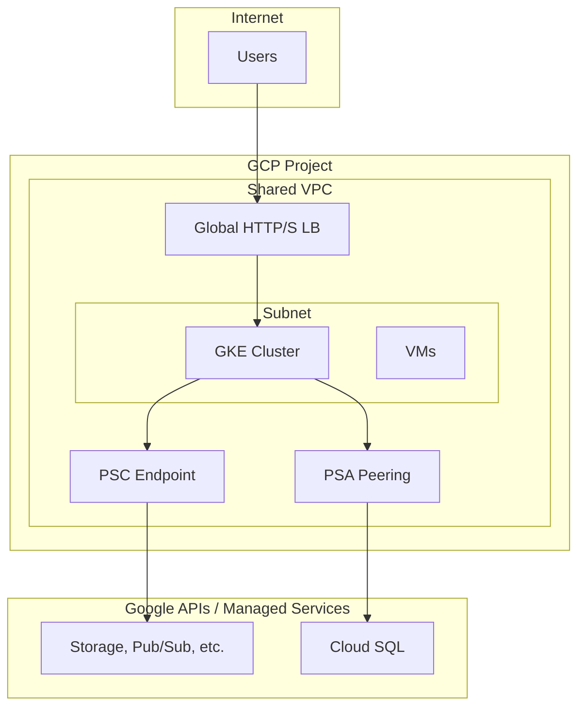

# GCP Network Design

## Overview

Network design covers VPC topology, subnet planning, load balancers, and connectivity. Clear choices reduce complexity and improve security.

---

## VPC Design Choices

### Choice 1: Single Shared VPC (Recommended)

- **One host project** with VPC; service projects attach subnets
- **Benefits**: Centralized firewall, simplified peering, single pane
- **Use when**: Most workloads; central platform team

### Choice 2: Per-Project VPC

- **Each project** has its own VPC; VPC peering for connectivity
- **Benefits**: Strong isolation, simpler project deletion
- **Use when**: Multi-tenant, regulated, or project autonomy required

### Choice 3: Per-Environment Shared VPC

- **One Shared VPC per environment** (dev, stage, prod)
- **Benefits**: Environment isolation; shared within env
- **Use when**: Strong dev/prod separation required

---

## Subnet Design

| Subnet Type | Purpose | CIDR Example |
|-------------|---------|--------------|
| Primary | VMs, GKE nodes, general workloads | 10.0.0.0/20 per region |
| GKE secondary | Pods (alias IP) | 10.0.16.0/20 |
| Proxy-only | Envoy-based LBs (regional) | 10.129.0.0/23 |
| PSA | Private Service Access (Cloud SQL, etc.) | Allocated via servicenetworking |
| PSC | Private Service Connect (Google APIs) | 10.255.255.5/32 |

---

## Load Balancer Choices

| LB Type | Use Case | Backend |
|---------|----------|---------|
| **Global HTTP(S)** | Public web, CDN | NEG, backend bucket |
| **Regional External** | GKE Ingress, regional apps | GKE NEG, instance group |
| **Internal HTTP(S)** | Internal APIs, microservices | GKE NEG, instance group |
| **Internal TCP/UDP** | Non-HTTP internal traffic | Instance group |
| **Network LB** | Passthrough, non-proxy | Instance group |

---

## Load Balancer Decision Tree

---

## Firewall Baseline

| Rule | Direction | Source | Dest | Port | Purpose |
|------|-----------|--------|------|------|---------|
| allow-internal | Ingress | 10.0.0.0/8 | 10.0.0.0/8 | All | Internal comms |
| allow-ssh-iap | Ingress | 35.235.240.0/20 | 10.0.0.0/8 | 22 | IAP for SSH |
| allow-health-check | Ingress | 130.211.0.0/22, 35.191.0.0/16 | 10.0.0.0/8 | All | LB health checks |
| allow-proxy-to-backend | Ingress | proxy-only CIDR | 10.0.0.0/8 | 80,443,8080 | Envoy LB → backends |
| deny-all | Ingress | 0.0.0.0/0 | 10.0.0.0/8 | All | Default deny (priority 65534) |

---

## Network Diagram: End-to-End

---

## Routing Mode

| Mode | Behavior | Use Case |
|------|----------|----------|
| **Regional** | Routes stay in region | Default; simpler |
| **Global** | Routes can span regions | Multi-region, global apps |

---

## Next Steps

- [05-connectivity-patterns.md](./05-connectivity-patterns.md) — Project, org, on-prem connectivity
- [06-private-access-endpoints.md](./06-private-access-endpoints.md) — PSC, PSA
- [12-gke-ingress-service-mesh.md](./12-gke-ingress-service-mesh.md) — GKE Ingress
