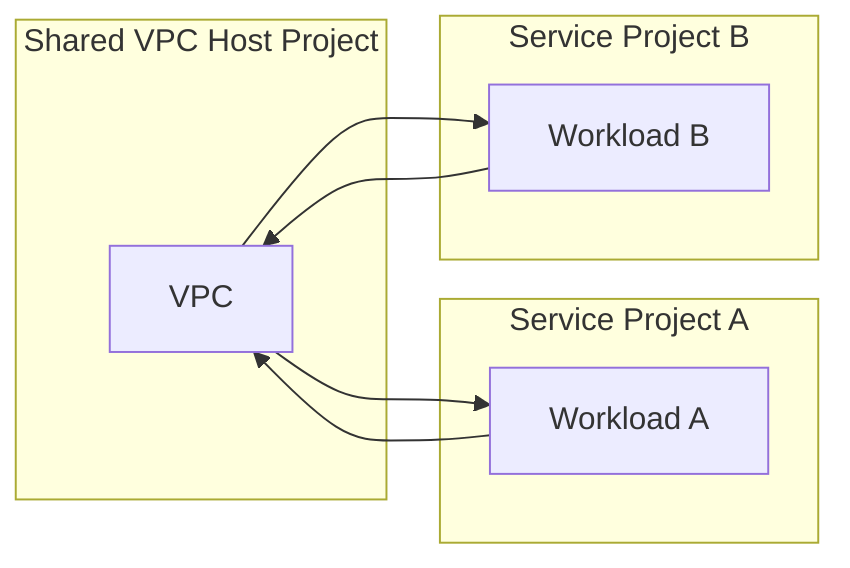
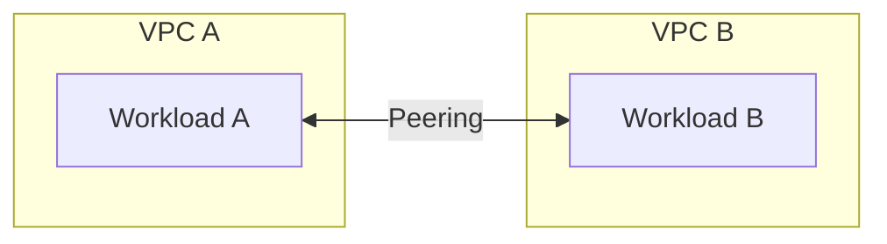
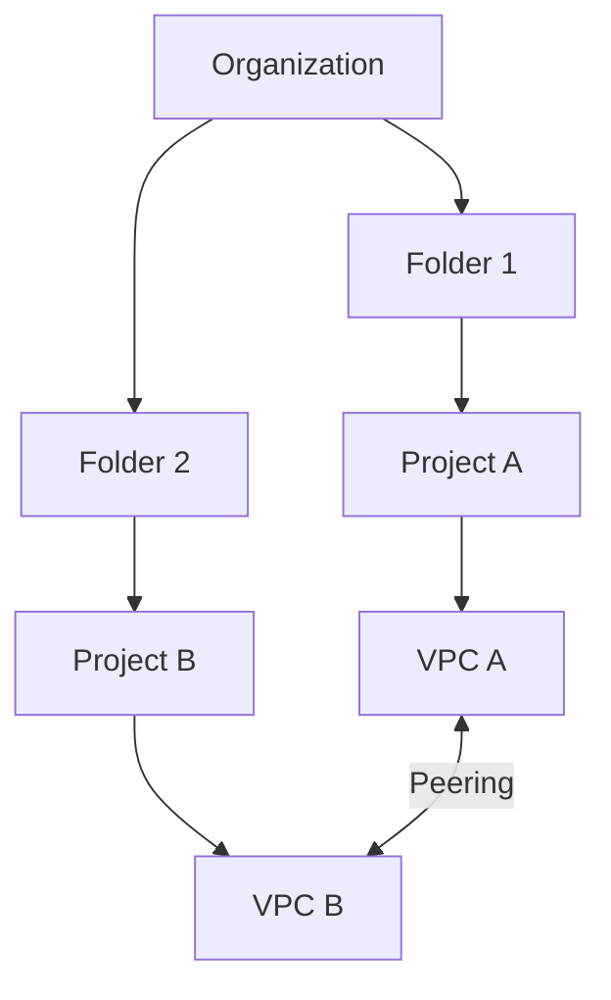
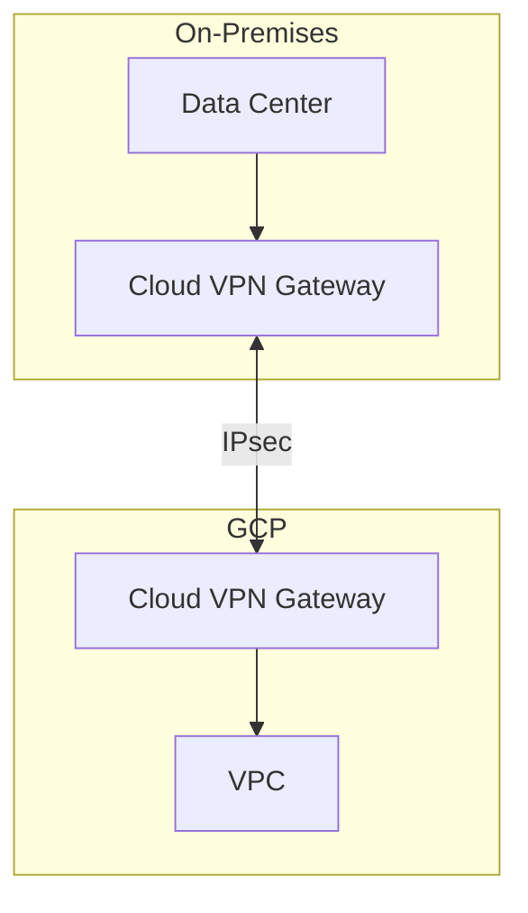
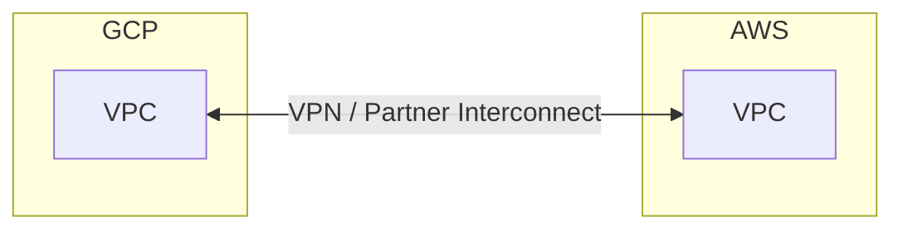
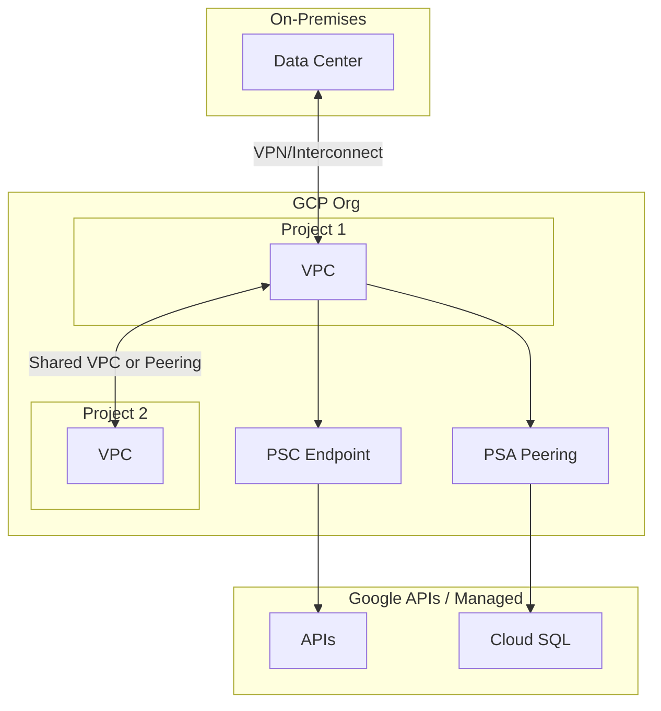

# GCP Connectivity Patterns

## Overview

Connectivity covers project-to-project, organization-level, on-premises, and cloud-to-cloud patterns. Choose based on isolation, cost, and compliance.

---

## Connectivity Matrix

| Source | Destination | Option | Use Case |
|--------|-------------|--------|----------|
| Project A | Project B (same org) | Shared VPC | Same VPC; no peering |
| Project A | Project B (same org) | VPC Peering | Different VPCs |
| Project A | Project B (different org) | VPC Peering (if allowed) | Cross-org |
| On-prem | GCP | Cloud VPN / Interconnect | Hybrid |
| GCP | AWS/Azure | Partner Interconnect / VPN | Multi-cloud |
| GCP | Google APIs | PSC / Public | Private vs public API access |

---

## Project-to-Project (Same Org)

**Mechanism**: Shared VPC — service projects attach subnets to host project's VPC. No peering; same L2 domain.

---

## VPC Peering (Different VPCs)

**Limitations**: No transitive peering; CIDR must not overlap. Use for cross-project when Shared VPC not used.

---

## Organization-Level Connectivity

**Consider**: Org policies can restrict peering. Use Shared VPC across folders when possible.

---

## On-Premises to GCP

| Option | Latency | Throughput | Cost | Use Case |
|--------|---------|------------|------|----------|
| **Cloud VPN** | Higher | Up to 3 Gbps/tunnel | Lower | Dev, small prod |
| **Dedicated Interconnect** | Lower | 10/100 Gbps | Higher | Production, high throughput |
| **Partner Interconnect** | Medium | 50 Mbps–10 Gbps | Medium | Colo, partner DC |

---

## Cloud-to-Cloud (GCP ↔ AWS/Azure)

**Options**:
- **VPN over internet**: Site-to-site VPN (AWS VPN / Azure VPN Gateway ↔ Cloud VPN)
- **Partner Interconnect**: Via Equinix, Megaport, etc.
- **Anthos / Multi-Cloud**: For container workloads

---

## Private Data Access

| Mechanism | Purpose |
|-----------|---------|
| **Private Google Access** | VMs without public IP reach Google APIs via private path |
| **Private Service Connect (PSC)** | Route to Google APIs (Storage, Pub/Sub) via private IP |
| **Private Service Access (PSA)** | Route to managed services (Cloud SQL, Memorystore) via private IP |

---

## Diagram: Full Connectivity Overview

---

## Next Steps

- [06-private-access-endpoints.md](./06-private-access-endpoints.md) — PSC, PSA details
- [09-centralized-logging-iam.md](./09-centralized-logging-iam.md) — Cross-project access
