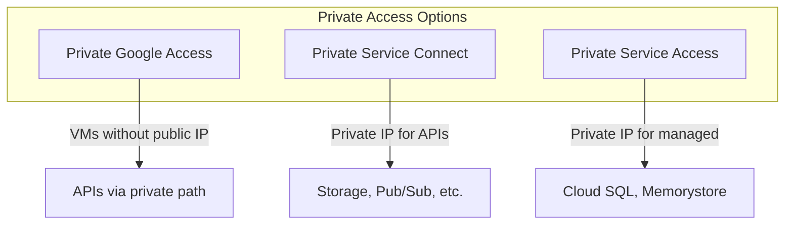
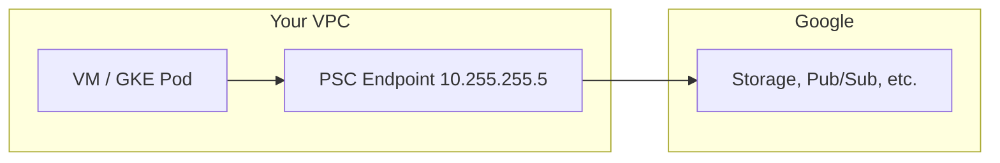
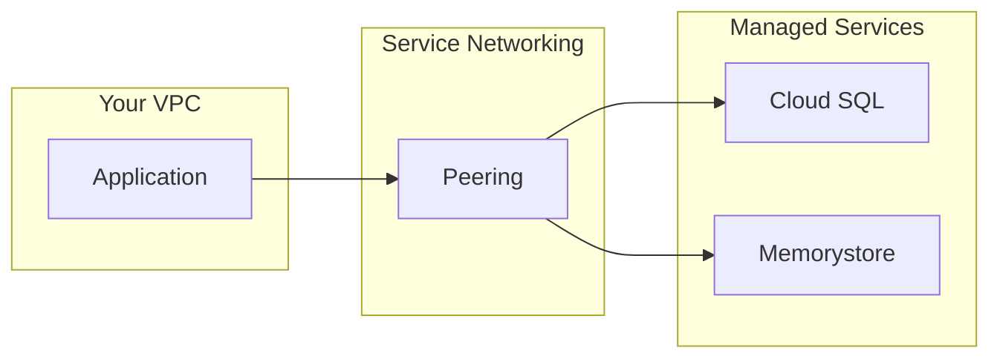

# Private Access & Service Endpoints

## Overview

Private access keeps traffic off the public internet for Google APIs and managed services. Use PSC for APIs, PSA for services like Cloud SQL.

---

## Private Access Options

---

## Private Google Access (PGA)

- **What**: Enables VMs without external IP to reach `*.googleapis.com` via Google's network
- **Where**: Subnet-level: `private_ip_google_access = true`
- **Traffic path**: VM → Google network (no public internet)

---

## Private Service Connect (PSC)

- **What**: Private endpoint for Google APIs (all-apis or specific APIs)
- **IP**: Allocated from your VPC (e.g., 10.255.255.5)
- **Traffic**: All API calls from VPC route through this IP

**Terraform**: `google_compute_global_address` (purpose=PRIVATE_SERVICE_CONNECT) + `google_compute_global_forwarding_rule` (target=all-apis)

---

## Private Service Access (PSA)

- **What**: Peering to `servicenetworking.googleapis.com` for managed services
- **Used by**: Cloud SQL, Memorystore, Filestore (private IP)
- **CIDR**: Allocate /16 from your VPC; Google uses it for service IPs

**Terraform**: `google_compute_global_address` (purpose=VPC_PEERING) + `google_service_networking_connection`

---

## Decision: PSC vs PSA

| Aspect | PSC | PSA |
|--------|-----|-----|
| **Target** | Google APIs (REST, gRPC) | Managed services (Cloud SQL, etc.) |
| **IP** | Single IP per VPC | /16 range for services |
| **Setup** | Forwarding rule to all-apis | Service networking peering |
| **Use when** | Storage, Pub/Sub, BigQuery from VPC | Cloud SQL private IP, Redis |

---

## VPC Connector (Serverless)

- **What**: Serverless VPC Access connector for Cloud Functions, Cloud Run
- **Purpose**: Functions/Run egress through VPC (PSC, PSA, on-prem)
- **CIDR**: /28 range; must not overlap subnets

---

## Next Steps

- [04-network-design.md](./04-network-design.md) — VPC design
- [05-connectivity-patterns.md](./05-connectivity-patterns.md) — Connectivity
