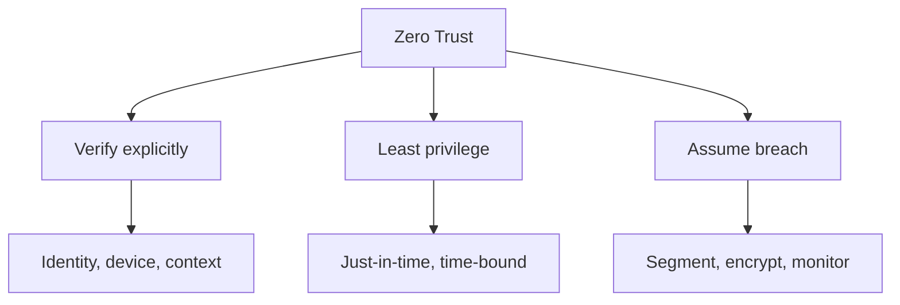
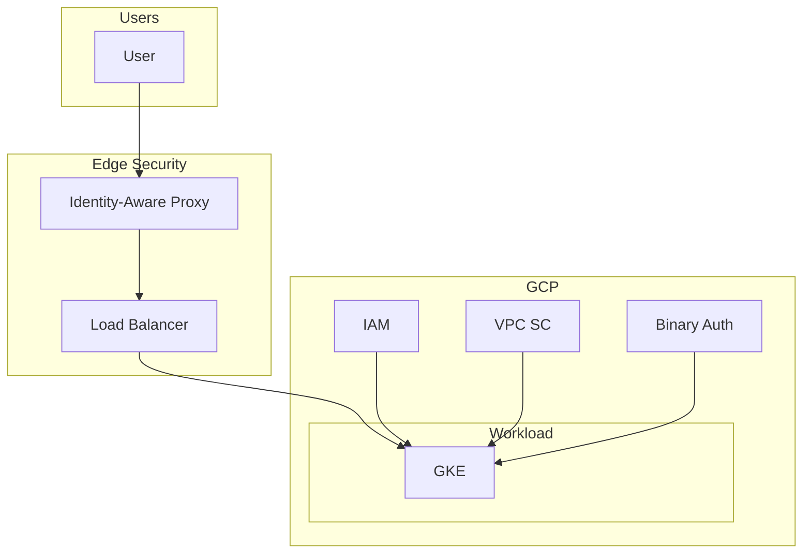

# Security Design & Zero Trust Principles

## Overview

Zero trust assumes no implicit trust based on network location. Every request is verified. GCP supports this with IAM, VPC SC, Binary Authorization, and context-aware access.

---

## Zero Trust Pillars

---

## Zero Trust Mapping to GCP

| Principle | GCP Implementation |
|-----------|--------------------|
| **Verify explicitly** | IAM, Workload Identity, Context-Aware Access |
| **Least privilege** | Custom roles, resource-level IAM |
| **Assume breach** | VPC SC, encryption, Security Command Center |
| **Segment** | VPC, firewall, VPC Service Controls |
| **Encrypt** | CMEK, default encryption, Secret Manager |
| **Monitor** | Cloud Logging, Security Center, Event Threat Detection |

---

## Security Design Scenarios

### Scenario 1: Standard Web App

- **Network**: Private GKE; no public node IPs
- **Ingress**: Global LB → GKE Ingress (internal or external)
- **Auth**: IAP or OAuth at LB; Workload Identity for GKE
- **Secrets**: Secret Manager; no env vars
- **Binary Auth**: Enforce signed images

### Scenario 2: Regulated / PII

- **VPC SC**: Perimeter around prod; restrict data exfiltration
- **CMEK**: Customer-managed keys for sensitive data
- **DLP**: Data Loss Prevention for sensitive fields
- **Audit**: Org-level audit logs; retention per compliance

### Scenario 3: Multi-Tenant SaaS

- **Isolation**: Per-tenant projects or namespaces + network policies
- **IAM**: Tenant-scoped SAs; no cross-tenant access
- **VPC SC**: Per-tenant perimeter or shared with attributes

---

## Zero Trust Architecture Diagram

---

## Security Checklist

- [ ] Workload Identity for GKE (no node SA keys)
- [ ] Binary Authorization for production
- [ ] VPC SC perimeter for sensitive projects
- [ ] CMEK for regulated data
- [ ] Centralized logging with retention
- [ ] Security Command Center enabled
- [ ] IAP for admin access (no direct SSH)

---

## Next Steps

- [08-vpc-service-controls.md](./08-vpc-service-controls.md) — VPC SC, Security Center
- [11-gke-security-zerotrust.md](./11-gke-security-zerotrust.md) — GKE zero trust
