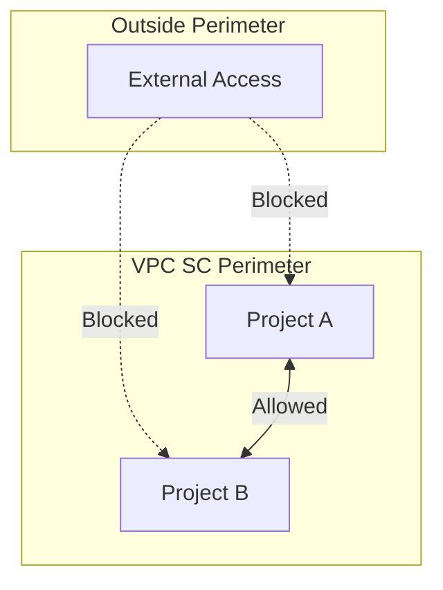
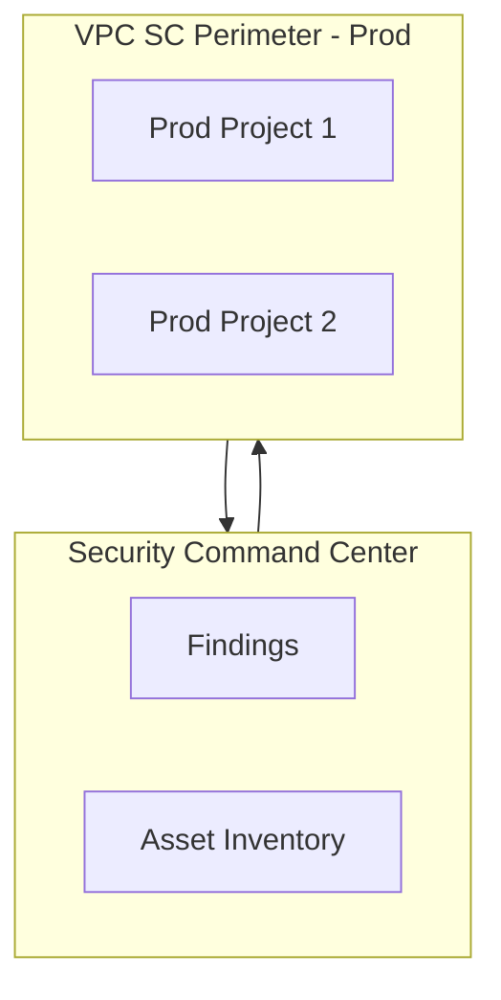

# VPC Service Controls & Security Command Center

## Overview

VPC Service Controls (VPC SC) add a security perimeter around projects to prevent data exfiltration. Security Command Center (SCC) provides threat detection and compliance.

---

## VPC Service Controls

**Purpose**: Restrict access to resources inside the perimeter from outside (e.g., copy to another project, export to BigQuery in different project).

---

## Access Levels

- **Access level**: Defines who can access the perimeter (e.g., IP allowlist, device trust)
- **Service perimeter**: Which projects + which APIs are protected
- **Ingress/egress rules**: Control traffic in/out of perimeter

---

## VPC SC + Private Google Access

- PSC/PSA keep API traffic private
- VPC SC adds policy layer: even with private access, cross-perimeter access can be denied

---

## Security Command Center (SCC)

| Component | Purpose |
|-----------|---------|
| **Asset inventory** | Discover resources, drift |
| **Findings** | Vulnerabilities, misconfigurations |
| **Event Threat Detection** | Anomaly detection |
| **Security Health Analytics** | Compliance checks |

**Recommendation**: Enable SCC at org level; central security project for findings.

---

## Diagram: VPC SC + SCC

