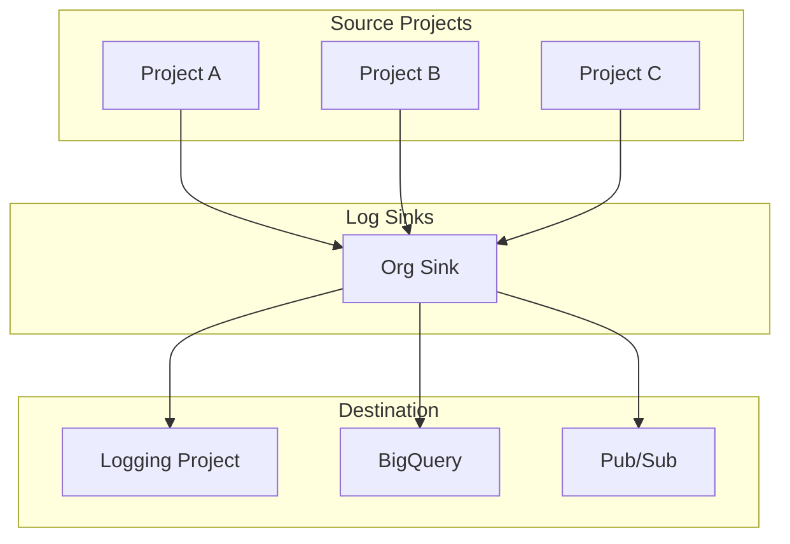
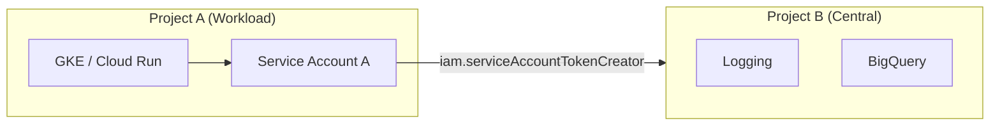
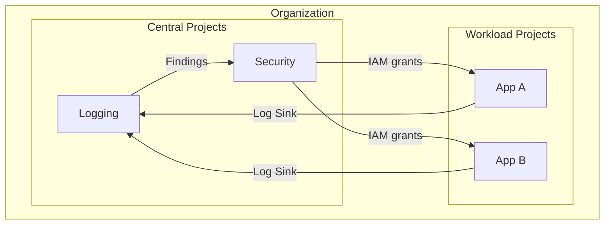

# Centralized Logging & Cross-Project Service Accounts

## Overview

Centralized logging collects logs from all projects into one place. Cross-project service accounts enable workloads in project A to act in project B (e.g., write logs, access resources).

---

## Centralized Logging Architecture



---

## How Centralized Logging Works

1. **Log Sink** (org or folder level): Routes logs matching a filter to a destination
2. **Destination**: Logging project, BigQuery dataset, or Pub/Sub topic
3. **IAM**: Sink's writer identity needs `logging.sinks.create` and destination write permissions

### Sink Configuration Example

```hcl
resource "google_logging_folder_sink" "central" {
  name        = "central-logs-sink"
  folder      = "folders/123456"
  destination = "logging.googleapis.com/projects/prj-logging/logs/central"
  filter      = "NOT (protoPayload.serviceName = \"storage.googleapis.com\" AND protoPayload.methodName = \"storage.objects.get\")"
}
```

---

## Cross-Project Service Account Access



**Pattern**: Service Account in Project A is granted roles in Project B (e.g., `roles/logging.logWriter`, `roles/bigquery.dataEditor`).

---

## Central Project → Other Projects

| Use Case | Central Project | Other Projects |
|----------|-----------------|----------------|
| **Logging** | Logging project receives org sink | Source projects (no extra config) |
| **Security** | Security project runs SCC, audit | All projects send logs |
| **CI/CD** | CICD project has build SAs | Workload projects grant `actAs` |

---

## Service Account from Central to Workload Projects

**Scenario**: Central platform team's SA needs to deploy or manage resources in workload projects.

1. Create SA in central project (or org-level)
2. Grant SA roles in workload projects (e.g., `roles/container.developer`)
3. Use Workload Identity Federation for CI/CD (no keys)

---

## Diagram: Full Logging + IAM Flow



---

## Best Practices

- **Logging project**: Dedicated project; no workloads
- **Retention**: Set per log type; compliance-driven
- **Exclusions**: Exclude high-volume, low-value logs (e.g., health checks)
- **Access**: Central security team has read; workload teams have limited access to their logs
