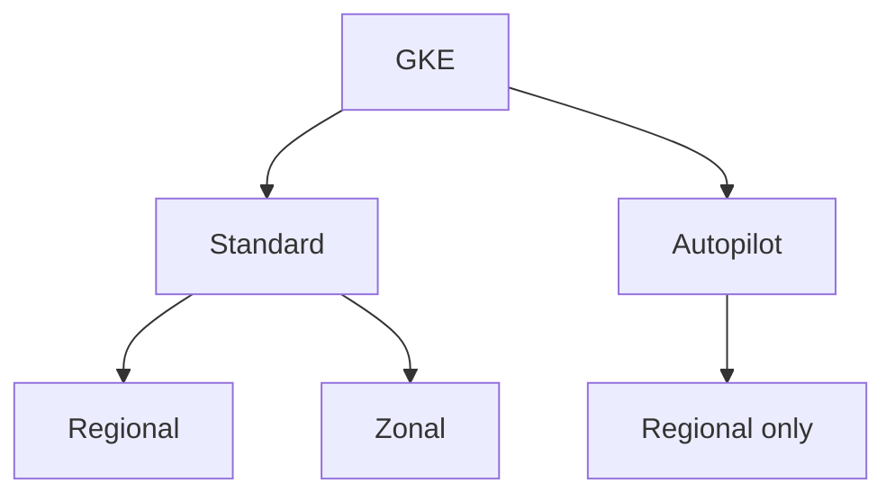
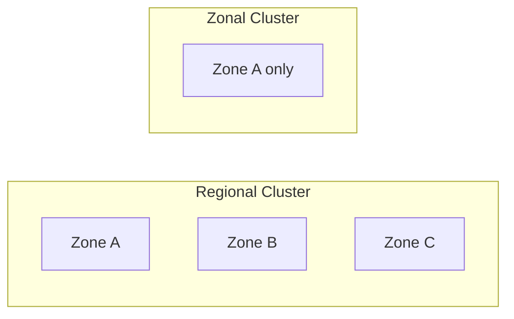
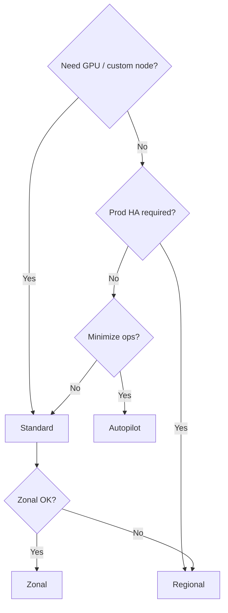

# GKE Versions & Offerings

## Overview

GKE offers multiple modes (Standard, Autopilot) and topologies (regional, zonal). Choose based on control, cost, and operational model.

---

## GKE Offerings

---

## Standard vs Autopilot

| Aspect | Standard | Autopilot |
|--------|----------|-----------|
| **Node management** | You manage nodes | Google manages nodes |
| **Pricing** | Per node (vCPU, memory) | Per pod (request-based) |
| **Control** | Full control (node config, OS) | Limited (pod-focused) |
| **Best for** | Custom needs, GPU, stateful | Stateless, dev, rapid scale |
| **Regional** | Yes | Yes (only) |
| **Zonal** | Yes | No |

---

## Regional vs Zonal Clusters

| Aspect | Regional | Zonal |
|--------|----------|-------|
| **Availability** | Multi-zone; survives zone failure | Single zone; zone failure = outage |
| **Cost** | Higher (replicas across zones) | Lower |
| **Control plane** | Regional (multi-zone) | Single zone |
| **Use when** | Production, HA | Dev, cost-sensitive, low-criticality |

---

## Why Choose What

### Choose **Autopilot** when:
- Stateless workloads
- Want minimal ops (no node tuning)
- Pay-per-pod is acceptable
- Don't need custom node configs (e.g., specific OS, kernel)

### Choose **Standard** when:
- GPU, local SSD, custom machine types
- Need node-level tuning
- Stateful workloads with specific storage
- Compliance requires node control

### Choose **Regional** when:
- Production; HA required
- Can afford multi-zone cost

### Choose **Zonal** when:
- Dev/test
- Cost over availability
- Workload is zone-tolerant

---

## GKE Versions

- **Release channel**: Rapid, Regular, Stable
- **Rapid**: Latest; more frequent upgrades
- **Regular**: Balanced
- **Static**: No auto-upgrade; you control

| Channel | Upgrade frequency | Use case |
|---------|-------------------|----------|
| Rapid | ~2 weeks | Early adopters |
| Regular | ~4 weeks | Most prod |
| Stable | ~4 months | Conservative prod |
| Static | Manual | Compliance, freeze |

---

## Decision Tree

