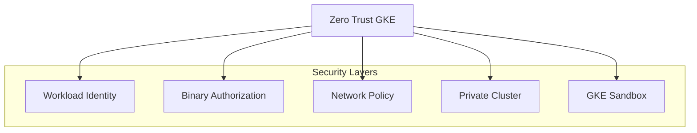
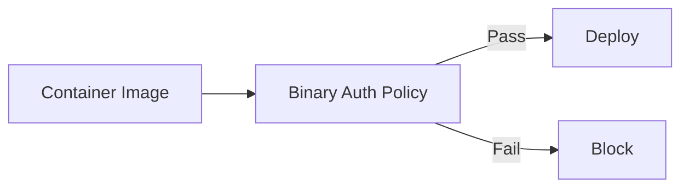
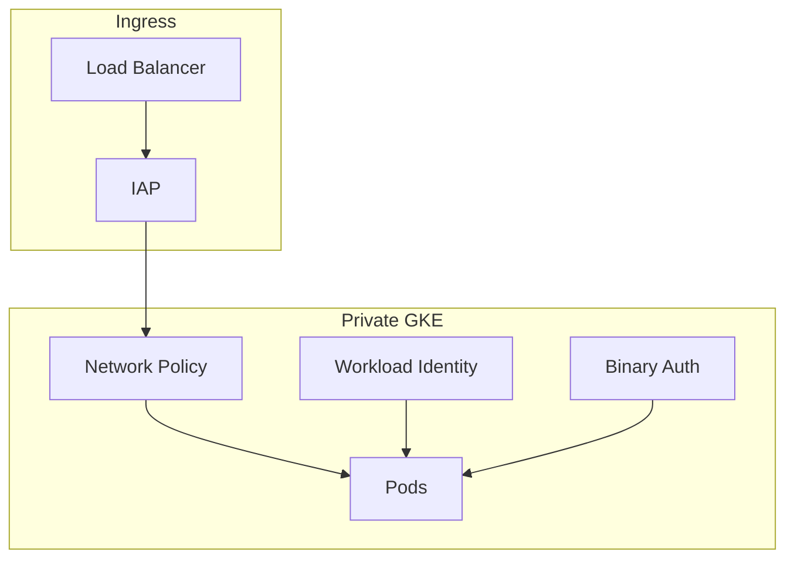

# GKE Security & Zero Trust

## Overview

GKE security aligns with zero trust: Workload Identity, Binary Authorization, network policies, and private clusters. No implicit trust from network or node identity.

---

## GKE Security Layers



---

## Workload Identity

- **What**: Pods use GCP SA without node SA or keys
- **How**: Kubernetes SA linked to GCP SA via annotation
- **Benefit**: No keys; least privilege per workload

```yaml
# Pod uses GCP SA via Workload Identity
spec:
  serviceAccountName: k8s-sa-name
  # k8s-sa-name bound to gcp-sa@project.iam.gserviceaccount.com
```

---

## Binary Authorization

- **What**: Only allow container images that pass policy (e.g., signed by trusted signer)
- **Policy**: Attestation-based; require signature from build pipeline
- **Effect**: Prevents unsigned or untrusted images from running



---

## Zero Trust with GKE

| Control | Implementation |
|---------|-----------------|
| **Identity** | Workload Identity; no node SA for app |
| **Image trust** | Binary Authorization; signed images only |
| **Network** | Network policy; deny by default |
| **Node exposure** | Private cluster; no public node IPs |
| **Pod isolation** | GKE Sandbox (gVisor) for untrusted workloads |

---

## Private Cluster

- **Nodes**: No external IPs; only private
- **Control plane**: Private endpoint option (Google API via private IP)
- **Access**: IAP tunnel or bastion; no direct SSH to nodes

---

## Network Policy

- **Default**: Allow all (unless Calico/Cilium with default deny)
- **Best practice**: Default deny; explicit allow for known flows
- **Use with**: Service mesh for mTLS + policy

---

## Diagram: Zero Trust GKE


