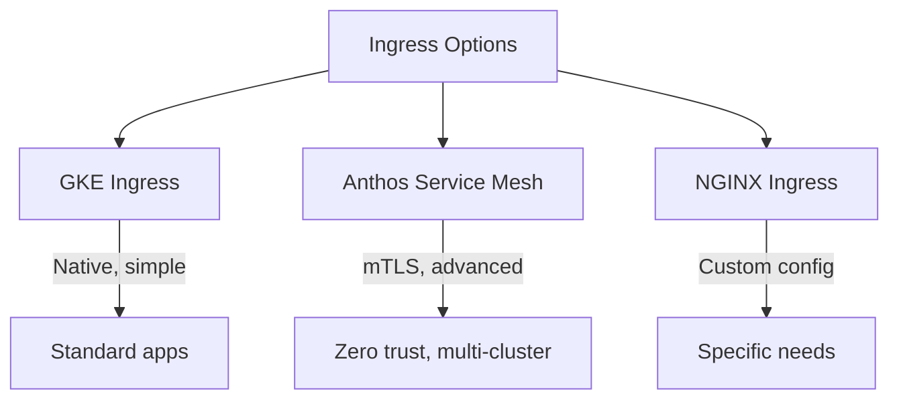
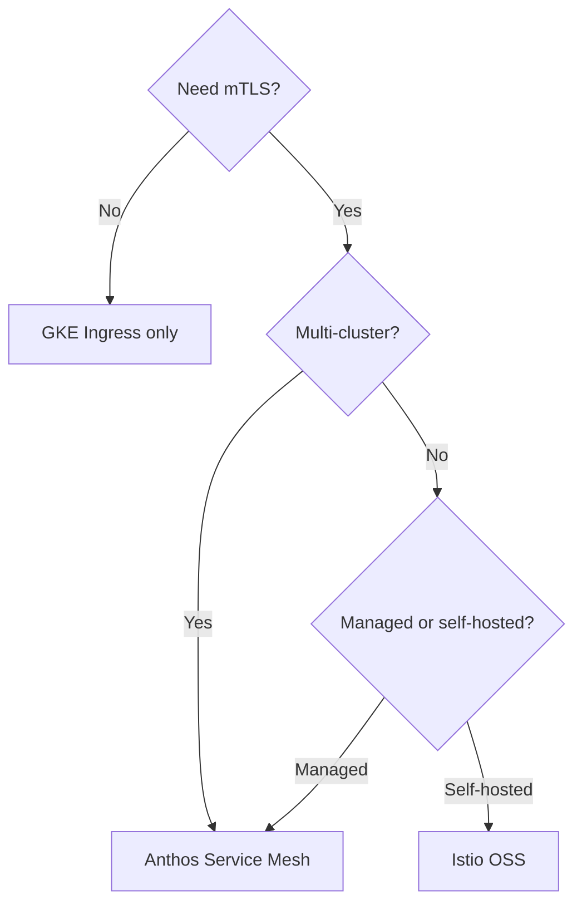
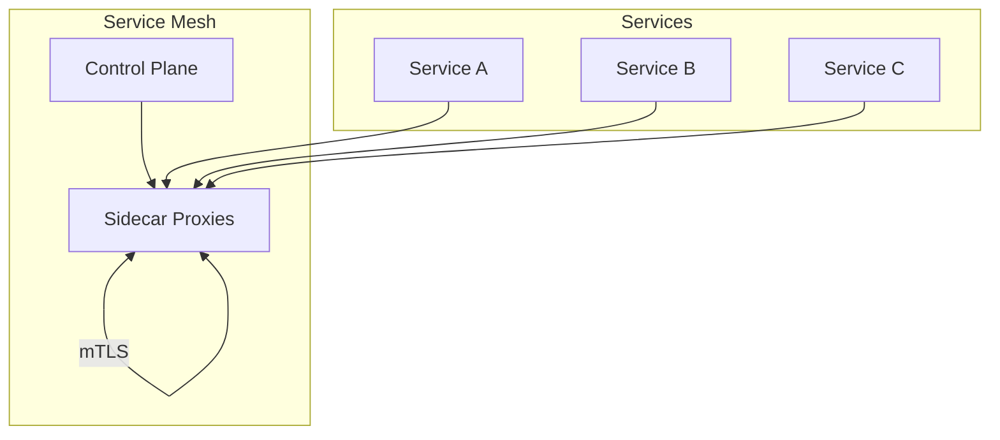
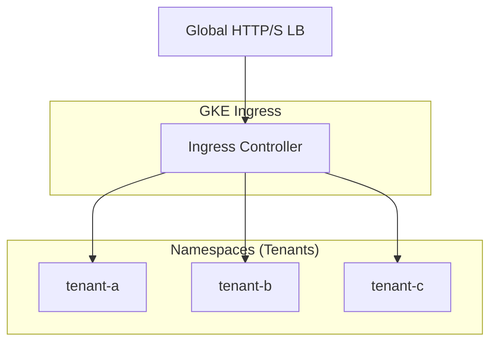

# GKE Ingress & Service Mesh

## Overview

Multitenant ingress and service mesh design choices for GKE: GKE Ingress, Anthos Service Mesh (ASM), or open-source Istio. Clear trade-offs for each.

---

## Ingress Options

---

## GKE Ingress (Native)

- **Backend**: Envoy-based; uses proxy-only subnet
- **Features**: L7 routing, TLS, backend auth
- **Multitenant**: One Ingress per tenant or shared with host-based routing

### Multitenant Ingress Patterns

| Pattern | Description | Use Case |
|---------|-------------|----------|
| **Host-based** | One Ingress; different hosts (tenant1.example.com) | Shared LB; tenant isolation by host |
| **Path-based** | One Ingress; paths (/tenant1/, /tenant2/) | Shared LB; path routing |
| **Per-tenant Ingress** | Separate Ingress per tenant | Strong isolation; separate certs |

---

## Service Mesh Choices

---

## Anthos Service Mesh (ASM) vs Istio OSS

| Aspect | ASM | Istio OSS |
|--------|-----|-----------|
| **Management** | Google-managed control plane | Self-managed |
| **Multi-cluster** | Native | Complex |
| **Integration** | GKE, Cloud Run | Any K8s |
| **Cost** | Per vCPU | Free (ops cost) |
| **Support** | Google support | Community |

---

## Service Mesh Design

**Benefits**: mTLS, traffic management, observability, policy (authz).

---

## Multitenant Ingress Diagram

**Host-based**: `tenant-a.example.com` → `tenant-a` namespace; `tenant-b.example.com` → `tenant-b`.

---

## Clear Choices Summary

| Need | Choice |
|------|--------|
| Simple L7 routing | GKE Ingress |
| mTLS, zero trust | ASM or Istio |
| Multi-cluster mesh | ASM |
| Cost-sensitive, single cluster | Istio OSS |
| Multitenant | Host-based Ingress + Network Policy per namespace |
