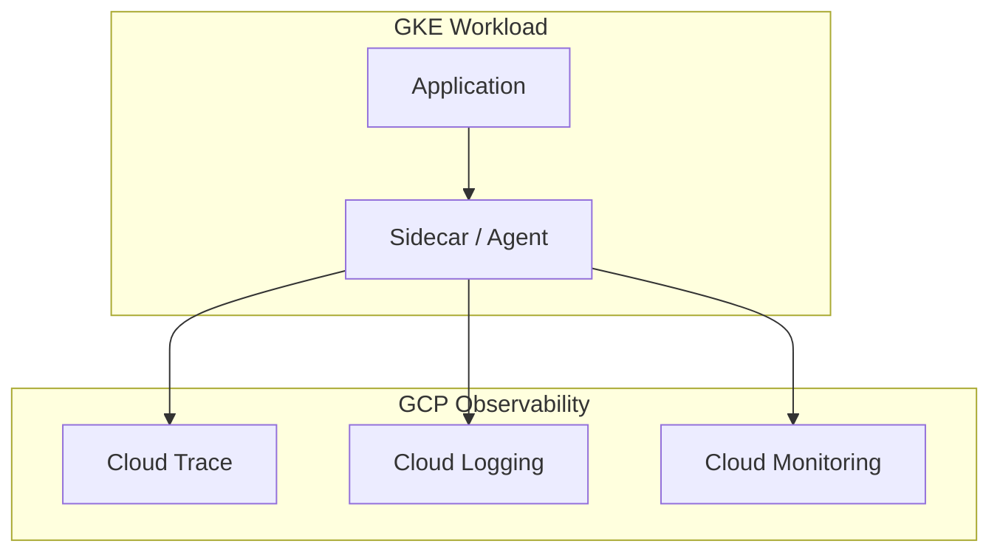
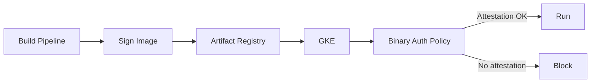

# GKE Tracing & Observability

## Overview

Tracing, logging, and monitoring for GKE: Cloud Trace, Cloud Logging, Cloud Monitoring. Binary Authorization ties into the build pipeline for image signing.

---

## Observability Stack

---

## Cloud Trace

- **What**: Distributed tracing for requests across services
- **Integration**: OpenTelemetry, Cloud Trace API, or auto-instrumentation
- **Use**: Latency analysis, dependency graph, bottleneck identification

---

## Logging

- **GKE logs**: Control plane, node, container, audit
- **Application logs**: stdout/stderr → Cloud Logging
- **Centralized**: Org sink to logging project (see [09-centralized-logging-iam.md](./09-centralized-logging-iam.md))

---

## Monitoring

- **Metrics**: GKE dashboard, custom metrics, Prometheus (via GMP)
- **Alerts**: Uptime checks, alerting policies
- **SLOs**: Service-level objectives for availability, latency

---

## Binary Authorization Flow

**Steps**:
1. Build signs image with KMS or PGP
2. Attestation stored in Container Analysis
3. Binary Auth policy requires attestation
4. Only signed images can run
