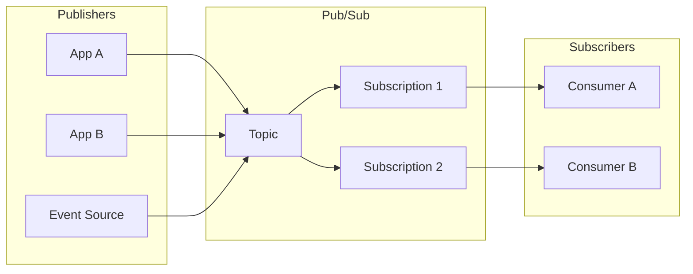
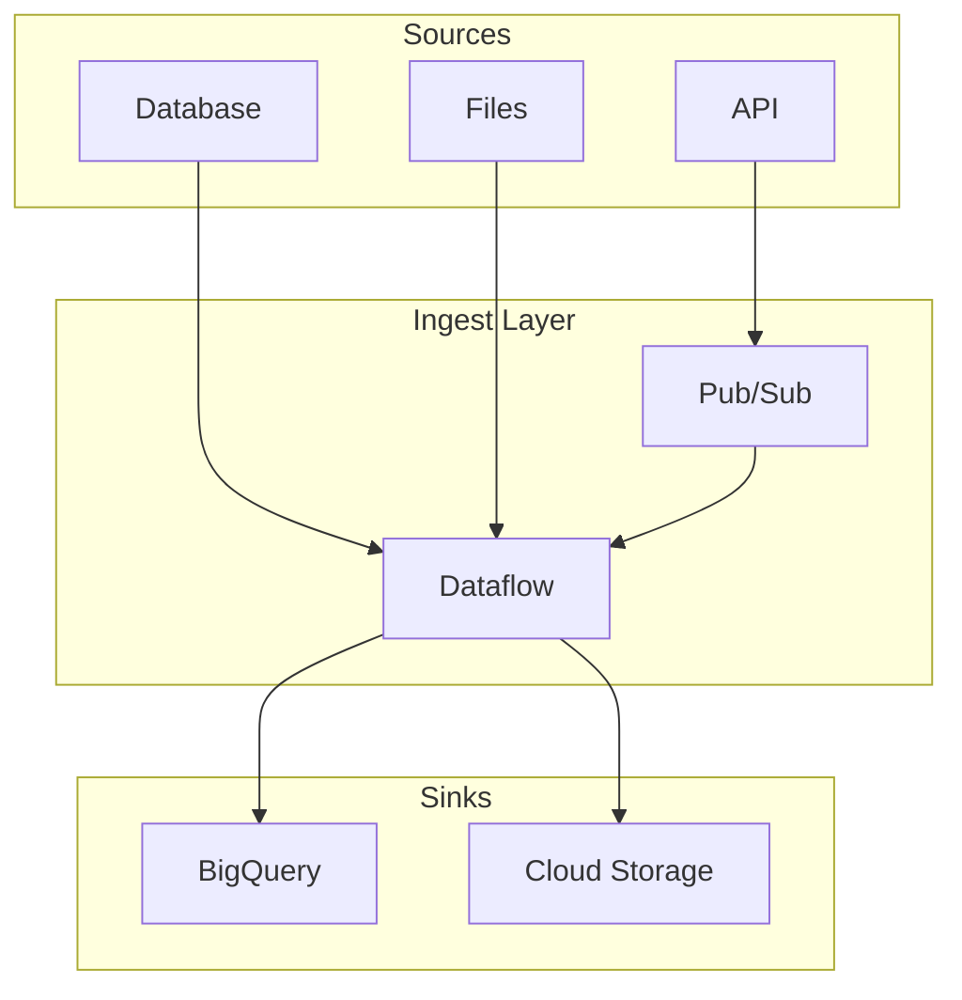

# Pub/Sub & Data Ingest Practices

## Overview

Pub/Sub is the primary messaging and event ingestion service on GCP. Best practices cover schema, ordering, dead-letter, and integration with data pipelines.

---

## Pub/Sub Architecture

---

## Data Ingest Patterns

| Pattern | Use Case | Components |
|---------|----------|------------|
| **Event-driven** | Real-time events | Pub/Sub → Cloud Functions / Run |
| **Streaming** | High-throughput logs | Pub/Sub → Dataflow → BigQuery |
| **Batch** | Scheduled loads | Cloud Scheduler → Cloud Functions → BigQuery |
| **Change Data Capture** | DB replication | Datastream → Pub/Sub / BigQuery |

---

## Pub/Sub Best Practices

| Practice | Description |
|----------|-------------|
| **Schema** | Use schema registry for message validation |
| **Ordering** | Enable ordering key for FIFO per key |
| **Dead-letter** | DLQ subscription for failed messages |
| **Retention** | Set retention (up to 31 days) for replay |
| **Ack deadline** | Tune for processing time; use mod_ack for long tasks |
| **Push vs Pull** | Push for serverless; Pull for control |

---

## Private Access for Pub/Sub

- **PSC**: Use Private Service Connect for `pubsub.googleapis.com` so publishers/subscribers in VPC use private IP
- **VPC Connector**: Cloud Functions/Run need VPC connector for private Pub/Sub if not using PSC

---

## Data Ingest Diagram

---

## Ordering & Exactly-Once

- **Ordering**: Set `message_ordering=true` on topic; use ordering key
- **Exactly-once**: Enable exactly-once delivery on subscription (idempotent processing)
