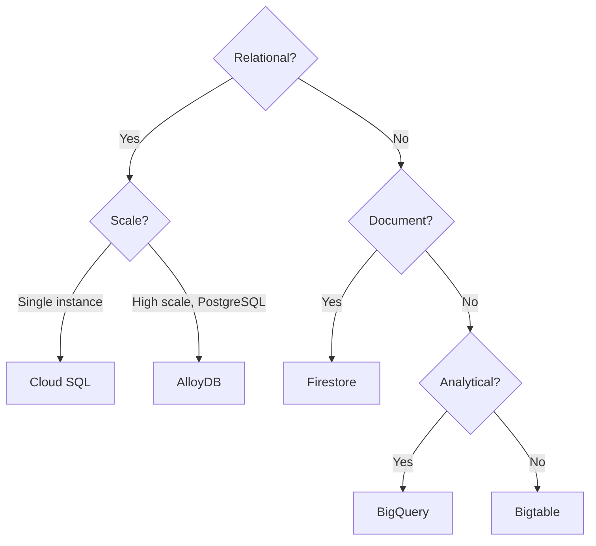

# GCP Database Design

## Overview

Database choices on GCP: relational (Cloud SQL, AlloyDB), NoSQL (Firestore, Bigtable), and analytical (BigQuery). Clear selection criteria for each scenario.

---

## Database Decision Tree

---

## Database Choices

| Database | Use Case | Characteristics |
|----------|----------|-----------------|
| **Cloud SQL** | MySQL, PostgreSQL; standard OLTP | Managed; single or HA; private IP via PSA |
| **AlloyDB** | PostgreSQL; high-performance OLTP | Compatible with PostgreSQL; analytics workloads |
| **Spanner** | Globally distributed; strong consistency | Horizontal scale; multi-region |
| **Firestore** | Document; mobile, web | NoSQL; real-time sync |
| **Bigtable** | Wide-column; high throughput | Low latency; time-series, IoT |
| **BigQuery** | Analytical; data warehouse | Serverless; SQL over petabyte |

---

## Design Scenarios

### Scenario 1: Standard Web App

- **Primary DB**: Cloud SQL (PostgreSQL) with private IP
- **Cache**: Memorystore (Redis) for sessions
- **Analytics**: BigQuery for reporting (export from Cloud SQL or CDC)

### Scenario 2: Global, Low-Latency

- **Primary DB**: Spanner (multi-region)
- **Use when**: Need strong consistency across regions

### Scenario 3: Event / Time-Series

- **Primary**: Bigtable or Firestore
- **Streaming**: Pub/Sub → Dataflow → BigQuery

### Scenario 4: Data Warehouse

- **Primary**: BigQuery
- **Ingest**: Dataflow, Datastream, or batch load from GCS

---

## Security

- **Private IP**: Use PSA for Cloud SQL, AlloyDB; no public IP
- **IAM**: Fine-grained; avoid broad `roles/cloudsql.client`
- **Encryption**: CMEK for regulated data
