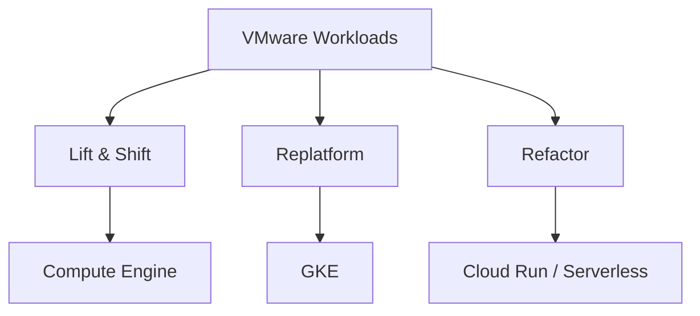
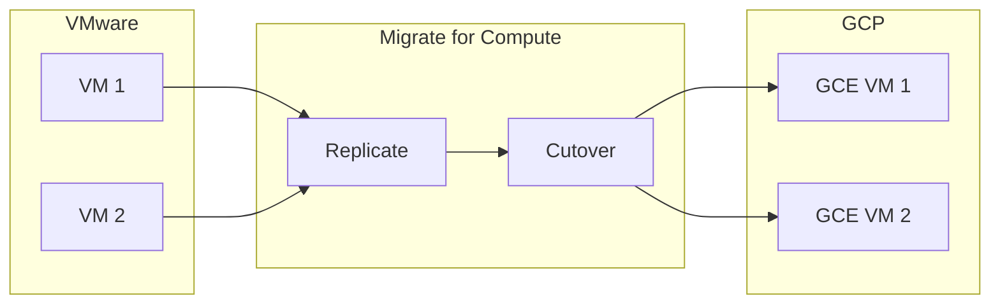

# VMware to GCP Migration

## Overview

Migration from VMware to GCP: lift-and-shift (Compute Engine) or modernize (GKE, serverless). Use Migrate for Compute Engine (formerly Velostrata) for VM migration.

---

## Migration Approaches

---

## Migrate for Compute Engine

- **What**: Agent-based or agentless migration of VMs to GCE
- **Process**: Replicate → Cutover
- **Use**: VMware, AWS, Azure → GCP

---

## Migration Phases

| Phase | Activities |
|-------|------------|
| **Assess** | Inventory VMs; identify dependencies; right-size |
| **Plan** | Network design; project structure; migration waves |
| **Pilot** | Migrate non-critical VMs; validate |
| **Migrate** | Wave-based migration; cutover |
| **Optimize** | Rightsize; consider GKE/serverless |

---

## Network Considerations

- **VPC**: Design Shared VPC or per-project; align with landing zone
- **Connectivity**: VPN or Interconnect for migration traffic
- **DNS**: Plan DNS cutover; consider Cloud DNS

---

## Diagram: VMware Migration Flow

