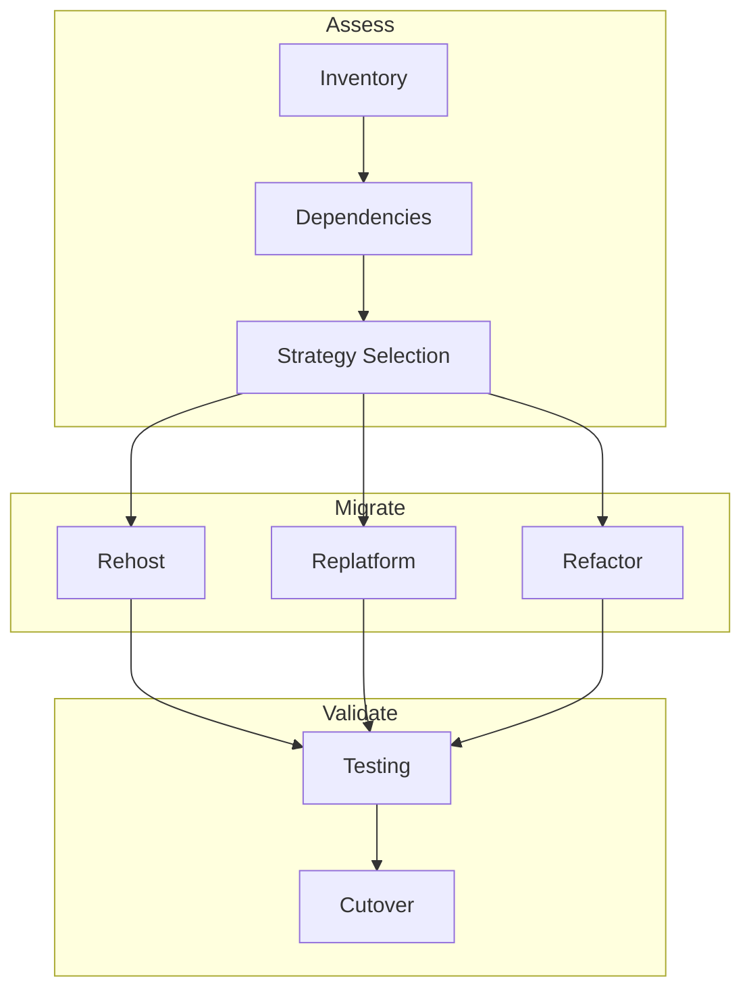

# Application Migration Strategies

## Overview

Application migration covers refactoring, replatforming, and rehosting. Choose based on business goals, timeline, and risk tolerance.

---

## Migration Strategies (6 Rs)

| Strategy | Description | Effort | Use Case |
|----------|-------------|--------|----------|
| **Rehost** | Lift & shift; minimal change | Low | Quick migration; legacy apps |
| **Replatform** | Move to managed (e.g., GKE, Cloud Run) | Medium | Modernize platform |
| **Repurchase** | Replace with SaaS | Low–Medium | CRM, ERP |
| **Refactor** | Rebuild for cloud-native | High | Strategic apps |
| **Retire** | Decommission | Low | Unused apps |
| **Retain** | Keep on-prem | — | Not ready |

---

## Application Migration Flow

---

## Replatform: VM → GKE

- **Containerize**: Dockerize app; push to Artifact Registry
- **Orchestrate**: Deploy to GKE; use Workload Identity
- **Data**: Migrate DB to Cloud SQL; use PSA

---

## Replatform: VM → Cloud Run

- **Containerize**: Same as GKE
- **Deploy**: Cloud Run; serverless; scale to zero
- **Use when**: Stateless; request-driven

---

## Refactor: Monolith → Microservices

- **Decompose**: Identify bounded contexts; extract services
- **API**: API Gateway or GKE Ingress
- **Data**: Per-service DB or shared with careful boundaries
