# Architecture Scenarios: GCP & AWS

Real-world architecture patterns for real-time services, ETL, infrastructure, and AI workloads on both GCP and AWS.

---

## 1. Real-Time Services

### 1.1 Real-Time Event Streaming (Pub/Sub vs Kinesis)

**GCP Architecture**

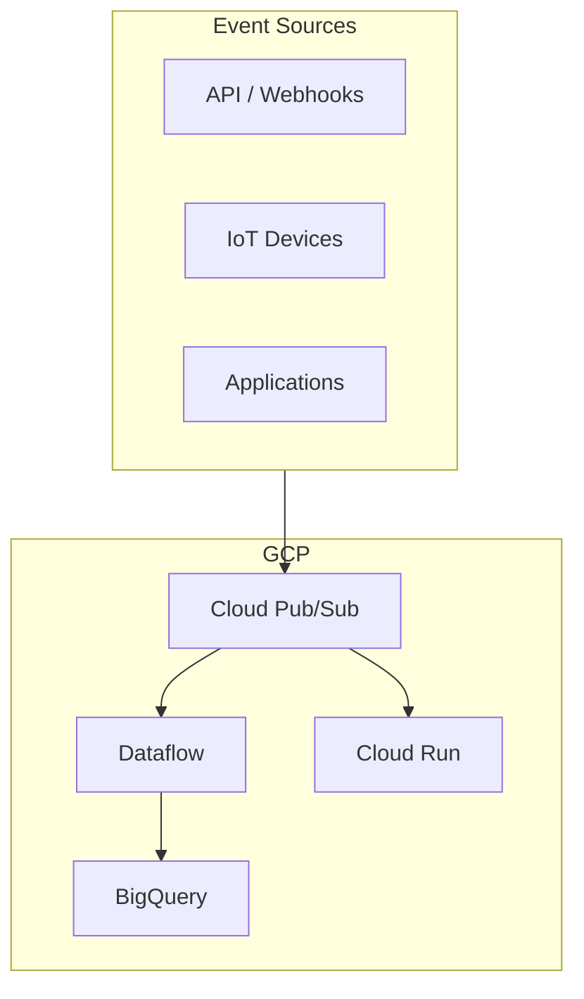

| Component | GCP | AWS |
|-----------|-----|-----|
| **Messaging** | Cloud Pub/Sub | Amazon Kinesis Data Streams / SQS |
| **Stream processing** | Dataflow (Apache Beam) | Kinesis Data Analytics / Flink |
| **Serverless consumer** | Cloud Functions / Cloud Run | Lambda |
| **Real-time DB** | Firestore / Bigtable | DynamoDB |

---

**AWS Architecture**

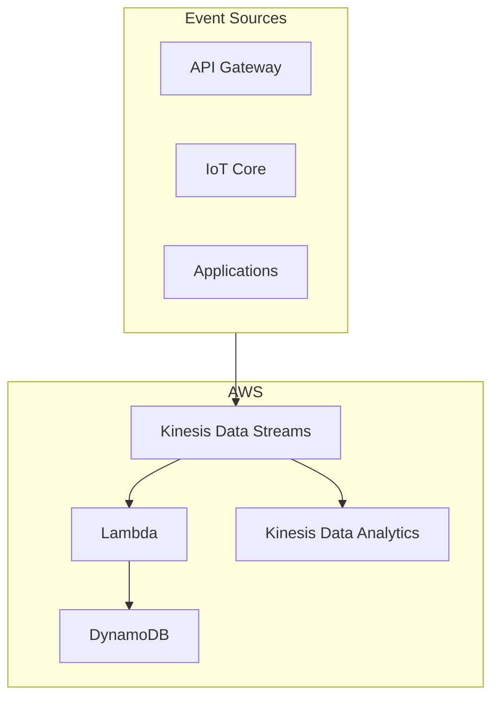

---

### 1.2 Real-Time Analytics Dashboard

**GCP**

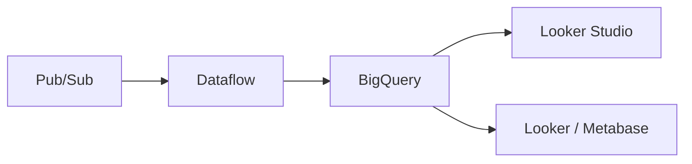

**AWS**

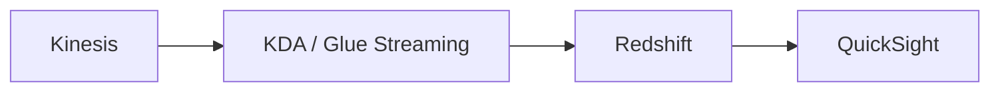

---

### 1.3 Real-Time Fraud Detection

**GCP**

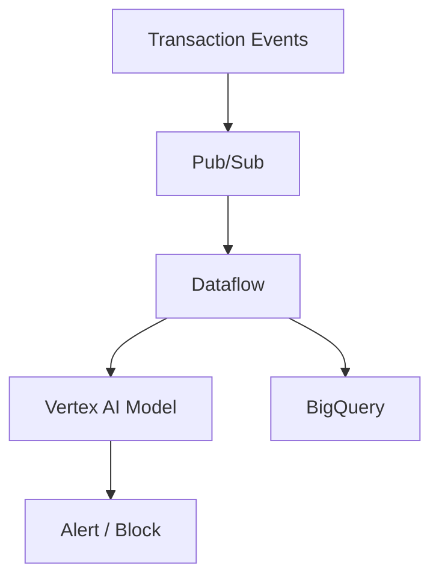

**AWS**

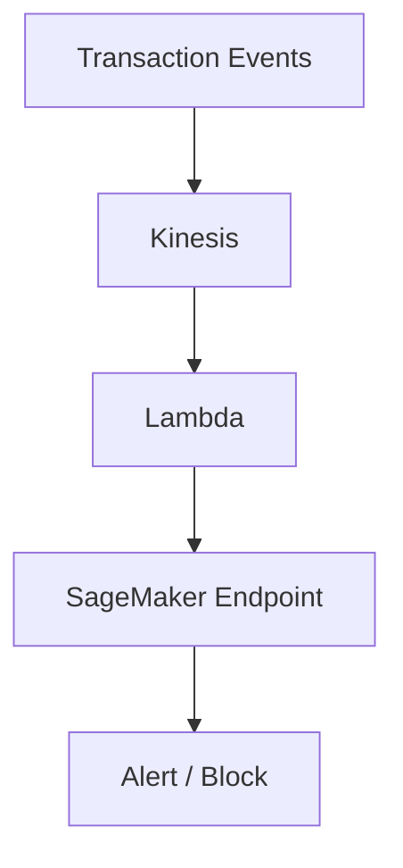

---

## 2. ETL Architectures

### 2.1 Batch ETL (Scheduled)

**GCP**

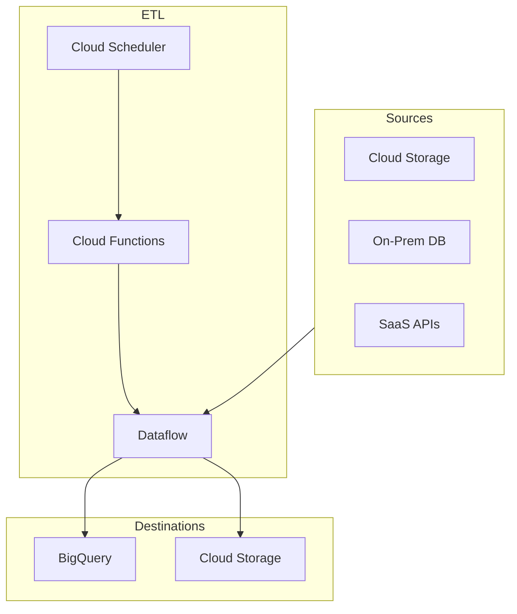

**AWS**

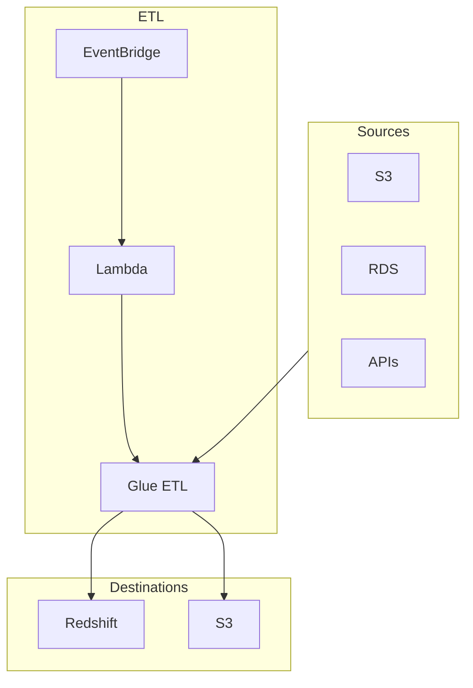

---

### 2.2 CDC (Change Data Capture) ETL

**GCP**

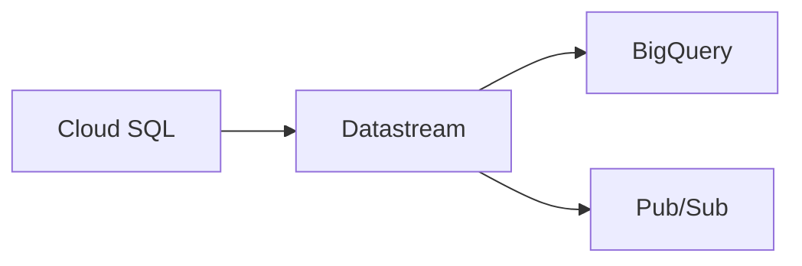

**AWS**

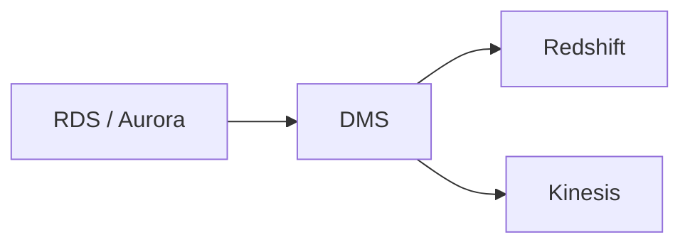

---

### 2.3 Streaming ETL

**GCP**

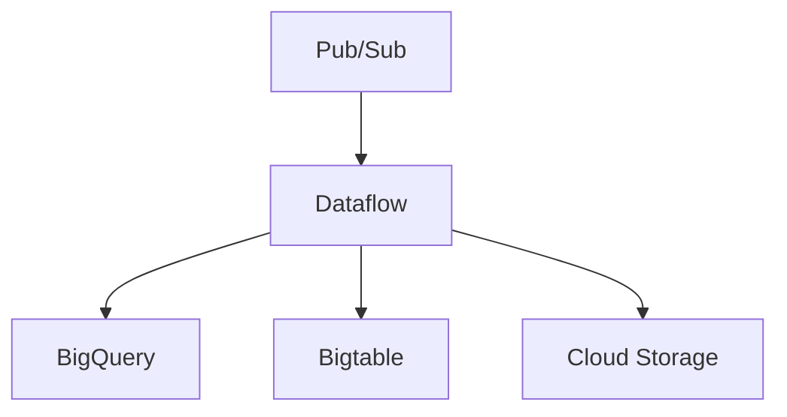

**AWS**

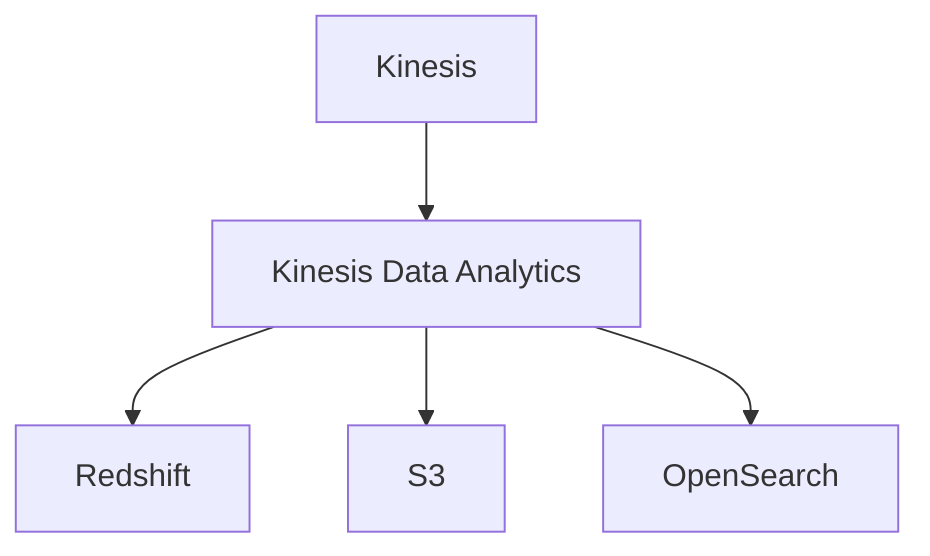

---

## 3. Infrastructure Scenarios

### 3.1 Multi-Region Active-Active

**GCP**

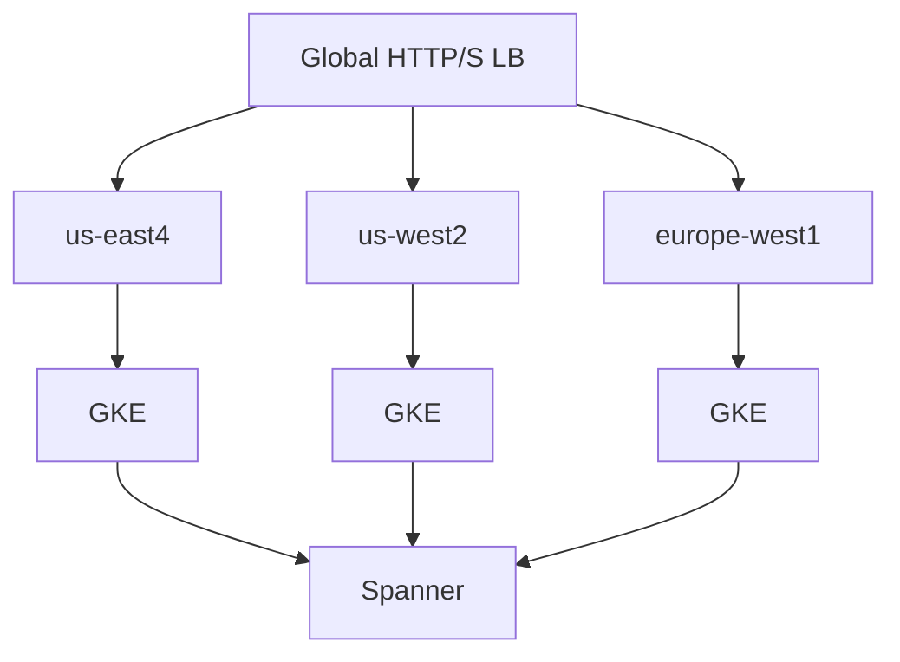

**AWS**

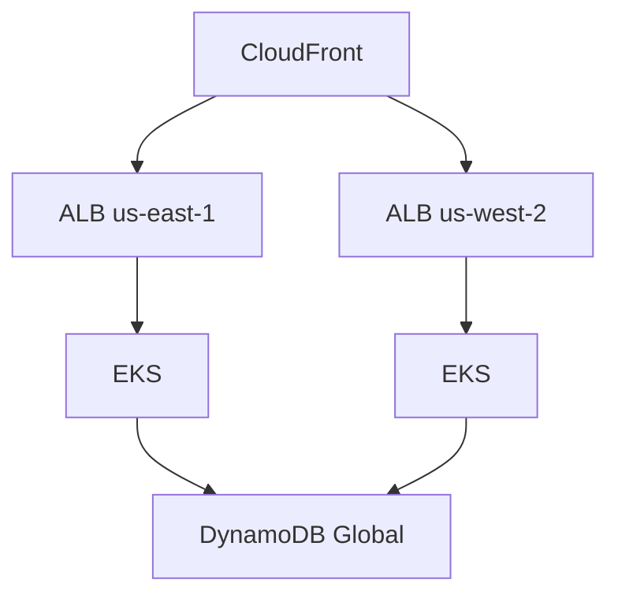

---

### 3.2 Hybrid (On-Prem + Cloud)

**GCP**

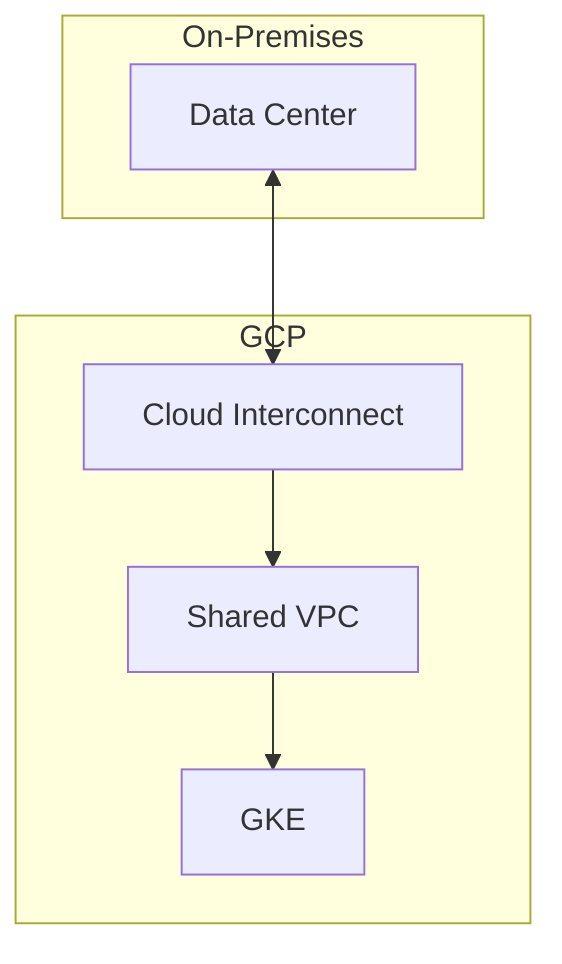

**AWS**

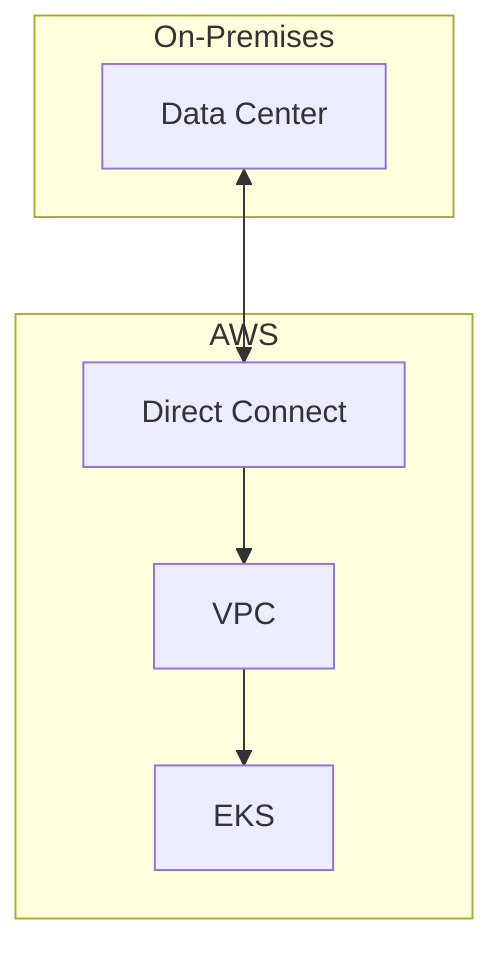

---

### 3.3 Multi-Cloud (GCP + AWS)

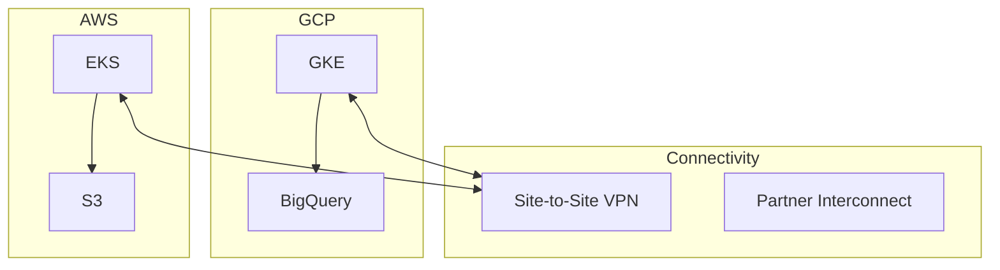

---

## 4. AI / ML Architectures

### 4.1 Batch Inference Pipeline

**GCP**

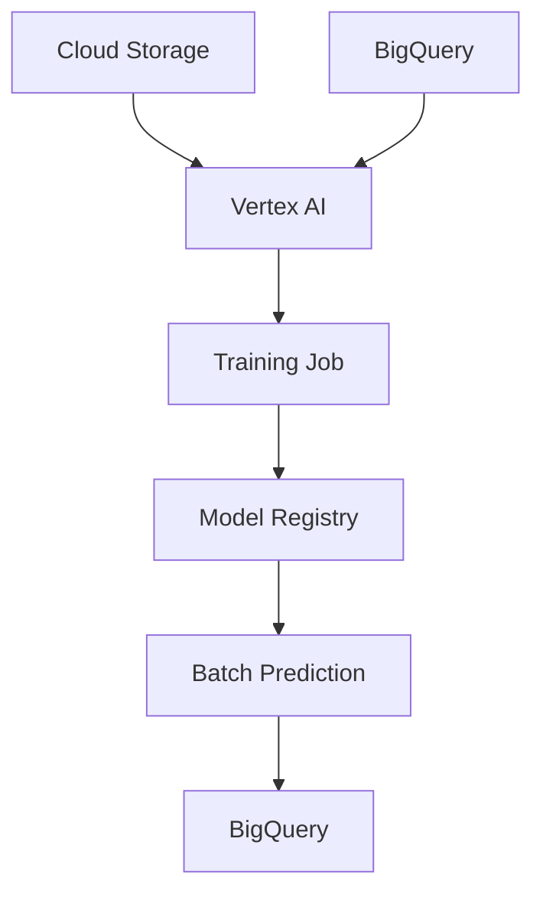

**AWS**

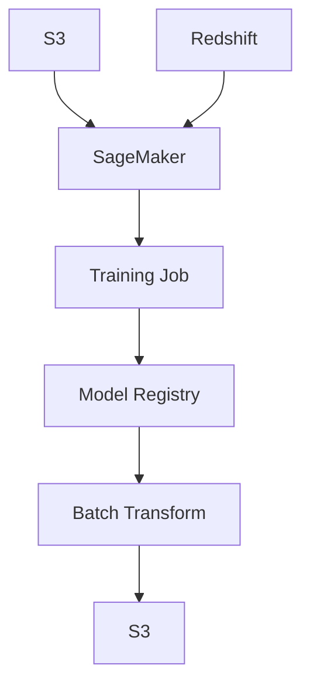

---

### 4.2 Real-Time Inference

**GCP**

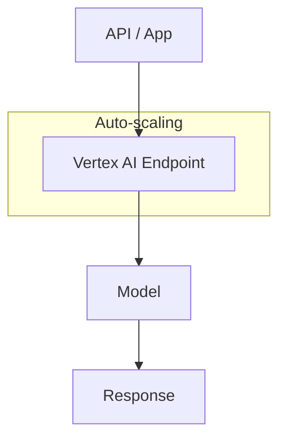

**AWS**

```mermaid
flowchart TB
    API[API Gateway] --> SageMaker[SageMaker Endpoint]
    SageMaker --> Model[Model]
    Model --> Response[Response]
    
    subgraph Scaling["Auto-scaling"]
        SageMaker
    end
```

---

### 4.3 Generative AI (LLM) Architecture

**GCP**

```mermaid
flowchart TB
    subgraph GCP["GCP"]
        App[Application]
        Vertex[Vertex AI]
        Gemini[Gemini API]
        Embed[Embedding API]
        VectorDB[Vertex AI Vector Search]
    end
    
    App --> Vertex
    Vertex --> Gemini
    Vertex --> Embed
    Embed --> VectorDB
    Gemini --> VectorDB
```

**AWS**

```mermaid
flowchart TB
    subgraph AWS["AWS"]
        App[Application]
        Bedrock[Amazon Bedrock]
        SageMaker[SageMaker]
        OpenSearch[OpenSearch Vector]
    end
    
    App --> Bedrock
    App --> SageMaker
    Bedrock --> OpenSearch
    SageMaker --> OpenSearch
```

---

### 4.4 MLOps Pipeline

**GCP**

```mermaid
flowchart LR
    Data[Data] --> Vertex[Vertex AI Pipelines]
    Vertex --> Train[Train]
    Train --> Eval[Evaluate]
    Eval --> Deploy[Deploy]
    Deploy --> Endpoint[Endpoint]
```

**AWS**

```mermaid
flowchart LR
    Data[Data] --> SageMaker[SageMaker Pipelines]
    SageMaker --> Train[Train]
    Train --> Eval[Evaluate]
    Eval --> Deploy[Deploy]
    Deploy --> Endpoint[Endpoint]
```

---

## 5. Scenario Comparison Matrix

| Scenario | GCP Primary | AWS Primary |
|----------|-------------|-------------|
| **Real-time events** | Pub/Sub + Dataflow | Kinesis + Lambda |
| **Batch ETL** | Dataflow, Cloud Composer | Glue, Step Functions |
| **CDC** | Datastream | DMS |
| **Streaming ETL** | Dataflow | Kinesis Data Analytics |
| **Real-time analytics** | BigQuery + Looker | Redshift + QuickSight |
| **ML training** | Vertex AI | SageMaker |
| **LLM / GenAI** | Vertex AI, Gemini | Bedrock, SageMaker |
| **Multi-region** | Global LB + Spanner | CloudFront + DynamoDB Global |
| **Hybrid** | Interconnect | Direct Connect |

---

## 6. Quick Reference: Service Mapping

| Capability | GCP | AWS |
|------------|-----|-----|
| **Messaging** | Pub/Sub | SQS, SNS, Kinesis |
| **Stream processing** | Dataflow | Kinesis Data Analytics, EMR |
| **Data warehouse** | BigQuery | Redshift |
| **Orchestration** | Cloud Composer (Airflow) | Step Functions, MWAA |
| **ML platform** | Vertex AI | SageMaker |
| **GenAI** | Vertex AI, Gemini | Bedrock |
| **Containers** | GKE | EKS |
| **Serverless** | Cloud Run, Functions | Lambda |
| **Object storage** | Cloud Storage | S3 |
