# Healthcare Imaging AI Pipeline Architecture

5 PB image processing ETL, metadata cataloging, Vertex AI inference, Gemini integration, LLM accuracy monitoring, data cataloging, and patient–image–disease training pipeline on GCP.

---

## Overview

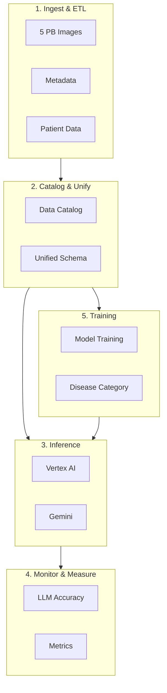

---

## 1. 5 PB Image Processing ETL

### Architecture

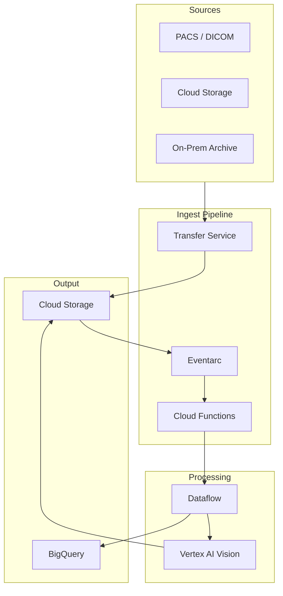

### Design Choices for 5 PB Scale

| Concern | Solution | Rationale |
|---------|----------|-----------|
| **Storage** | Cloud Storage (Standard → Nearline/Archive) | Lifecycle rules; cost optimization |
| **Transfer** | Transfer Service (batch), Storage Transfer Service | Multi-threaded; parallel; resumable |
| **Processing** | Dataflow (Apache Beam) + Vertex AI Vision | Horizontal scale; GPU workers |
| **Chunking** | Process by study/series; shard by prefix | Avoid hotspots; parallelize |
| **Metadata** | Extract to BigQuery; DICOM tags | Queryable; joinable with patient |

### Dataflow Pipeline Pattern

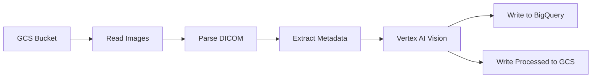

### Storage Tiering (5 PB)

| Tier | Use Case | Cost |
|------|----------|------|
| **Standard** | Hot / active processing | Highest |
| **Nearline** | Processed; occasional access | Medium |
| **Coldline** | Archive; compliance | Low |
| **Archive** | Long-term retention | Lowest |

---

## 2. Cataloging & Metadata Processing

### Architecture

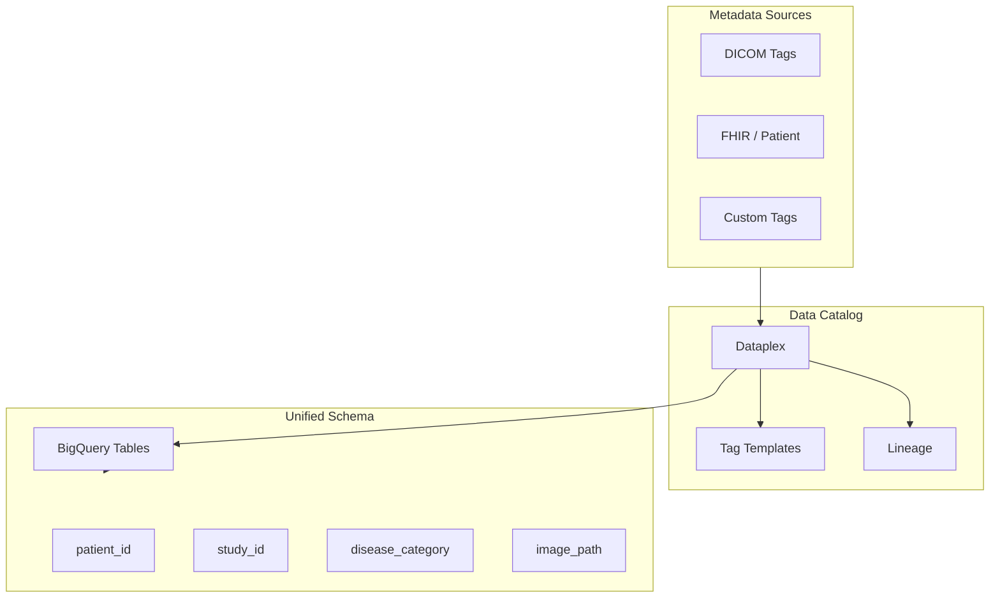

### Unified Schema (Patient + Image + Disease)

| Field | Source | Description |
|-------|--------|-------------|
| `patient_id` | FHIR / HL7 | De-identified patient ID |
| `study_id` | DICOM | Study UID |
| `series_id` | DICOM | Series UID |
| `image_path` | GCS | `gs://bucket/patient/study/series/image.dcm` |
| `disease_category` | Labeling / Model | ICD-10, SNOMED, custom |
| `modality` | DICOM | CT, MRI, X-Ray |
| `body_part` | DICOM / AI | Anatomical region |
| `metadata_json` | Extracted | Full DICOM tags |

### Dataplex for Governance

- **Data Catalog**: Discover, tag, search
- **Dataplex**: Lakehouse; unified metadata
- **Tag templates**: PII, PHI, sensitivity
- **Lineage**: Image → Extract → BigQuery → Model

---

## 3. Vertex AI Inference

### Architecture

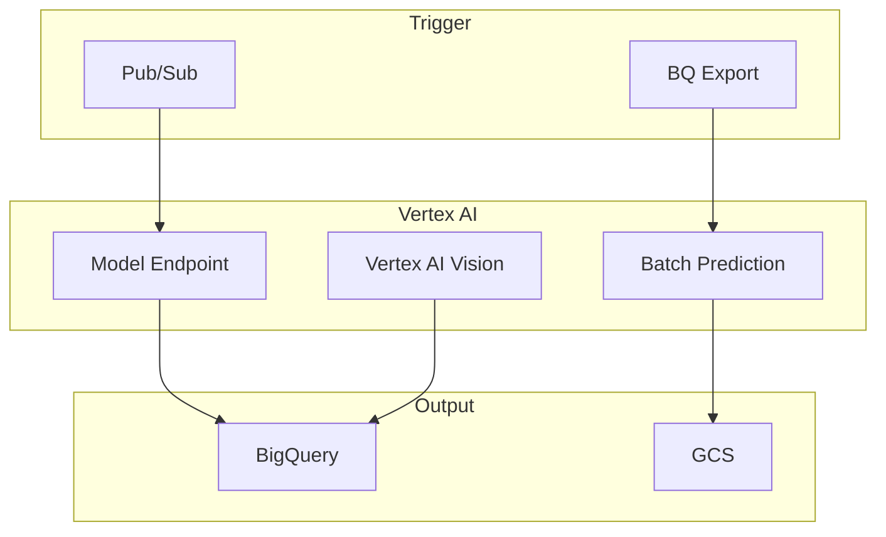

### Real-Time vs Batch

| Mode | Use Case | Component |
|------|----------|-----------|
| **Real-time** | Live PACS; urgent reads | Vertex AI Endpoint (GPU) |
| **Batch** | Bulk historical; ETL | Batch Prediction |
| **Vision API** | Pre-built models (labels, objects) | Vertex AI Vision |

---

## 4. Gemini Integration

### Architecture

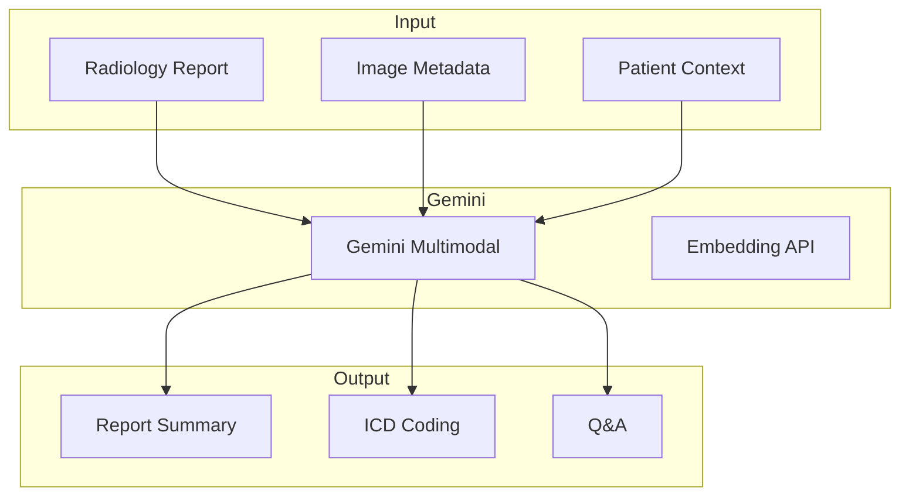

### Use Cases

- **Report summarization**: Long report → concise summary
- **ICD/SNOMED coding**: Free text → structured codes
- **Multimodal**: Image + report → combined interpretation
- **Q&A**: Clinician questions over report + metadata

---

## 5. Watching & Measuring LLM Accuracy

### Architecture

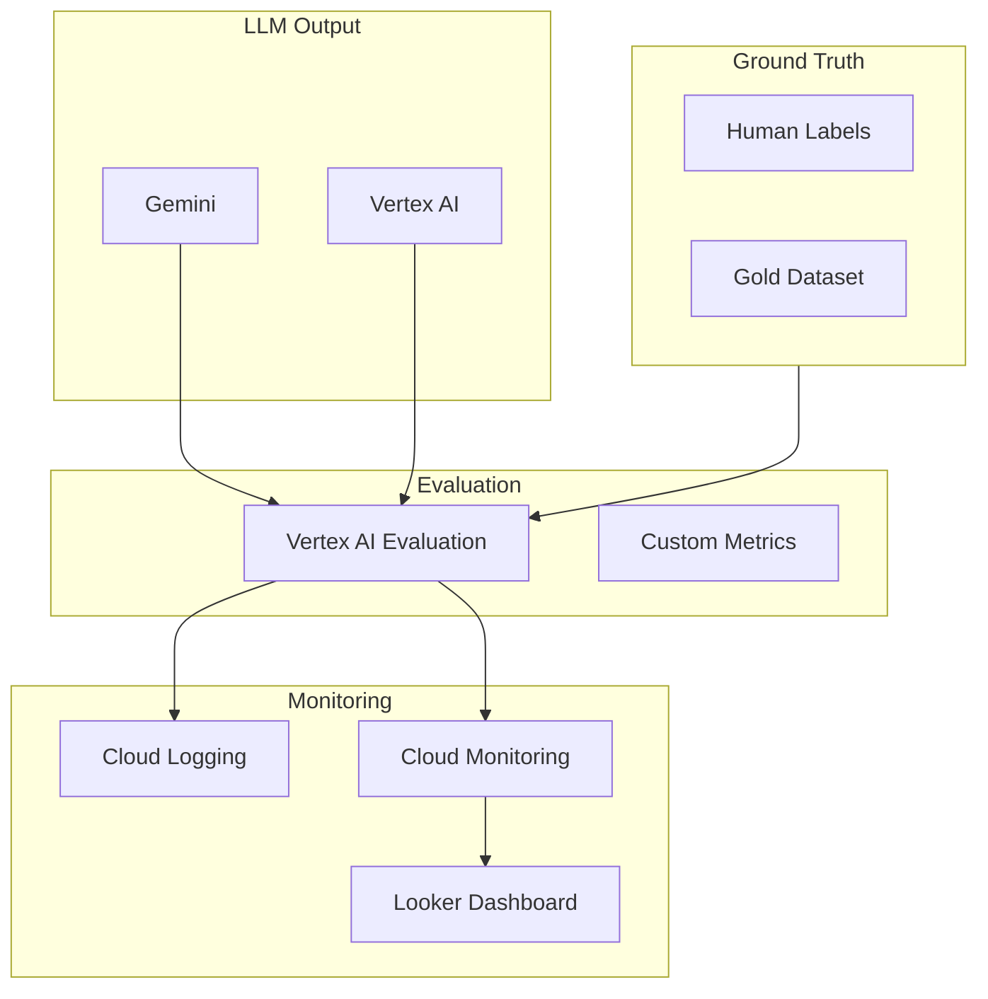

### Metrics to Track

| Metric | Description | Tool |
|--------|-------------|------|
| **Exact match** | Output vs gold | Custom / Vertex Eval |
| **BLEU / ROUGE** | Text similarity | Vertex AI Evaluation |
| **Clinical accuracy** | Domain expert review | Human-in-loop |
| **Latency** | P50, P99 | Cloud Monitoring |
| **Drift** | Input/output distribution | Vertex AI Model Monitoring |
| **Hallucination rate** | Factual errors | Custom eval |

### Evaluation Pipeline

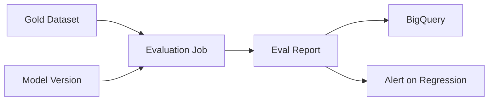

---

## 6. Data Cataloging

### Architecture

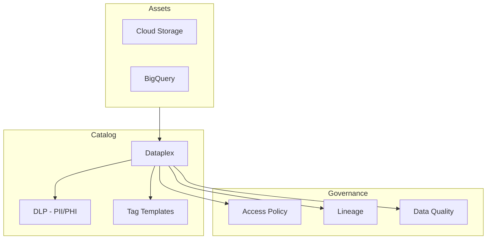

### Tag Templates

- **sensitivity**: PHI, PII, de-identified
- **disease_category**: Oncology, Cardiology, etc.
- **modality**: CT, MRI, X-Ray
- **retention**: Compliance retention period

---

## 7. Combining Patient + Image + Disease & Training

### Unified Training Dataset

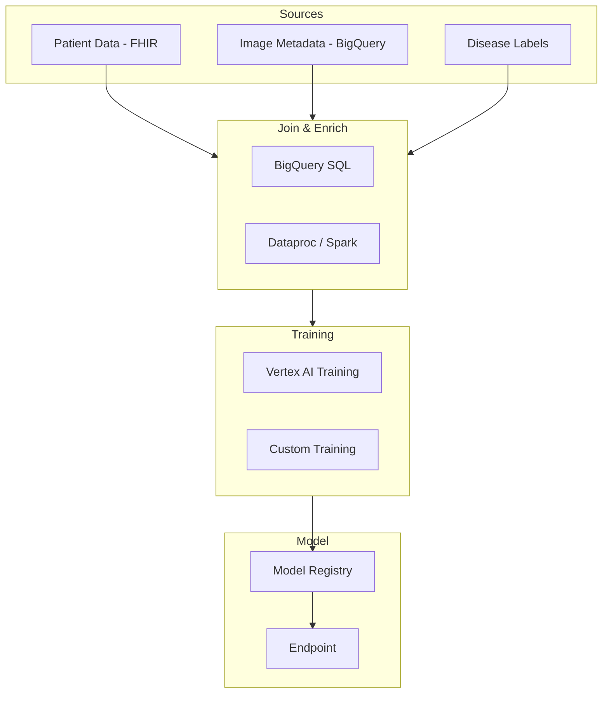

### Training Data Schema

| Field | Source | Use |
|-------|--------|-----|
| `patient_id` | FHIR | Cohort; demographics |
| `age`, `sex` | FHIR | Demographics |
| `study_id`, `series_id` | DICOM | Image reference |
| `image_uri` | GCS | Training input |
| `disease_category` | Labels / ICD | Target variable |
| `modality`, `body_part` | DICOM | Features |
| `report_text` | Report | Multimodal input |

### Training Pipeline

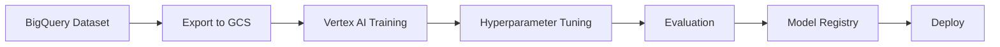

---

## 8. End-to-End Architecture

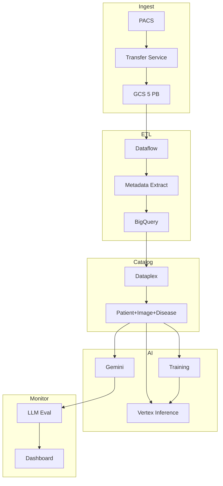

---

## 9. Component Summary

| Component | GCP Service | Purpose |
|-----------|-------------|---------|
| **5 PB storage** | Cloud Storage | Images; lifecycle tiers |
| **Image ETL** | Dataflow, Transfer Service | Ingest; metadata extract |
| **Catalog** | Dataplex, Data Catalog | Governance; lineage |
| **Metadata** | BigQuery | Unified schema; queries |
| **Inference** | Vertex AI, Vision | Image models |
| **LLM** | Gemini API | Reports; coding; Q&A |
| **LLM accuracy** | Vertex AI Evaluation, custom | Metrics; alerts |
| **Training** | Vertex AI Training | Patient+image+disease models |
| **Monitoring** | Cloud Monitoring, Logging | Latency; errors; drift |

---

## 10. Compliance & Security

| Requirement | Implementation |
|-------------|----------------|
| **PHI/PII** | DLP; de-identification; CMEK |
| **HIPAA** | BAA; audit logs; access controls |
| **Retention** | Lifecycle rules; BigQuery TTL |
| **Access** | IAM; VPC SC; private endpoints |
