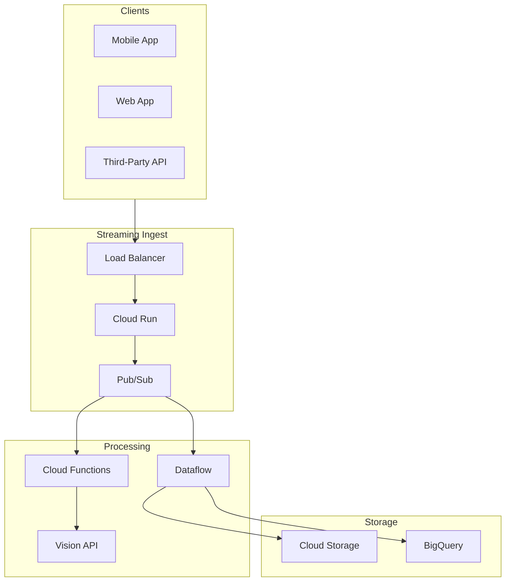
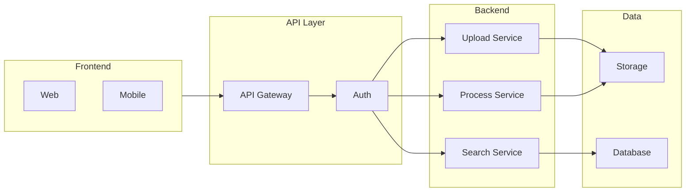
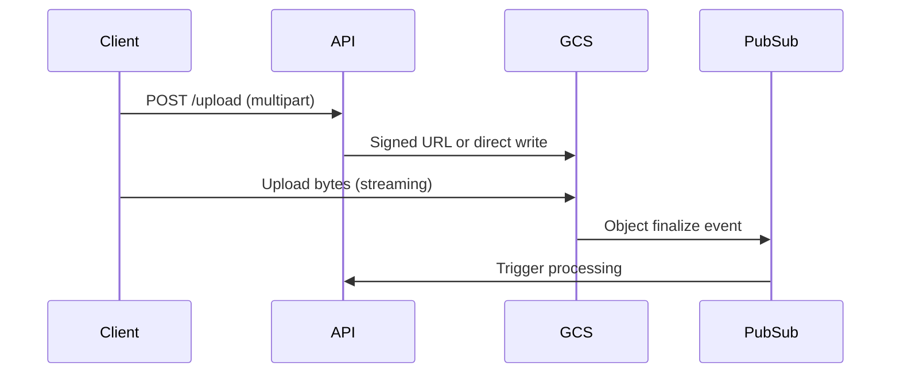
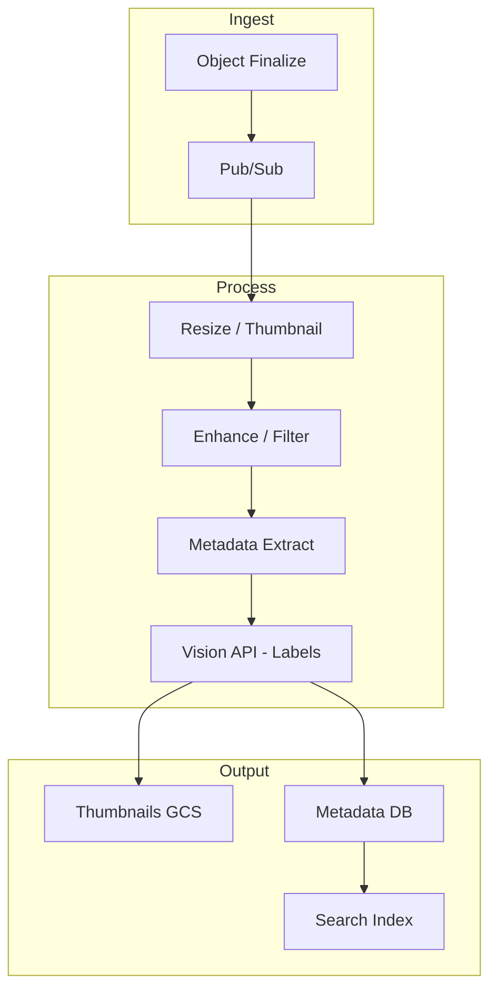
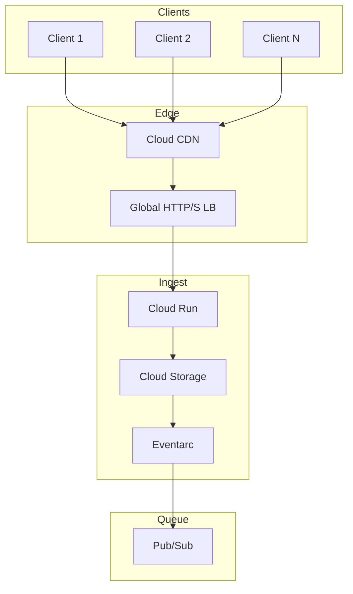
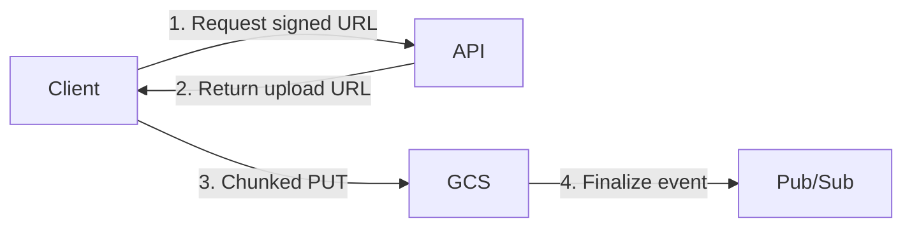
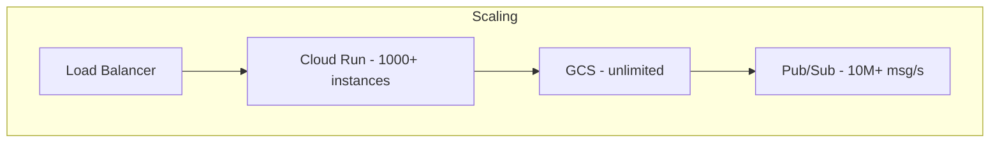
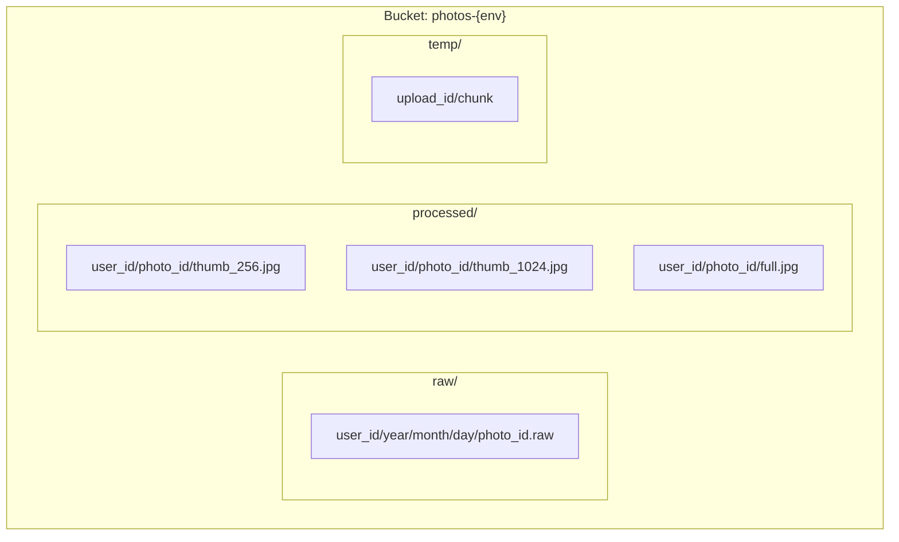
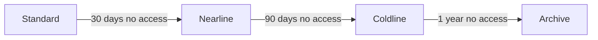
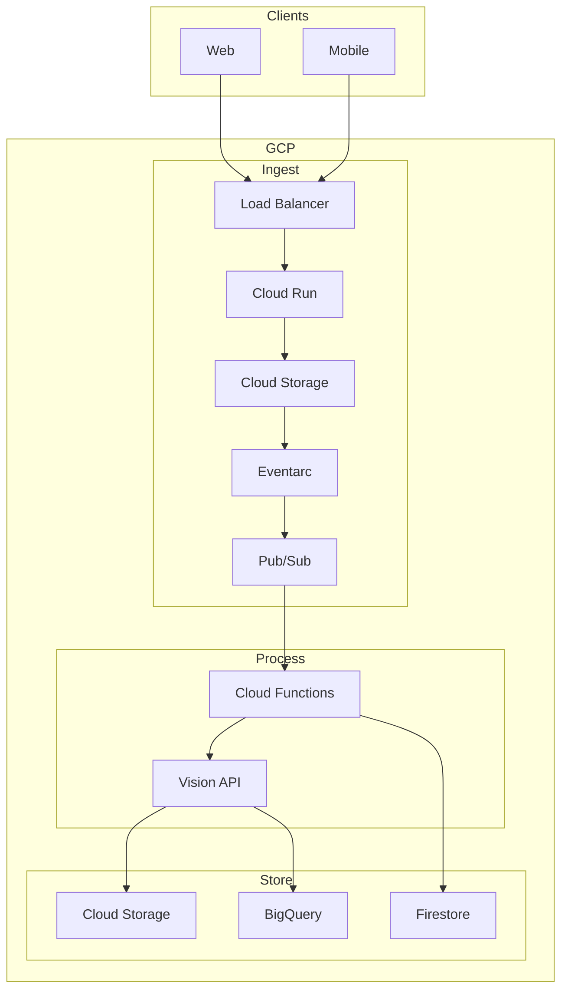

# Photo Processing App & Infrastructure Design

Architecture for a photo processing application with large-scale streaming ingest and storage.

---

## Overview



---

## 1. Application Design

### 1.1 High-Level Architecture



---

### 1.2 Upload Flow



**Options for large uploads:**

| Method | Use Case | Max Size | Pros |
|--------|----------|----------|------|
| **Direct to GCS** | Resumable, large | 5 TB | No proxy; resumable |
| **Signed URL** | Client upload | 5 TB | No server bandwidth |
| **Chunked upload** | Resumable | 5 TB | Resume on failure |
| **Stream through API** | Small–medium | ~100 MB | Simple; single request |

---

### 1.3 Processing Pipeline



---

## 2. Large Streaming Ingest

### 2.1 Streaming Architecture



---

### 2.2 Resumable Upload (Client → GCS)



**Resumable upload flow:**
1. Client requests upload URL from API
2. API returns signed resumable upload URL (or initiates session)
3. Client uploads in chunks (e.g., 256 KB–5 MB)
4. On failure, client resumes from last byte
5. GCS emits `OBJECT_FINALIZE` → triggers processing

---

### 2.3 High-Throughput Ingest

| Component | Role |
|-----------|------|
| **Cloud Run** | Stateless; scales to 0; handles auth + URL generation |
| **Cloud Storage** | Receives bytes; no proxy; multi-region |
| **Eventarc** | GCS → Pub/Sub on object finalize |
| **Pub/Sub** | Decouples ingest from processing; backpressure |
| **Cloud CDN** | Cache metadata; reduce origin load |

---

### 2.4 Scaling for Large Streams



| Service | Scale | Tuning |
|---------|-------|--------|
| **Cloud Run** | 0–1000+ | Concurrency; min instances for cold start |
| **Cloud Storage** | Unlimited | Prefix sharding; avoid hot keys |
| **Pub/Sub** | 10M msg/s | Ordering; ack deadline; push vs pull |
| **Dataflow** | Horizontal | Worker count; autoscaling |

---

## 3. Storage Design

### 3.1 Storage Layout



**Naming convention:**
```
gs://photos-prod/raw/{user_id}/{year}/{month}/{day}/{photo_id}.{ext}
gs://photos-prod/processed/{user_id}/{photo_id}/thumb_256.jpg
gs://photos-prod/processed/{user_id}/{photo_id}/thumb_1024.jpg
gs://photos-prod/processed/{user_id}/{photo_id}/full.jpg
```

---

### 3.2 Lifecycle & Tiering



| Tier | Use Case | Cost |
|------|----------|------|
| **Standard** | Active; recent uploads | Highest |
| **Nearline** | Thumbnails; occasional view | Medium |
| **Coldline** | Archive; compliance | Low |
| **Archive** | Long-term; rarely accessed | Lowest |

---

### 3.3 Capacity Planning

| Scenario | Est. Size | Approach |
|----------|-----------|----------|
| **1M users, 100 photos each** | ~10 TB | Single bucket; prefix by user |
| **10M users, 1000 photos each** | ~1 PB | Multi-bucket; shard by user hash |
| **100M+ photos** | 10+ PB | Multiple buckets; lifecycle rules |

---

## 4. End-to-End Infrastructure



---

## 5. Component Summary

| Component | Service | Purpose |
|-----------|---------|---------|
| **Upload API** | Cloud Run | Auth; signed URLs; metadata |
| **Streaming storage** | Cloud Storage | Raw + processed; resumable upload |
| **Event trigger** | Eventarc + Pub/Sub | Object finalize → process |
| **Processing** | Cloud Functions / Dataflow | Resize; enhance; extract |
| **Vision** | Vision API | Labels; faces; objects |
| **Metadata** | Firestore / BigQuery | Search; queries |
| **CDN** | Cloud CDN | Cache thumbnails; reduce latency |

---

## 6. AWS Equivalent (Reference)

| GCP | AWS |
|-----|-----|
| Cloud Storage | S3 |
| Cloud Run | Lambda / ECS Fargate |
| Pub/Sub | SQS / SNS / EventBridge |
| Eventarc | S3 Event Notifications |
| Vision API | Rekognition |
| Firestore | DynamoDB |
| Cloud CDN | CloudFront |
