# Photo App: Multi-Cloud Secure Design (AWS, Azure, GCP)

Full-stack design for 1–10 MB photo ingest, authentication, storage, categorization, inference, browsing, sharing, analytics, and secure zero-trust infrastructure across AWS, Azure, and GCP.

---

## 1. Requirements Summary

| Requirement | Description |
|-------------|-------------|
| **Photo size** | 1–10 MB; rapid ingest |
| **Auth** | User authentication |
| **Frontend** | Web/mobile app |
| **Storage** | Photo storage; categorization |
| **Inference** | AI/ML on photos |
| **Browsing** | User photo gallery |
| **Sharing** | Share photos with others |
| **Analytics** | Data warehouse for management |
| **Security** | Zero trust; exfiltration prevention |
| **Availability** | HA within region; across regions |
| **Observability** | Metrics; logs; troubleshooting |

---

## 2. High-Level Architecture (Cloud-Agnostic)

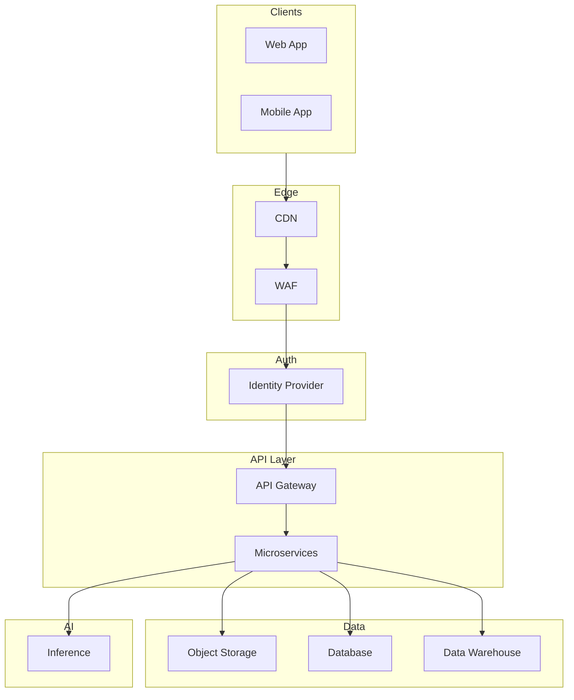

---

## 3. Per-Cloud Architecture

### 3.1 GCP Architecture

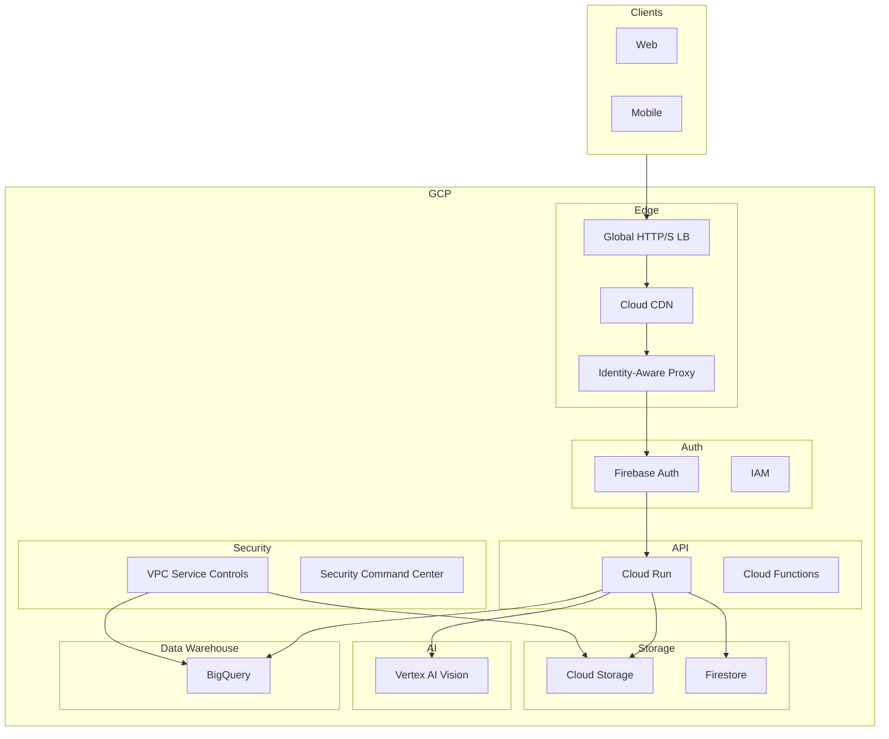

---

### 3.2 AWS Architecture

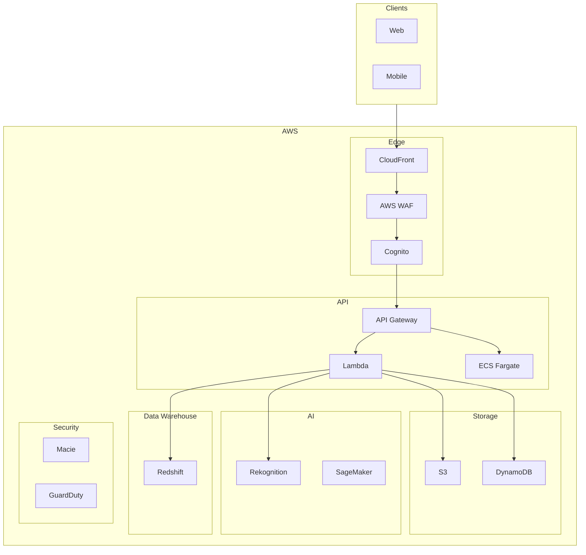

---

### 3.3 Azure Architecture

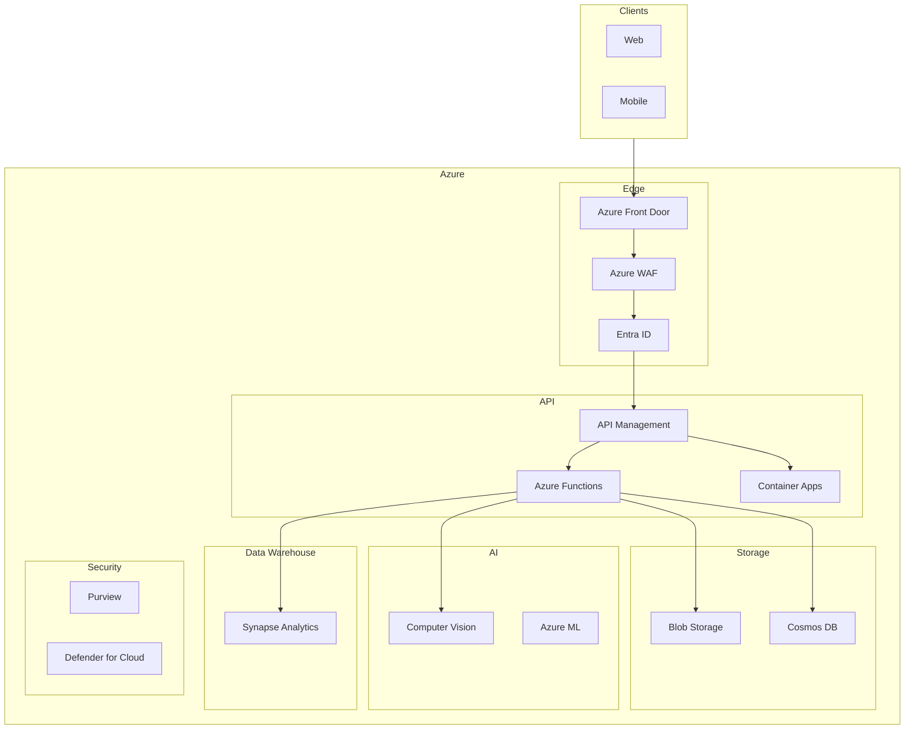

---

## 4. Service Mapping (All Three Clouds)

| Capability | GCP | AWS | Azure |
|------------|-----|-----|-------|
| **Auth** | Firebase Auth, IAP | Cognito | Entra ID, B2C |
| **API** | Cloud Run, API Gateway | API Gateway, Lambda | API Management, Functions |
| **Object storage** | Cloud Storage | S3 | Blob Storage |
| **NoSQL** | Firestore | DynamoDB | Cosmos DB |
| **Data warehouse** | BigQuery | Redshift | Synapse Analytics |
| **Vision/AI** | Vertex AI Vision | Rekognition | Computer Vision |
| **CDN** | Cloud CDN | CloudFront | Front Door + CDN |
| **WAF** | Cloud Armor | AWS WAF | Azure WAF |
| **Exfiltration control** | VPC SC | Macie, SCP | Purview, Defender |

---

## 5. Data Flow: 1–10 MB Rapid Ingest

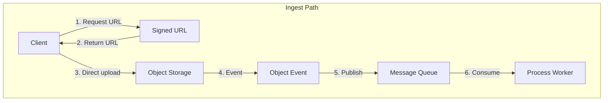

| Cloud | Signed URL | Event | Queue |
|-------|------------|-------|-------|
| **GCP** | Cloud Storage signed URL | Eventarc (GCS trigger) | Pub/Sub |
| **AWS** | S3 presigned URL | S3 Event Notifications | SQS |
| **Azure** | Blob SAS URL | Event Grid | Service Bus |

---

## 6. Zero Trust & Security Design

### 6.1 Zero Trust Layers

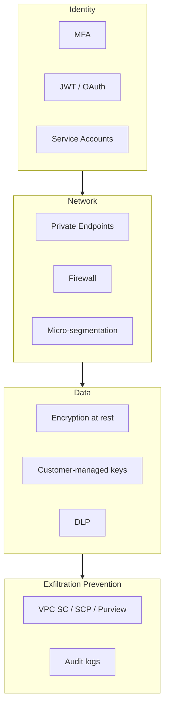

---

### 6.2 Exfiltration Prevention

| Cloud | Control | Purpose |
|-------|---------|---------|
| **GCP** | VPC Service Controls | Block copy to projects outside perimeter; restrict exports |
| **GCP** | DLP | Detect PII; block sensitive data egress |
| **AWS** | SCP (Service Control Policies) | Restrict cross-account data movement |
| **AWS** | Macie | Detect sensitive data; alert on exposure |
| **Azure** | Purview | Data governance; egress policies |
| **Azure** | Defender for Storage | Threat detection; exfiltration alerts |

---

### 6.3 Secure Infrastructure Checklist

- [ ] Private endpoints for storage, DB, APIs (no public IP)
- [ ] Identity-based access (no network-based trust)
- [ ] Encryption at rest (CMEK where required)
- [ ] Encryption in transit (TLS 1.3)
- [ ] VPC SC / SCP / Purview perimeter
- [ ] DLP for PII/PHI
- [ ] Audit logging; immutable logs
- [ ] Least privilege IAM; no broad roles

---

## 7. High Availability Design

### 7.1 Within Region (Single Region HA)

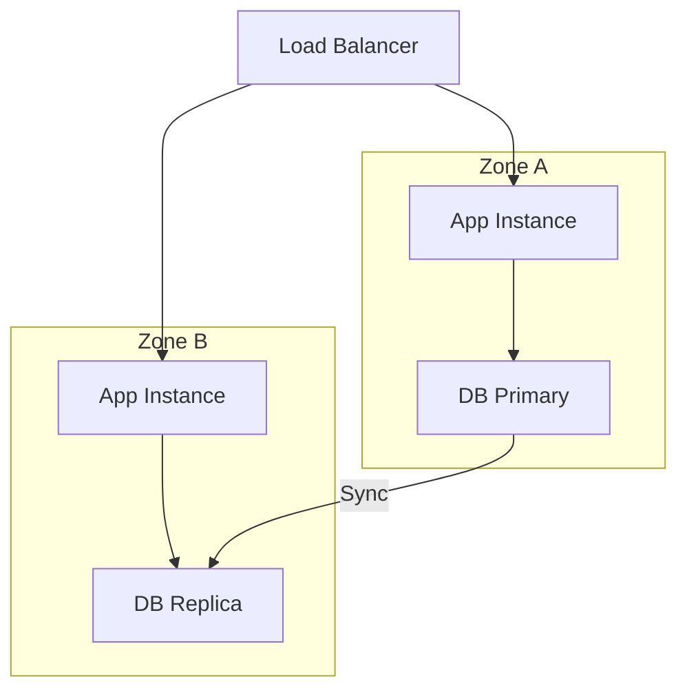

| Component | GCP | AWS | Azure |
|-----------|-----|-----|-------|
| **LB** | Regional External LB | ALB (multi-AZ) | Load Balancer (multi-AZ) |
| **Compute** | GKE / Cloud Run (multi-zone) | EKS / ECS (multi-AZ) | AKS / Container Apps (multi-zone) |
| **DB** | Cloud SQL HA, Firestore | RDS Multi-AZ, DynamoDB | SQL DB, Cosmos DB |
| **Storage** | GCS (multi-zone) | S3 (multi-AZ) | Blob (RA-GRS) |

---

### 7.2 Across Regions (Multi-Region HA)

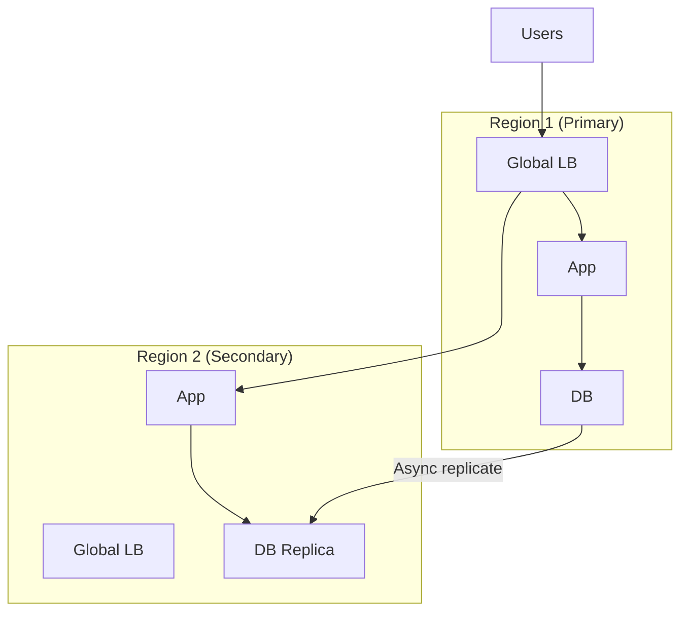

| Component | GCP | AWS | Azure |
|-----------|-----|-----|-------|
| **Global LB** | Global HTTP(S) LB | CloudFront + ALB | Front Door |
| **DB** | Spanner, Firestore | DynamoDB Global, Aurora Global | Cosmos DB (multi-region) |
| **Storage** | GCS (multi-region) | S3 Cross-Region Replication | Blob GRS, Geo-redundant |
| **Failover** | Traffic Director, health checks | Route 53 failover | Traffic Manager |

---

## 8. Observability & Troubleshooting

### 8.1 Metrics to Collect

| Category | Metrics | Purpose |
|----------|---------|---------|
| **Ingest** | Upload rate, latency P50/P99, errors | Throughput; bottlenecks |
| **Processing** | Queue depth, processing time, failures | Backlog; retries |
| **Storage** | Object count, size, tier distribution | Capacity; cost |
| **API** | Request rate, latency, 4xx/5xx | Availability; errors |
| **Auth** | Login success/fail, token refresh | Security; UX |
| **Inference** | Model latency, throughput | AI performance |
| **DB** | Connections, query latency | Database health |

---

### 8.2 Observability Stack (Per Cloud)

| Capability | GCP | AWS | Azure |
|------------|-----|-----|-------|
| **Metrics** | Cloud Monitoring | CloudWatch | Azure Monitor |
| **Logs** | Cloud Logging | CloudWatch Logs | Log Analytics |
| **Traces** | Cloud Trace | X-Ray | Application Insights |
| **Dashboards** | Looker Studio, Grafana | CloudWatch, Grafana | Azure Dashboards, Grafana |
| **Alerting** | Alerting policies | CloudWatch Alarms | Action Groups |
| **APM** | Cloud Profiler | X-Ray, CodeGuru | Application Insights |

---

### 8.3 Log Analysis & Troubleshooting

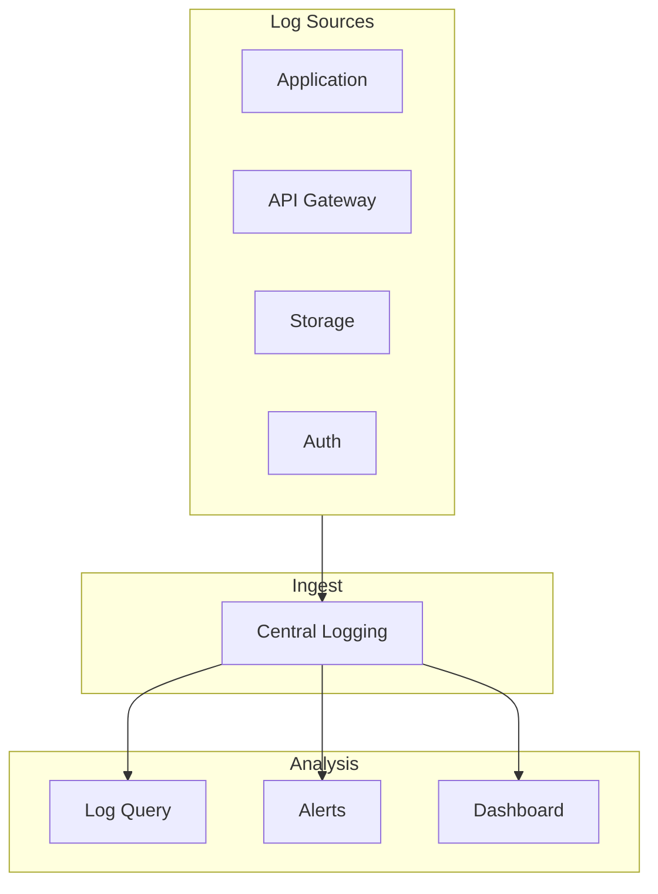

**Troubleshooting queries (example – GCP Logging):**
```
# Upload failures
resource.type="cloud_run_revision"
severity>=ERROR
textPayload=~"upload"

# Slow inference
metric.type="run.googleapis.com/request_latencies"
metric.labels.response_code!="200"

# Auth failures
protoPayload.serviceName="firebaseauth.googleapis.com"
protoPayload.methodName="SignIn"
protoPayload.status.code!=0
```

---

### 8.4 Troubleshooting Tools Matrix

| Issue | GCP | AWS | Azure |
|-------|-----|-----|-------|
| **Trace request** | Cloud Trace | X-Ray | Application Insights |
| **Log search** | Log Explorer | CloudWatch Logs Insights | Log Analytics KQL |
| **Metric drill-down** | Metrics Explorer | CloudWatch Metrics | Metrics Explorer |
| **Error budget** | SLO Monitoring | CloudWatch SLO | Azure SLO |
| **Incident** | Incident Manager | Incident Manager | Azure Monitor Alerts |

---

## 9. End-to-End Feature Flow

### 9.1 Upload → Store → Categorize → Infer

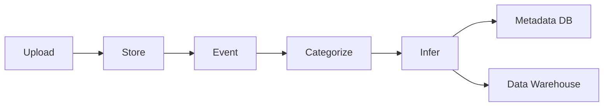

### 9.2 Browse & Share

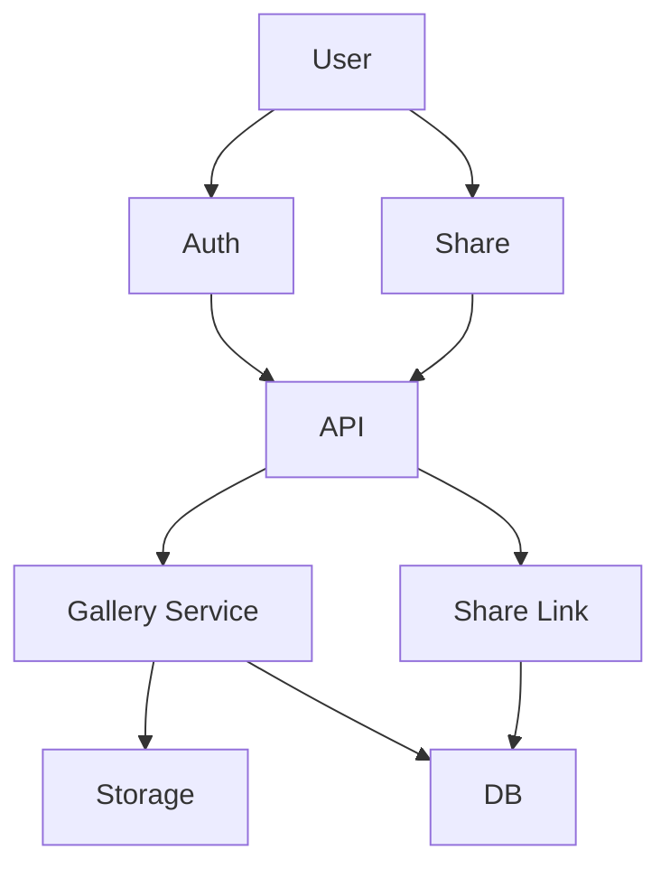

### 9.3 Analytics (Management Data Warehouse)

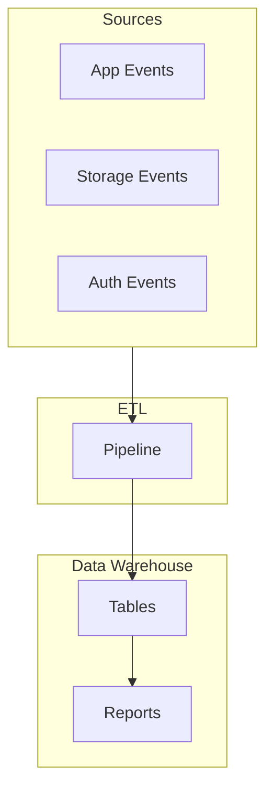

| Cloud | ETL | Data Warehouse |
|-------|-----|----------------|
| **GCP** | Dataflow, BigQuery Transfer | BigQuery |
| **AWS** | Glue, DMS | Redshift |
| **Azure** | Data Factory, Synapse pipelines | Synapse Analytics |

---

## 10. Multi-Cloud Design Summary

| Aspect | GCP | AWS | Azure |
|--------|-----|-----|-------|
| **Auth** | Firebase, IAP | Cognito | Entra, B2C |
| **Upload** | Signed URL, GCS | Presigned URL, S3 | SAS, Blob |
| **Process** | Cloud Functions, Dataflow | Lambda, SQS | Functions, Service Bus |
| **Inference** | Vertex AI Vision | Rekognition | Computer Vision |
| **Storage** | GCS, Firestore | S3, DynamoDB | Blob, Cosmos DB |
| **DW** | BigQuery | Redshift | Synapse |
| **Exfiltration** | VPC SC | Macie, SCP | Purview |
| **HA (region)** | Multi-zone | Multi-AZ | Multi-zone |
| **HA (global)** | Global LB, Spanner | CloudFront, DynamoDB Global | Front Door, Cosmos DB |
| **Observability** | Cloud Ops | CloudWatch | Azure Monitor |

---

## 11. Applying This Design to Other Solutions

Use this multi-cloud, secure, HA pattern for:

| Solution | Doc | Same Pattern |
|----------|-----|--------------|
| **Healthcare imaging (5 PB)** | 19-healthcare-imaging-ai-pipeline.md | Add GCP/AWS/Azure mapping; VPC SC/SCP/Purview; multi-region HA |
| **Architecture scenarios** | 18-architecture-scenarios-gcp-aws.md | Extend to Azure; add observability matrix |
| **Photo processing (earlier)** | 20-photo-processing-app-infrastructure.md | Superseded by this doc (21) |

**Template for any solution:**
1. Define GCP, AWS, Azure service mapping
2. Add zero trust + exfiltration controls per cloud
3. Design HA within region (multi-zone/AZ)
4. Design HA across regions (global LB, global DB)
5. Define observability stack (metrics, logs, traces, alerts)
6. Add troubleshooting queries and dashboards
