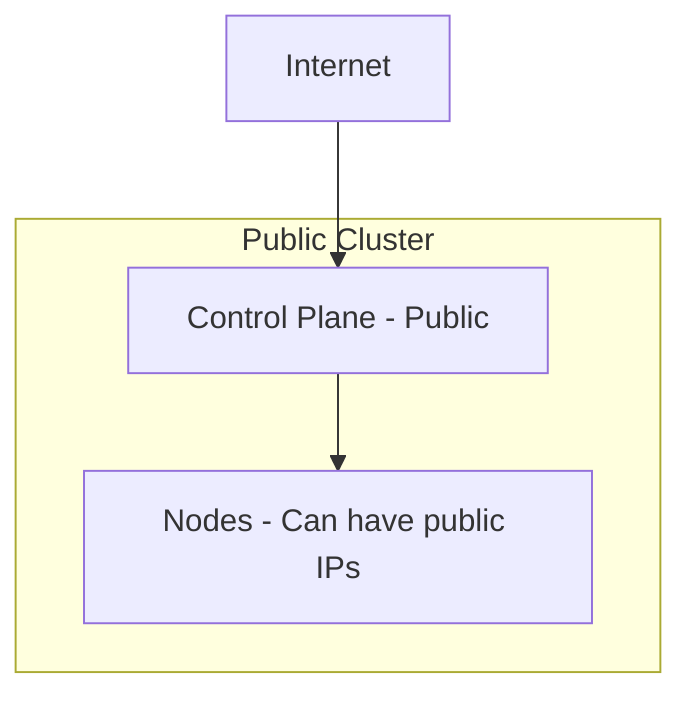
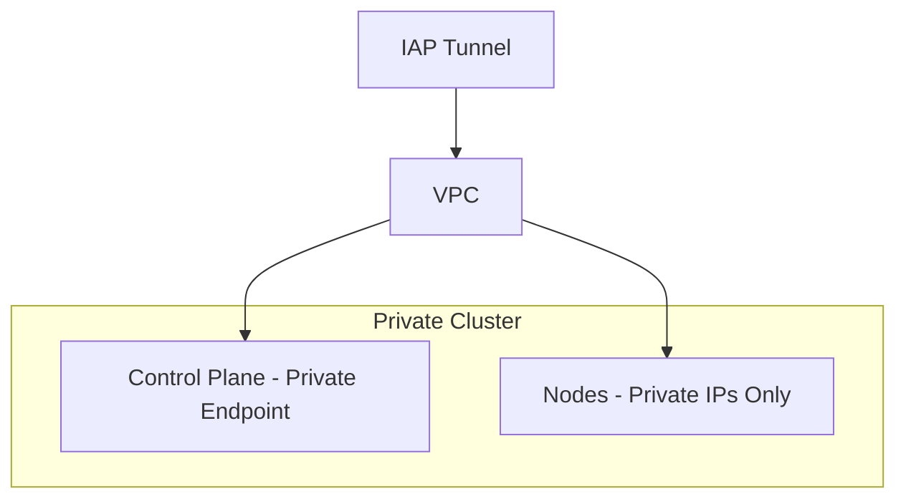
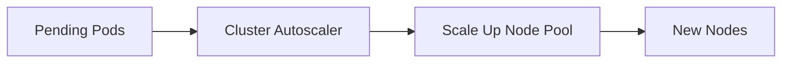
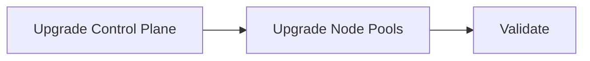

# GKE Detailed: Private, Public, Scalability, Upgrades

Comprehensive GKE design: cluster types, scalability, patterns, upgrades, and release channels.

---

## 1. GKE Cluster Types: Private vs Public

### 1.1 Public Cluster

| Aspect | Public Cluster |
|--------|----------------|
| **Control plane** | Public endpoint |
| **Nodes** | Can have external IPs |
| **Access** | kubectl from anywhere (with auth) |
| **Use case** | Dev; simple |

### 1.2 Private Cluster

| Aspect | Private Cluster |
|--------|-----------------|
| **Control plane** | Private endpoint only (or public + private) |
| **Nodes** | No external IPs |
| **Access** | From VPC; IAP tunnel; VPN; Interconnect |
| **Use case** | Prod; compliance |

### 1.3 Master Authorized Networks

- Restrict which IPs can reach the public API endpoint
- Add corporate IP ranges; block 0.0.0.0/0

---

## 2. Scalability

### 2.1 Cluster Autoscaler

| Capability | Description |
|------------|-------------|
| **Scale up** | Add nodes when pods are pending |
| **Scale down** | Remove underutilized nodes |
| **Node pool** | Per-pool min/max |

### 2.2 GKE Autopilot

- Google manages nodes; you only define pods
- No node pools to manage
- Scale to zero for unused capacity
- **Regional only**; no zonal Autopilot

### 2.3 Vertical Pod Autoscaler (VPA)

- Adjusts CPU/memory requests based on usage
- Can work with Cluster Autoscaler

### 2.4 Horizontal Pod Autoscaler (HPA)

- Scales pods based on CPU, memory, custom metrics

---

## 3. GKE Patterns

### 3.1 Multi-Tenant

| Pattern | Description |
|---------|-------------|
| **Namespace per tenant** | ResourceQuota; Network Policy |
| **Cluster per tenant** | Strong isolation |
| **Fleet** | Multi-cluster management |

### 3.2 GitOps

| Tool | Purpose |
|------|---------|
| **Config Sync** | Native; Fleet |
| **ArgoCD** | GitOps; multi-cluster |
| **Flux** | GitOps |

### 3.3 Ingress

| Type | Component |
|------|-----------|
| **GKE Ingress** | Native; Envoy-based |
| **NGINX** | NGINX Ingress Controller |

---

## 4. Upgrades

### 4.1 Release Channels

| Channel | Upgrade Cadence | Use Case |
|---------|-----------------|----------|
| **Rapid** | ~2 weeks | Early adopters |
| **Regular** | ~4 weeks | Most production |
| **Stable** | ~4 months | Conservative production |
| **Static** | Manual | No auto-upgrade |

### 4.2 Upgrade Flow

### 4.3 Node Pool Upgrade

| Method | Description |
|--------|-------------|
| **Surge** | Create new nodes; drain old |
| **Blue-green** | New node pool; migrate workloads |

---

## 5. GKE vs EKS Comparison

| Aspect | GKE | EKS |
|--------|-----|-----|
| **Private cluster** | Private endpoint; no node public IPs | Private endpoint; private subnets |
| **Autopilot** | Yes; managed nodes | Fargate (serverless) |
| **Release channel** | Rapid, Regular, Stable, Static | Version-based; no channel |
| **Node scaling** | Cluster Autoscaler; VPA | CA; Karpenter |
| **Fleet** | Fleet API; multi-cluster | EKS; separate clusters |

---

## 6. Best Practices

- Use **private cluster** for production
- **Workload Identity** for pod IAM
- **Release channel** (Regular or Stable) for prod
- **Binary Authorization** for image signing
- **Network policy** for pod segmentation
