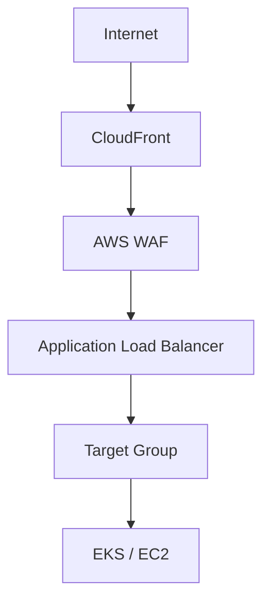
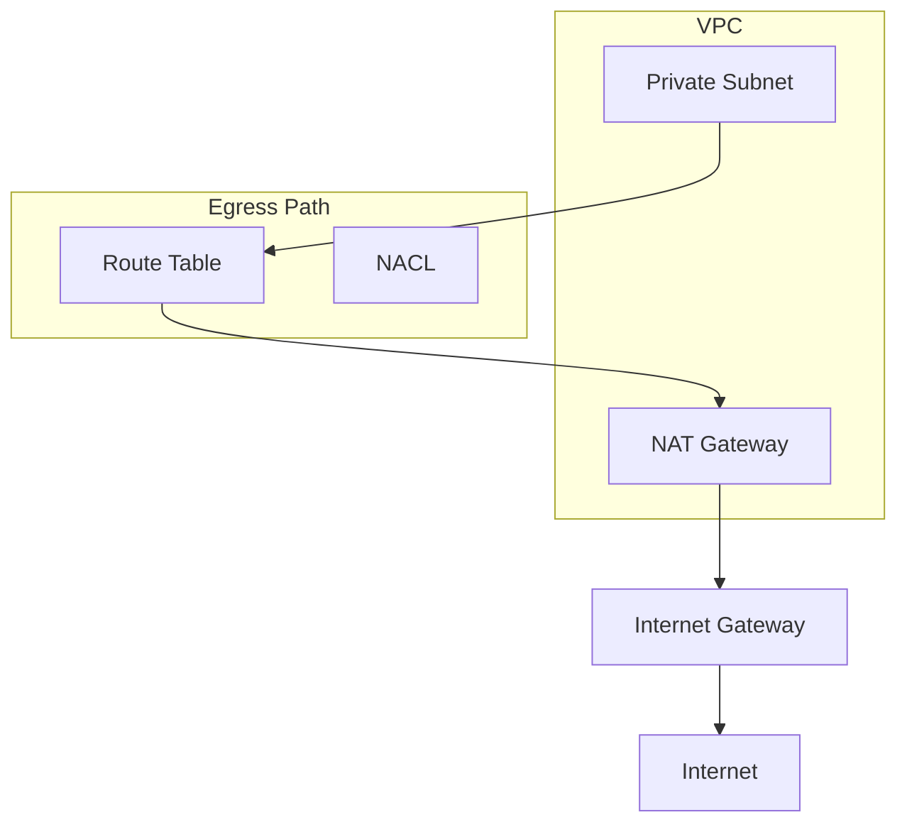
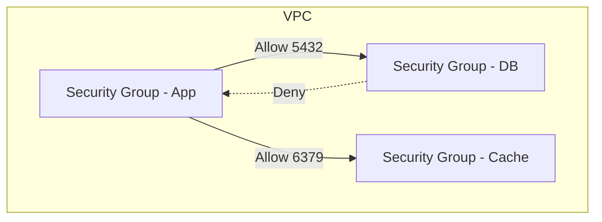
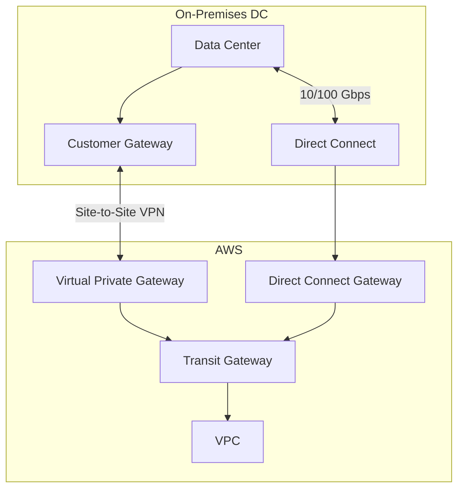
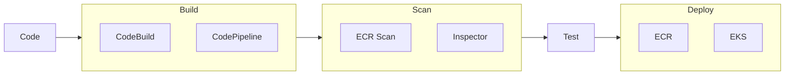
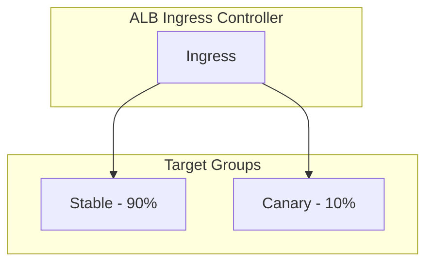
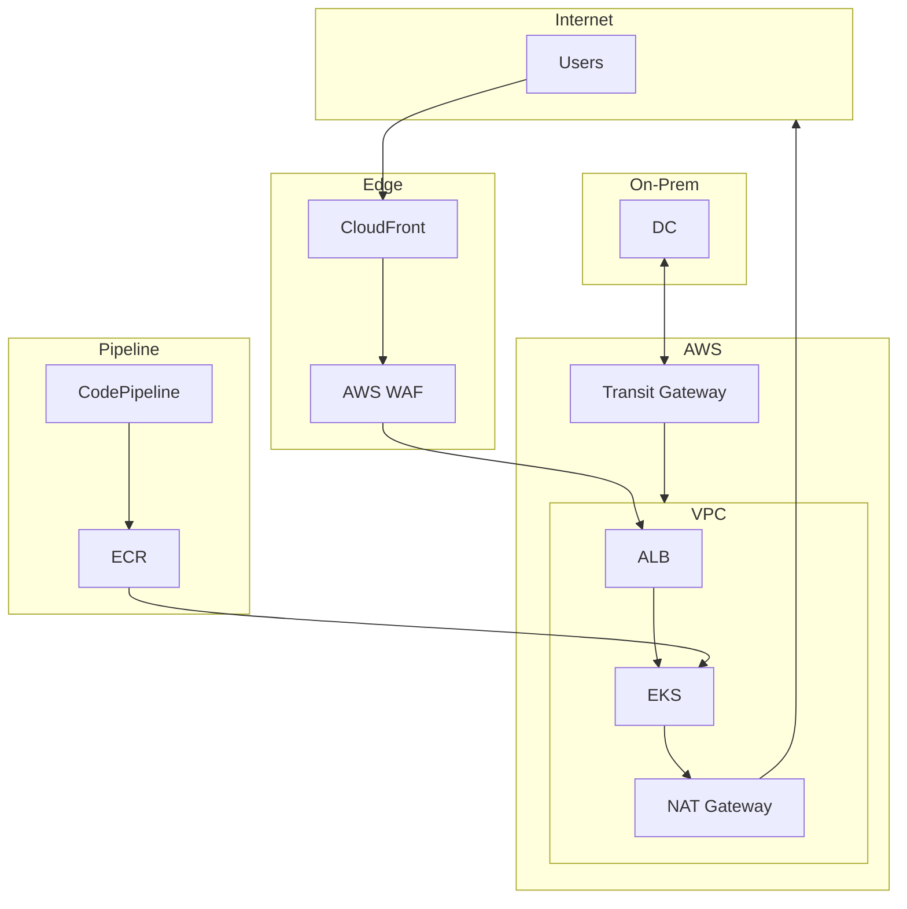

# AWS End-to-End Solution

Complete design for production, dev, and QA deployments with security in pipeline, canary releases, and full traffic control (ingress, egress, east-west, on-prem).

---

## 1. Environment Strategy (Prod, Dev, QA)

### 1.1 Account and OU Structure

```
Organization Root
├── Security (OU)
│   └── security-audit-account
├── Infrastructure (OU)
│   └── network-account
├── Workloads (OU)
│   ├── dev-account
│   ├── qa-account
│   └── prod-account
└── Sandbox (OU)
    └── sandbox-account
```

**Why**: Separate accounts per environment provide strong isolation, independent guardrails via SCPs, and clear cost allocation. Security and network accounts centralize shared services.

### 1.2 Environment Differences

| Aspect | Dev | QA | Prod |
|--------|-----|-----|------|
| **VPC** | Dev VPC (shared) | QA VPC (shared) | Prod VPC (shared) |
| **Instance size** | t3.medium | t3.large | c5.xlarge |
| **EKS node group** | 1–2 nodes | 2–3 nodes | 5+ nodes, multi-AZ |
| **ECR image scan** | Warn | Block critical | Block high + critical |
| **GuardDuty** | Enabled | Enabled | Enabled + S3 protection |
| **SCP** | Relaxed | Stricter | Full restrictions |

**Why**: Dev minimizes cost; QA mirrors prod for pre-release validation; Prod has strictest controls and HA.

---

## 2. Network Design: Ingress, Egress, East-West

### 2.1 Ingress Control



**Components**:
- **CloudFront**: Global edge; DDoS protection (Shield); SSL termination; caching
- **AWS WAF**: OWASP rules, rate limiting, geo-blocking, custom rules
- **Application Load Balancer (ALB)**: L7 routing; path-based; host-based; TLS
- **Network Load Balancer (NLB)**: For non-HTTP; static IP; ultra-low latency

**Why**: CloudFront + WAF centralizes edge security. ALB provides L7 routing and health checks. WAF blocks malicious requests before they reach the origin.

### 2.2 Egress Control



**Components**:
- **NAT Gateway**: Per-AZ; workloads in private subnets egress through NAT
- **Route tables**: Private subnets route 0.0.0.0/0 to NAT Gateway
- **Network ACLs (NACL)**: Stateless; allow/deny by CIDR, port at subnet boundary
- **Security Groups**: Stateful; egress rules per SG
- **VPC Endpoints**: For AWS services (S3, ECR, etc.); no internet egress for API calls

**Egress rules (example)**:
- Security Group egress: Allow HTTPS to specific CIDRs (e.g., payment, analytics)
- NACL: Deny egress to unknown ranges
- VPC Endpoints: S3, ECR, CloudWatch via private link (no NAT)

**Why**: NAT Gateway centralizes egress and hides private IPs. VPC Endpoints keep AWS API traffic inside the network. Security Groups and NACLs enforce least-privilege egress.

### 2.3 East-West Traffic Control



**Components**:
- **Security Groups**: Stateful; allow only required ports between SGs (e.g., app SG → RDS SG on 5432)
- **VPC Flow Logs**: Audit east-west traffic; feed to GuardDuty
- **EKS Network Policy**: Calico or VPC CNI; pod-to-pod segmentation
- **PrivateLink**: Service-to-service via private endpoints (e.g., EKS → RDS Proxy)

**Why**: Security Groups enforce micro-segmentation. A compromised app tier cannot reach DB unless explicitly allowed. EKS Network Policy extends this to pods.

### 2.4 On-Prem to AWS Connectivity



**Components**:
- **Site-to-Site VPN**: Dual tunnel; HA; for backup or smaller bandwidth
- **Direct Connect**: Dedicated 1/10/100 Gbps; low latency; predictable
- **Transit Gateway**: Central hub; VPC and on-prem attach; simplified routing
- **Route propagation**: BGP over VPN and DX for dynamic failover
- **Security Groups / NACLs**: Restrict ingress from on-prem CIDR to specific subnets

**Why**: VPN provides redundancy; Direct Connect provides throughput. Transit Gateway scales to many VPCs and simplifies routing. BGP enables automatic failover.

---

## 3. Security in Pipeline (CI/CD)

### 3.1 Pipeline Architecture



### 3.2 Security Gates

| Gate | Component | Action |
|------|-----------|--------|
| **Secret scan** | Git pre-commit / CodeBuild | Block if secrets in repo |
| **Dependency scan** | CodeBuild + Trivy / Snyk | Block critical CVEs |
| **Container scan** | ECR image scanning | Block deploy if critical/high |
| **IAM Roles for Tasks** | EKS Pod Identity | No long-lived keys |
| **Infrastructure** | Terraform + OPA / Checkov | Block if policy violations |

**Why**: Security is enforced in the pipeline. Vulnerable images and misconfigured IAC are blocked before deployment.

### 3.3 IAM Roles for CI/CD

- **CodeBuild**: Assumes role with ECR push, EKS deploy; no access keys
- **GitHub Actions / GitLab**: OIDC with AWS; AssumeRoleWithWebIdentity
- **EKS Pod Identity**: Pods assume IAM roles; no node role for app workloads

**Why**: No long-lived credentials. Each pipeline run gets scoped, short-lived credentials.

### 3.4 Pipeline Stages (Example)

```
1. Trigger: Push to main / tag
2. Build: CodeBuild → Docker build → push to ECR
3. Scan: ECR scan → fail if critical/high CVE
4. Deploy Dev: EKS apply (auto)
5. Deploy QA: Manual approval → EKS apply
6. Deploy Prod: Manual approval → canary target group → full rollout
```

---

## 4. Canary Deployment Mechanism

### 4.1 EKS Canary with ALB Ingress



**Components**:
- **ALB Ingress Controller**: Manages ALB and target groups from Ingress
- **Target groups**: One for stable, one for canary
- **Weighted routing**: ALB forwards by target group weight (e.g., 90/10)
- **Or**: **App Mesh** for advanced traffic splitting, retries, fault injection

### 4.2 Canary Flow

1. Deploy canary deployment (new image tag)
2. Register canary pods in canary target group
3. Set ALB weight: 90% stable, 10% canary
4. Monitor CloudWatch: latency, error rate, custom metrics
5. If healthy: shift to 50%, then 100%; decommission old
6. If unhealthy: set canary weight to 0%; roll back

**Why**: Canary limits blast radius. Issues are detected with a small fraction of traffic.

### 4.3 CodeDeploy Blue/Green and Canary

- **CodeDeploy**: EC2/ECS/Lambda deployments with traffic shifting
- **ECS**: Blue/green with gradual shift (e.g., 10% → 50% → 100%)
- **Lambda**: Weighted aliases; shift traffic between versions

**Why**: Native AWS deployment options with built-in rollback and traffic shifting.

---

## 5. Component Summary and Rationale

| Component | What | Why |
|-----------|------|-----|
| **Separate accounts** | Dev, QA, Prod accounts | Blast radius; SCP; billing |
| **Transit Gateway** | Central network hub | Simplify VPC and on-prem routing |
| **NAT Gateway** | Per-AZ egress | No public IPs; centralized egress |
| **VPC Endpoints** | PrivateLink for AWS APIs | No internet for S3, ECR, etc. |
| **Security Groups** | Stateful firewall | East-west and north-south segmentation |
| **AWS WAF** | Web application firewall | OWASP; rate limit; geo-block |
| **GuardDuty** | Threat detection | VPC Flow Logs; S3; EKS audit |
| **ECR** | Container registry | Image scanning; lifecycle |
| **CodeBuild / CodePipeline** | CI/CD | Native; IAM integration |
| **Direct Connect** | On-prem link | Throughput; predictable latency |

---

## 6. End-to-End Diagram


