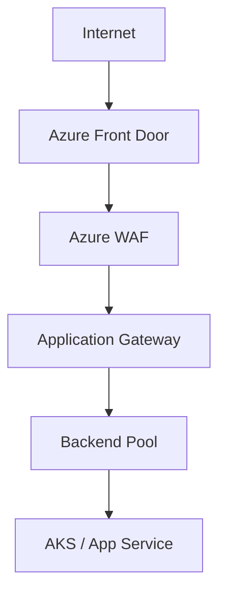
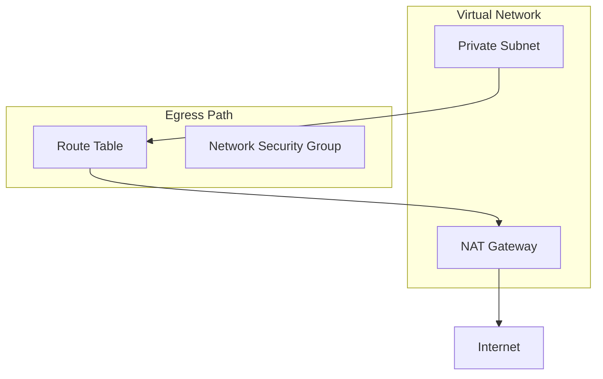
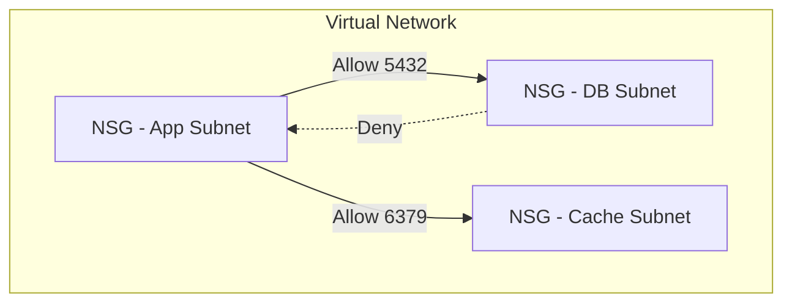
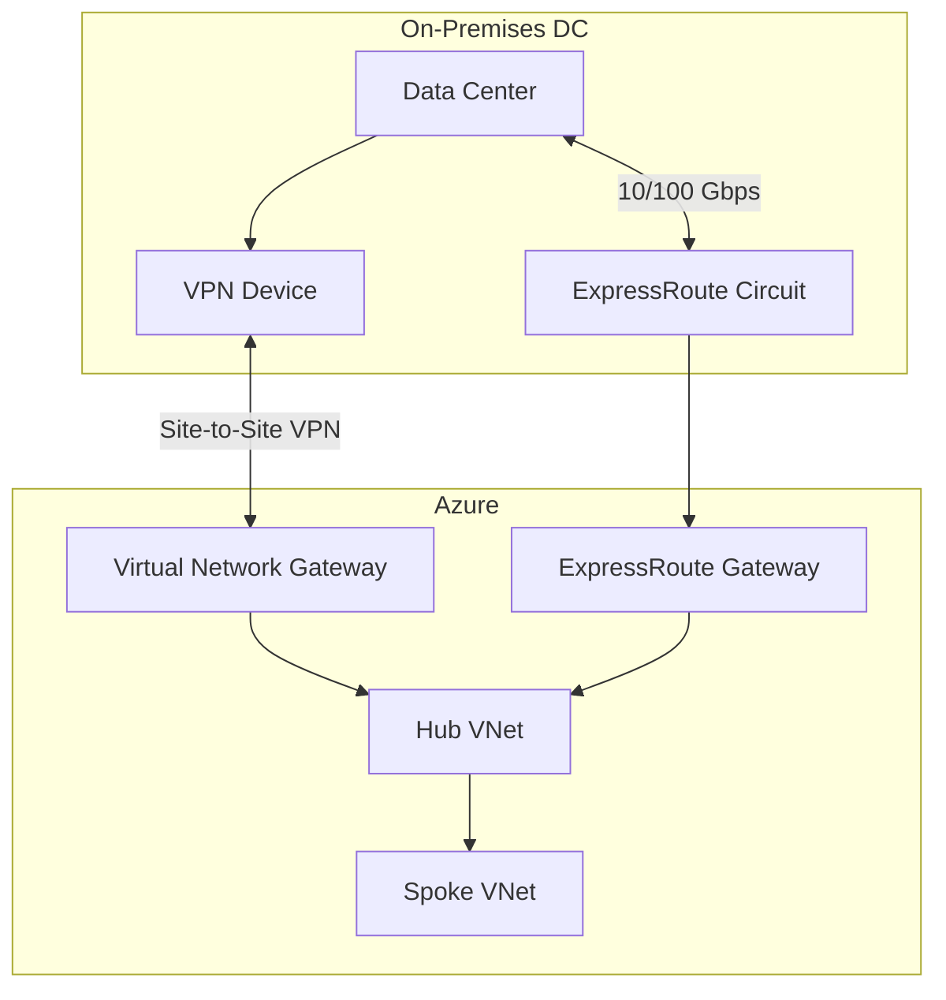
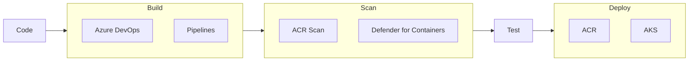
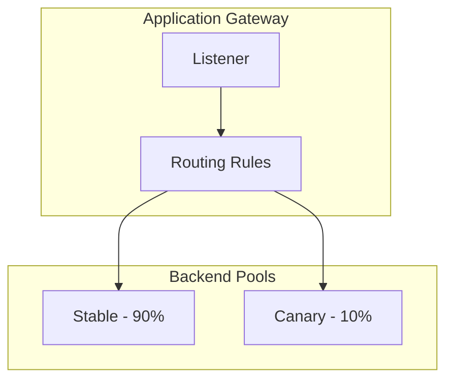
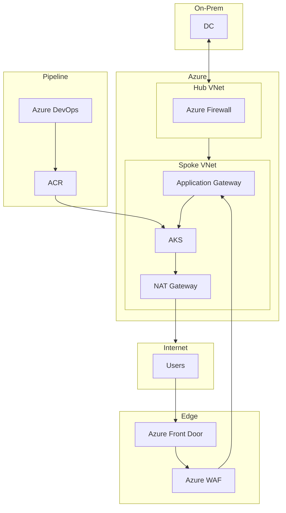

# Azure End-to-End Solution

Complete design for production, dev, and QA deployments with security in pipeline, canary releases, and full traffic control (ingress, egress, east-west, on-prem).

---

## 1. Environment Strategy (Prod, Dev, QA)

### 1.1 Subscription and Management Group Structure

```
Management Group Root
├── Platform
│   ├── logging-subscription
│   ├── security-subscription
│   └── connectivity-subscription
├── Workloads
│   ├── dev-subscription
│   ├── qa-subscription
│   └── prod-subscription
└── Sandbox
    └── sandbox-subscription
```

**Why**: Separate subscriptions per environment provide isolation, policy inheritance via management groups, and clear cost tracking. Platform subscriptions host shared connectivity, logging, and security.

### 1.2 Environment Differences

| Aspect | Dev | QA | Prod |
|--------|-----|-----|------|
| **VNet** | Dev spoke | QA spoke | Prod spoke |
| **VM/Container size** | B2s | B4ms | D4s v3 |
| **AKS node pool** | 1–2 nodes | 2–3 nodes | 5+ nodes, multi-zone |
| **ACR image scan** | Warn | Block critical | Block high + critical |
| **Defender for Cloud** | Foundational | Standard | Standard + Storage |
| **Azure Policy** | Relaxed | Stricter | Full compliance |

**Why**: Dev minimizes cost; QA mirrors prod for validation; Prod has full security and HA.

---

## 2. Network Design: Ingress, Egress, East-West

### 2.1 Ingress Control



**Components**:
- **Azure Front Door**: Global edge; SSL termination; caching; DDoS protection
- **Azure WAF**: OWASP Core Rule Set, rate limiting, geo-filtering, custom rules
- **Application Gateway**: L7 load balancer; path-based routing; SSL offload; WAF integration
- **Alternative**: Front Door Premium with WAF; no App Gateway for simpler topologies

**Why**: Front Door provides global entry and DDoS protection. WAF blocks malicious requests. Application Gateway handles L7 routing and health checks for regional backends.

### 2.2 Egress Control



**Components**:
- **NAT Gateway**: Per-region; all egress from subnets using it goes through a single public IP
- **User-Defined Routes (UDR)**: 0.0.0.0/0 via NAT Gateway for egress subnets
- **Network Security Groups (NSG)**: Egress rules; allow/deny by destination, port
- **Private Endpoints**: For Azure services (Storage, Key Vault, etc.); no internet egress for API calls

**Egress rules (example)**:
- NSG egress: Allow HTTPS to specific IP ranges (e.g., payment, analytics)
- NSG egress: Deny default for unknown destinations
- Private Endpoints: Storage, Key Vault, ACR via private link (no NAT)

**Why**: NAT Gateway centralizes egress and provides a stable outbound IP. Private Endpoints keep Azure API traffic on the backbone. NSGs enforce least-privilege egress.

### 2.3 East-West Traffic Control



**Components**:
- **Network Security Groups**: Ingress/egress rules between subnets (e.g., app subnet → db subnet on 5432)
- **Azure Firewall**: Optional; for hub-and-spoke; central east-west inspection
- **AKS Network Policy**: Calico or Azure CNI; pod-to-pod segmentation
- **Private Endpoints**: Service-to-service via private link (e.g., AKS → Azure SQL)

**Why**: NSGs enforce micro-segmentation at subnet level. A compromised app subnet cannot reach DB unless explicitly allowed. AKS Network Policy extends this to pods.

### 2.4 On-Prem to Azure Connectivity



**Components**:
- **Site-to-Site VPN**: Dual tunnel; for backup or smaller bandwidth
- **ExpressRoute**: Dedicated 1/10/100 Gbps; private connectivity; no internet
- **Virtual Network Gateway**: VPN and ExpressRoute gateways
- **Hub-and-Spoke**: Hub VNet for connectivity; spokes for workloads
- **Route propagation**: BGP over VPN and ExpressRoute for dynamic failover
- **NSG / Azure Firewall**: Restrict ingress from on-prem CIDR to specific subnets

**Why**: VPN provides redundancy; ExpressRoute provides throughput and private path. Hub-and-spoke scales to many spokes. BGP enables automatic failover.

---

## 3. Security in Pipeline (CI/CD)

### 3.1 Pipeline Architecture



### 3.2 Security Gates

| Gate | Component | Action |
|------|-----------|--------|
| **Secret scan** | Repo scanner / pipeline task | Block if secrets in repo |
| **Dependency scan** | Pipeline + Trivy / Snyk | Block critical CVEs |
| **Container scan** | ACR image scanning | Block deploy if critical/high |
| **Managed Identity** | Pipeline and pods | No service principal keys |
| **Infrastructure** | Terraform + Azure Policy | Block if policy violations |

**Why**: Security is enforced in the pipeline. Vulnerable images and non-compliant IAC are blocked before deployment.

### 3.3 Managed Identity for CI/CD

- **Azure DevOps**: Service connection with Managed Identity or federated credential
- **GitHub Actions**: OIDC with Azure; federated credential
- **AKS Pod Identity**: Pods use Managed Identity; no secrets for Azure APIs

**Why**: No long-lived secrets. Pipelines and pods use identity-based access with short-lived tokens.

### 3.4 Pipeline Stages (Example)

```
1. Trigger: Push to main / tag
2. Build: Azure Pipelines → Docker build → push to ACR
3. Scan: ACR scan → fail if critical/high CVE
4. Deploy Dev: AKS apply (auto)
5. Deploy QA: Manual approval → AKS apply
6. Deploy Prod: Manual approval → canary backend pool → full rollout
```

---

## 4. Canary Deployment Mechanism

### 4.1 AKS Canary with Application Gateway Ingress



**Components**:
- **Application Gateway Ingress Controller (AGIC)**: Manages App Gateway from Kubernetes Ingress
- **Backend pools**: One for stable, one for canary
- **Path-based or weight-based**: Route by path (e.g., /canary) or use Azure Traffic Manager for weight-based
- **Or**: **Azure Service Fabric** or **Container Apps** with revision-based traffic splitting

### 4.2 Canary Flow

1. Deploy canary deployment (new image tag)
2. Add canary pods to canary backend pool
3. Configure routing: 90% stable, 10% canary (via path or Traffic Manager)
4. Monitor Application Insights: latency, error rate, custom metrics
5. If healthy: shift to 50%, then 100%; decommission old
6. If unhealthy: route 0% to canary; roll back

**Why**: Canary limits blast radius. Issues are detected with a small fraction of traffic.

### 4.3 Container Apps Canary

- **Revisions**: Each deploy creates a revision
- **Traffic splitting**: Split traffic by revision (e.g., 90% v1, 10% v2)
- **Built-in**: No ingress controller; native revision management

**Why**: Serverless canary without managing clusters. Native traffic splitting.

---

## 5. Component Summary and Rationale

| Component | What | Why |
|-----------|------|-----|
| **Separate subscriptions** | Dev, QA, Prod | Blast radius; policy; billing |
| **Hub-and-Spoke** | Hub VNet for connectivity | Centralized firewall; shared services |
| **NAT Gateway** | Per-region egress | No public IPs; centralized egress |
| **Private Endpoints** | Private link for Azure services | No internet for Storage, Key Vault, etc. |
| **Network Security Groups** | Subnet-level firewall | East-west and north-south segmentation |
| **Azure WAF** | Web application firewall | OWASP; rate limit; geo-block |
| **Defender for Cloud** | Threat detection | VNet; Storage; AKS |
| **ACR** | Container registry | Image scanning; geo-replication |
| **Azure DevOps / GitHub** | CI/CD | Native; Managed Identity |
| **ExpressRoute** | On-prem link | Throughput; private path |

---

## 6. End-to-End Diagram


