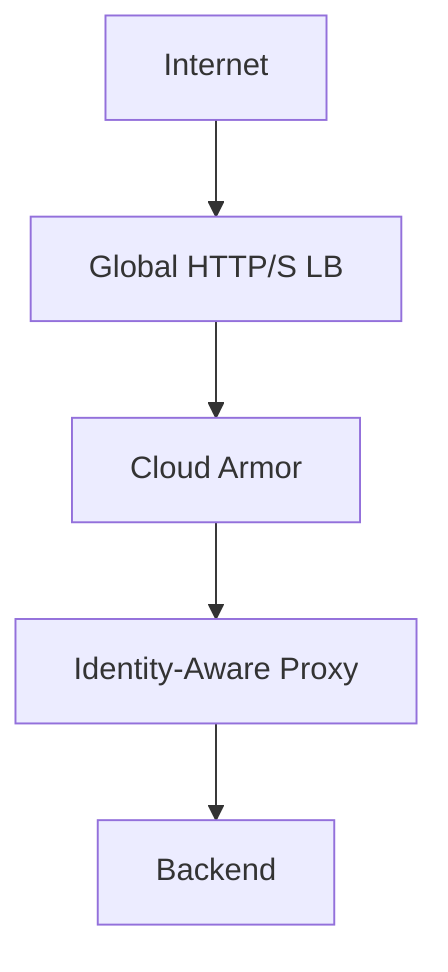
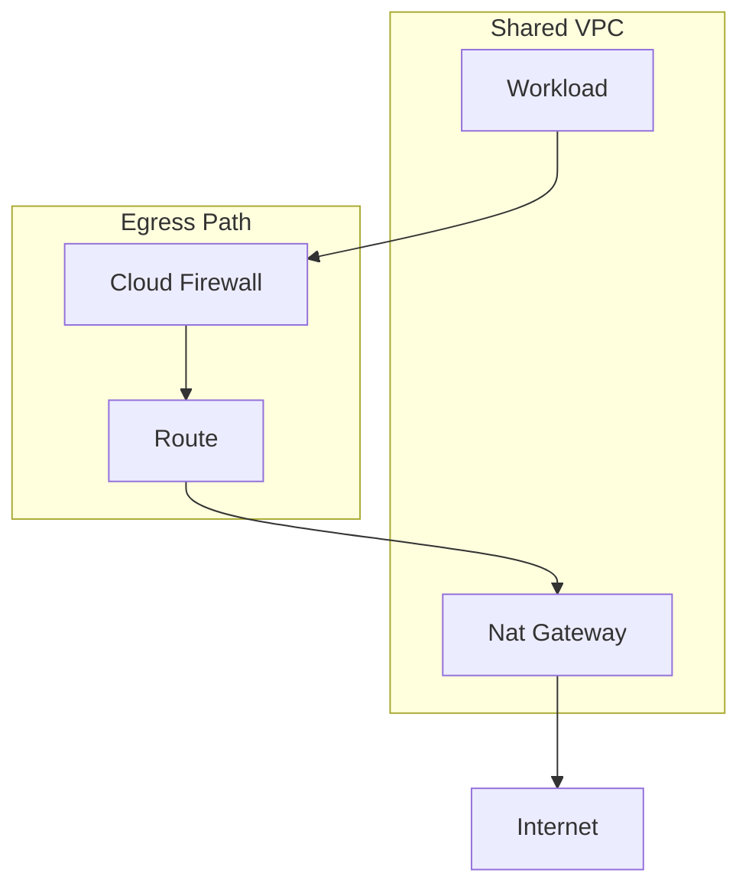
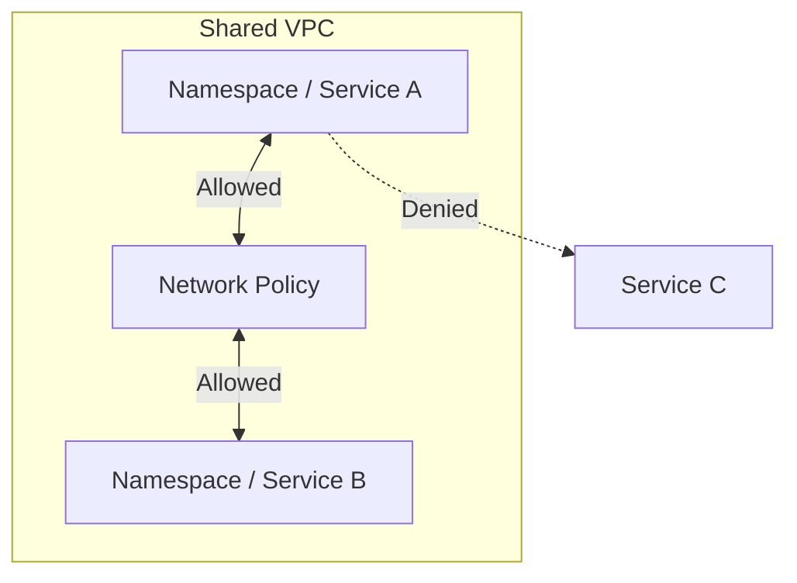
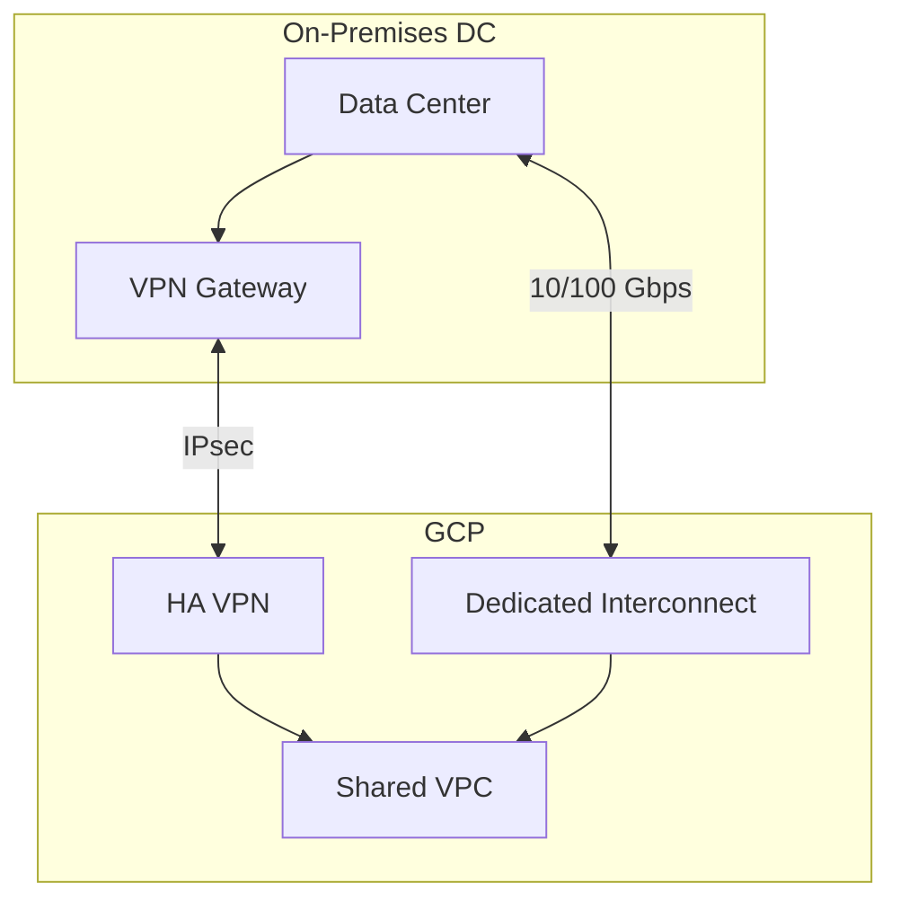
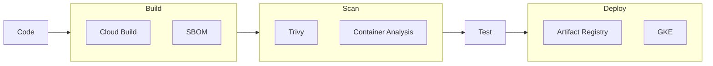
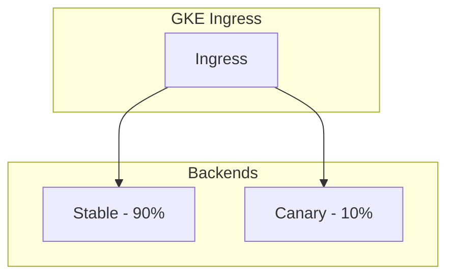
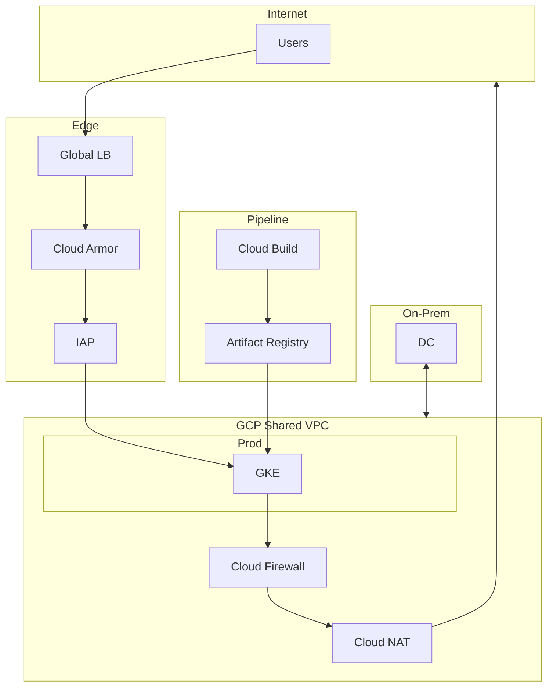

# GCP End-to-End Solution

Complete design for production, dev, and QA deployments with security in pipeline, canary releases, and full traffic control (ingress, egress, east-west, on-prem).

---

## 1. Environment Strategy (Prod, Dev, QA)

### 1.1 Folder and Project Structure

```
Organization
├── Platform (shared)
│   ├── prj-logging
│   ├── prj-security
│   └── prj-network-host
├── Dev
│   └── prj-app-dev
├── QA
│   └── prj-app-qa
└── Prod
    └── prj-app-prod
```

**Why**: Separate projects per environment isolate blast radius, enforce different IAM, and allow independent billing. Platform projects are shared to avoid duplication of logging, security, and network.

### 1.2 Environment Differences

| Aspect | Dev | QA | Prod |
|--------|-----|-----|------|
| **Shared VPC** | Attached to dev host | Attached to qa host | Attached to prod host |
| **Node size** | Smaller (e2-medium) | Same as prod | Production sizing |
| **Replicas** | 1–2 | 2–3 | 5+ |
| **Binary Auth** | Audit only | Enforce | Enforce |
| **VPC SC** | No | Optional | Yes |
| **Budget alerts** | Low threshold | Medium | High |

**Why**: Dev is cost-optimized; QA mirrors prod for validation; Prod has full security and HA.

---

## 2. Network Design: Ingress, Egress, East-West

### 2.1 Ingress Control



**Components**:
- **Global HTTP(S) Load Balancer**: Single entry point; SSL termination; global anycast
- **Cloud Armor**: WAF, DDoS, geo-restriction, rate limiting, custom rules
- **Identity-Aware Proxy (IAP)**: Identity-based access for admin/internal apps; no VPN for SSH

**Why**: Centralized ingress with WAF and identity reduces attack surface. IAP replaces bastion hosts for zero-trust access.

### 2.2 Egress Control



**Components**:
- **Cloud NAT**: Centralized egress; no public IPs on workloads
- **Cloud Firewall**: Egress rules; allow/deny by destination, port, tag
- **Route priority**: Route table ensures egress goes through NAT and firewall

**Egress rules (example)**:
- Allow: `*.googleapis.com` (API access)
- Allow: Specific SaaS IPs (e.g., payment, analytics)
- Deny: Default route for unknown destinations

**Why**: Centralized egress prevents data exfiltration and limits outbound destinations.

### 2.3 East-West Traffic Control



**Components**:
- **VPC firewall**: Ingress rules by source tag (e.g., `gke-app` can reach `gke-db`)
- **GKE Network Policy**: Calico or Cilium; pod-to-pod allow/deny
- **Service perimeter (VPC SC)**: Block cross-project data copy

**Why**: Micro-segmentation limits lateral movement. A compromised service cannot reach other workloads without explicit allow.

### 2.4 On-Prem to GCP Connectivity



**Components**:
- **HA VPN**: Dual tunnel; 99.99% SLA; for smaller bandwidth or backup
- **Dedicated Interconnect**: 10/100 Gbps; for production traffic
- **Cloud Router**: BGP for dynamic routing
- **Firewall**: Ingress from on-prem CIDR; restrict to specific subnets

**Why**: HA VPN for redundancy; Interconnect for throughput. BGP enables failover.

---

## 3. Security in Pipeline (CI/CD)

### 3.1 Pipeline Architecture



### 3.2 Security Gates

| Gate | Component | Action |
|------|-----------|--------|
| **SAST** | Cloud Build + Secret Scanner | Block if secrets found |
| **Dependency scan** | Artifact Registry / Trivy | Block CVEs above threshold |
| **Image signing** | Cloud KMS + attestation | Block unsigned images |
| **Binary Auth** | GKE Policy | Block if attestation missing |
| **IAC scan** | Terraform + Sentinel / Policy | Block if policy violations |

**Why**: Security is enforced in the pipeline, not only at runtime. Unsafe images never reach clusters.

### 3.3 Workload Identity Federation for CI/CD

- **No long-lived keys**: GitLab/GitHub uses OIDC; Cloud Build uses Workload Identity
- **Short-lived tokens**: GCP SA tokens issued per pipeline run
- **Why**: Reduces credential theft risk; tokens expire per job.

### 3.4 Pipeline Stages (Example)

```
1. Trigger: Push to main / tag
2. Build: Cloud Build → Docker build → push to Artifact Registry
3. Scan: Trivy / Artifact Registry scan → fail if critical CVE
4. Sign: KMS sign image → create attestation
5. Deploy Dev: Apply to dev GKE (auto)
6. Deploy QA: Manual approval → apply to qa GKE
7. Deploy Prod: Manual approval → canary → full rollout
```

---

## 4. Canary Deployment Mechanism

### 4.1 GKE Canary with Traffic Splitting



**Components**:
- **GKE Ingress**: NEG backends for stable and canary deployments
- **Traffic split**: `canary` annotation (e.g., `nginx.ingress.kubernetes.io/canary-weight: "10"`)
- **Or**: **Traffic Director** for advanced traffic splitting and fault injection

### 4.2 Canary Flow

1. Deploy canary with new tag (e.g., `v2`)
2. Route 10% traffic to canary via Ingress annotation
3. Monitor: latency, error rate, custom metrics
4. If healthy: increase to 50%, then 100%
5. If unhealthy: roll back; route 0% to canary

**Why**: Canary limits impact of bad releases. Errors are caught early with small user percentage.

### 4.3 Cloud Run Canary

- **Traffic splitting**: `cloud run deploy --no-traffic` then gradually add traffic
- **Revisions**: Each deploy is a revision; split traffic by revision
- **Why**: Serverless canary without managing clusters.

---

## 5. Component Summary and Rationale

| Component | What | Why |
|-----------|------|-----|
| **Shared VPC** | Single VPC; service projects attach | Centralized firewall; no peering; simpler routing |
| **Cloud Armor** | WAF at LB | OWASP; DDoS; geo-restriction |
| **Cloud NAT** | Centralized egress | No public IPs; controlled egress |
| **Cloud Firewall** | Stateful firewall | Egress rules; tag-based |
| **VPC SC** | Service perimeter | Block exfiltration; restrict cross-project |
| **Binary Auth** | Image attestation | Only signed images run |
| **Workload Identity** | Pod → GCP SA | No node SA keys; least privilege |
| **Artifact Registry** | Container registry | Vulnerability scanning; signing |
| **Cloud Build** | CI/CD | Native; Workload Identity; private pool |
| **HA VPN / Interconnect** | On-prem link | Hybrid connectivity; BGP |

---

## 6. End-to-End Diagram


