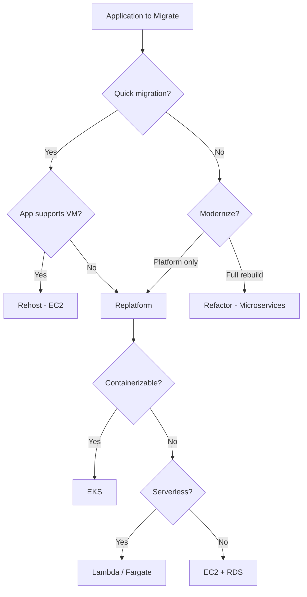
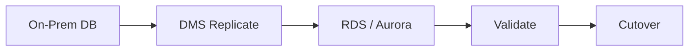
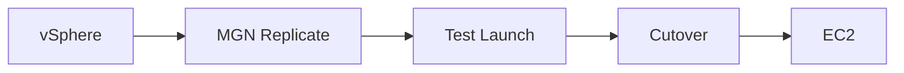

# AWS Migration Solution (Data, Application, Server, VMware)

End-to-end migration design for on-prem to AWS: data, application, server, and VMware migrations. AWS 6R strategy, decision points, discovery, cutover, and cloud-native target options.

---

## 1. AWS 6R Migration Strategy

### 1.1 The Six Rs

| Strategy | Description | Downtime | Effort | Use When |
|----------|-------------|----------|--------|-----------|
| **Rehost (Lift & Shift)** | VM → EC2; minimal change | Low–Medium | Low | Legacy; quick migration; no app changes |
| **Replatform (Lift, Tinker & Shift)** | Same app; managed services (RDS, EKS) | Medium | Medium | Want managed DB, containers; some optimization |
| **Repurchase (Drop & Shop)** | Replace with SaaS | Low | Low–Medium | CRM, ERP available as SaaS |
| **Refactor (Re-architect)** | Rebuild for cloud-native (microservices) | High | High | Strategic apps; modernize; scale |
| **Retire** | Decommission | None | Low | Unused apps |
| **Retain** | Keep on-prem | — | — | Not ready; compliance |

### 1.2 Decision Tree

---

## 2. Pre-Migration Discovery

### 2.1 What to Discover Beforehand

| Category | Items | Tools / Method |
|----------|-------|----------------|
| **Inventory** | VMs, apps, dependencies | Application Migration Service; AWS Migration Hub |
| **Network** | IPs, DNS, firewall rules | Network scan; firewall export |
| **Storage** | Disk size, IOPS, growth | VM disk metrics; CloudWatch (post-migration) |
| **Database** | Type, size, connections | DMS assessment; native tools |
| **Dependencies** | App-to-app, DB, external APIs | Application Discovery Service |
| **Compliance** | PCI, HIPAA, retention | Audit; compliance team |
| **Licensing** | OS, middleware | License inventory |
| **DNS** | Records, zones, internal resolution | Route 53; DNS export |
| **Reachability** | On-prem ↔ cloud paths | Traceroute; Direct Connect test |

### 2.2 DNS Considerations

| Item | Action |
|------|--------|
| **Internal DNS** | Route 53 private hosted zones; or hybrid (on-prem forward to Route 53) |
| **Record migration** | Export; import to Route 53; lower TTL before cutover |
| **Split-horizon** | Strategy for same name resolving differently pre/post cutover |
| **Cutover** | Lower TTL days before; switch delegation at cutover |

### 2.3 IP and Reachability

| Item | Action |
|------|--------|
| **IP addressing** | Plan VPC CIDR; avoid overlap with on-prem |
| **Reachability on-prem → cloud** | Direct Connect / VPN; firewall allow VPC CIDR |
| **Reachability cloud → on-prem** | Firewall allow VPC CIDR; route propagation |
| **Private endpoints** | VPC Endpoints for S3, RDS Proxy, etc.; no public IP |
| **Testing** | Connectivity test from on-prem to VPC before migration |

---

## 3. Data Migration

### 3.1 Database Migration Strategies

| Source | Target | Tool | Downtime |
|--------|--------|------|----------|
| **Oracle / SQL Server** | RDS | Database Migration Service (DMS) | Minimal (CDC) |
| **MySQL / PostgreSQL** | RDS / Aurora | DMS; native dump/restore | Low |
| **MongoDB** | DocumentDB | mongodump; DMS | Low |
| **Files / NAS** | S3 | DataSync; Transfer Family; rsync | Low |
| **SAP** | RDS / Redshift | DMS; SAP tools | Medium |

### 3.2 Data Migration Flow

### 3.3 Cutover Checklist

- [ ] Replication lag &lt; acceptable threshold
- [ ] Data validation (row count, checksum)
- [ ] Application config updated (connection string, DNS)
- [ ] DNS cutover planned
- [ ] Rollback plan documented
- [ ] VPC Endpoint / PrivateLink for RDS configured

---

## 4. Application Migration

### 4.1 Target Options (Refactor / Replatform)

| Target | Use When | Considerations |
|--------|----------|----------------|
| **EKS** | Microservices; need orchestration | Network policy; IAM roles for service accounts |
| **ECS Fargate** | Containers; serverless | No node management |
| **Lambda** | Event-driven; stateless | Cold start; 15 min limit |
| **EC2** | Lift & shift; legacy app | Auto Scaling; ALB |
| **App Runner** | Web apps; containers | Simpler than EKS |

### 4.2 Refactor to Microservices

| Step | Action |
|------|--------|
| **Decompose** | Identify bounded contexts; extract services |
| **API** | API Gateway; OpenAPI |
| **Data** | Per-service DB or shared with clear boundaries |
| **Deploy** | EKS or ECS per service |
| **Migrate** | Strangler fig; migrate service by service |

### 4.3 Ingress / Egress for Migrated Apps

| Direction | Control |
|----------|---------|
| **Ingress** | ALB / NLB; WAF; CloudFront |
| **Egress** | NAT Gateway; VPC Endpoints for AWS APIs; Security Groups |
| **On-prem** | Direct Connect; Security Group / NACL allow both directions |

### 4.4 Compliance During Migration

- **Data in transit**: TLS; Direct Connect private path
- **Data at rest**: KMS; encryption at rest
- **Access**: IAM; CloudTrail to central account
- **Retention**: S3 lifecycle; RDS retention

---

## 5. Server Migration (VM)

### 5.1 AWS Application Migration Service (MGN)

| Phase | Action |
|------|--------|
| **Discovery** | Agent on source; inventory in Migration Hub |
| **Replicate** | Continuous block-level sync; minimal downtime |
| **Test** | Launch instance in AWS; validate |
| **Cutover** | Stop source; final sync; launch in EC2 |

### 5.2 Minimum Downtime Strategy

| Step | Action |
|------|--------|
| **1. Replicate** | Run MGN replication; sync until lag minimal |
| **2. Pre-cutover** | Update DNS TTL; prepare runbook |
| **3. Cutover window** | Stop app; final sync; launch in EC2; update DNS |
| **4. Validate** | Smoke test; CloudWatch |
| **5. Rollback** | If fail; revert DNS; restart on-prem |

### 5.3 What to Discover for Server Migration

| Item | Why |
|------|-----|
| **VM specs** | Right-size in EC2 |
| **Disks** | Size; type (gp3, io2) |
| **Network** | IP; Security Group; dependencies |
| **Boot order** | Multi-disk VMs |
| **Licensing** | BYOL vs license-included AMI |
| **Agents** | Antivirus; backup; remove before migration |

### 5.4 Private Endpoints for Migrated Servers

- **VPC Endpoints**: For S3, ECR, CloudWatch from EC2
- **RDS**: Private subnet; no public IP
- **No public IP**: EC2 with only private IP; access via Session Manager

---

## 6. VMware Migration

### 6.1 AWS Application Migration Service (VMware)

| Capability | Description |
|------------|-------------|
| **Source** | VMware vSphere (on-prem or VMware Cloud on AWS) |
| **Process** | Replicate → Cutover |
| **Network** | Preserve or remap IPs |
| **Storage** | Convert to EBS |

### 6.2 Discovery and Tools

| Tool | Purpose |
|------|---------|
| **AWS Application Migration Service** | Discovery; replication; cutover |
| **Application Discovery Service** | Dependency mapping; assessment |
| **Migration Hub** | Central view; tracking |
| **Manual** | Network diagram; firewall rules; DNS |

### 6.3 VMware Migration Flow

### 6.4 VMware Discovery Checklist

| Item | Tool / Method |
|------|---------------|
| **vCenter inventory** | MGN replication agent; Migration Hub |
| **VM config** | vCPU, RAM, disk, NIC |
| **Storage layout** | Datastore; thin vs thick |
| **Network** | vSwitch; port group; VLAN |
| **Dependencies** | Application Discovery Service |
| **Snapshots** | Consolidate before migration |
| **Tools** | Application Migration Service; Migration Hub; Application Discovery Service |

### 6.5 Considerations

| Item | Action |
|------|--------|
| **vMotion / DRS** | Not applicable; use Auto Scaling |
| **vCenter** | No equivalent; use EC2 Console / CloudFormation |
| **Storage** | vmdk → EBS |
| **Network** | VPC; subnets; Security Groups; no vSwitch |

---

## 7. Cutover Planning

### 7.1 Cutover Checklist

- [ ] Connectivity verified (on-prem ↔ cloud)
- [ ] DNS updated or ready to switch
- [ ] Security Groups / NACLs allow required traffic
- [ ] VPC Endpoints configured
- [ ] Replication lag acceptable
- [ ] Rollback plan documented
- [ ] Stakeholders notified

### 7.2 Cutover Sequence (Example)

1. **T-1 week**: Lower DNS TTL; final discovery
2. **T-1 day**: Freeze changes; final replication
3. **T-0**: Stop app; final sync; launch in AWS; update DNS
4. **T+1 hour**: Validate; monitor CloudWatch
5. **T+24 hours**: Decommission on-prem if stable

---

## 8. EKS Fleet Management

| Capability | Tool |
|------------|------|
| **Multi-cluster** | EKS; separate clusters per env |
| **GitOps** | ArgoCD; Flux |
| **Policy** | OPA Gatekeeper; Kyverno |

---

## 9. On-Prem & AWS Outpost

| Option | Use Case |
|--------|----------|
| **Outpost** | Run EC2, EKS, RDS in DC |
| **Direct Connect** | High throughput |
| **Site-to-Site VPN** | Backup |

---

## 10. Data & Migration from Other Clouds

| Source | Target | Tool |
|--------|--------|------|
| **GCP** | S3, EC2 | rclone; Transfer Family; VM import |
| **Azure** | S3, EC2 | DataSync; rclone; VM import |

---

## 11. Component Summary

| Migration Type | AWS Tool / Service | Key Consideration |
|----------------|-------------------|-------------------|
| **Data** | DMS, DataSync, Transfer Family | CDC; validation; VPC Endpoint for RDS |
| **Application** | Application Migration Service, EKS, ECS | Target choice; VPC Endpoints |
| **Server** | Application Migration Service (MGN) | Replicate; cutover; right-size |
| **VMware** | Application Migration Service | vSphere source; Migration Hub |
| **Fleet** | EKS; ArgoCD | Multi-cluster; GitOps |
| **On-prem** | Outpost; Direct Connect | Hybrid |
| **Cross-cloud** | DataSync; rclone; VM import | GCP/Azure → AWS |
