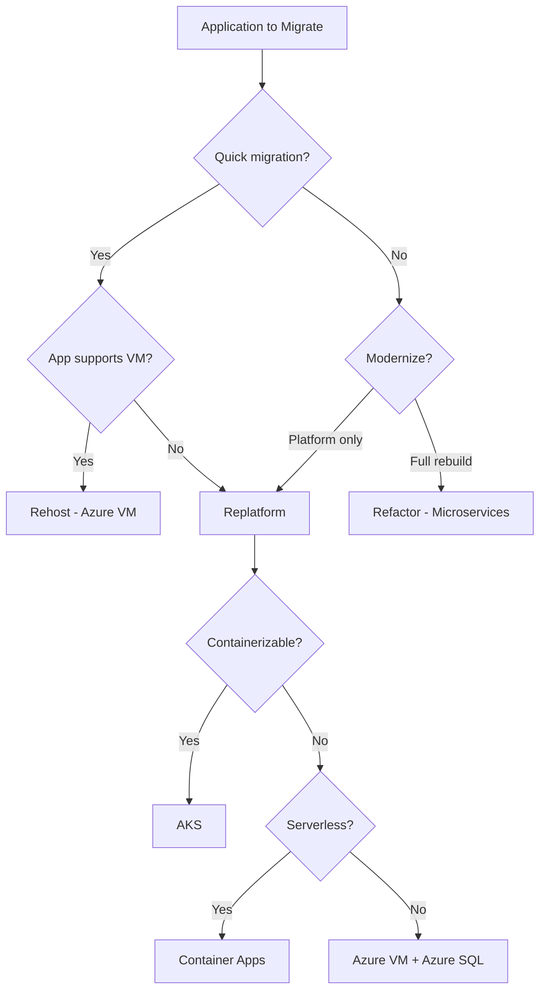
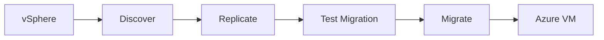

# Azure Migration Solution (Data, Application, Server, VMware)

End-to-end migration design for on-prem to Azure: data, application, server, and VMware migrations. 6R strategy, decision points, discovery, cutover, and cloud-native target options.

---

## 1. Migration Strategy (6R-Aligned)

### 1.1 The Six Rs

| Strategy | Description | Downtime | Effort | Use When |
|----------|-------------|----------|--------|-----------|
| **Rehost (Lift & Shift)** | VM → Azure VM; minimal change | Low–Medium | Low | Legacy; quick migration; no app changes |
| **Replatform (Lift, Tinker & Shift)** | Same app; managed services (Azure SQL, AKS) | Medium | Medium | Want managed DB, containers; some optimization |
| **Repurchase** | Replace with SaaS | Low | Low–Medium | CRM, ERP available as SaaS |
| **Refactor (Re-architect)** | Rebuild for cloud-native (microservices) | High | High | Strategic apps; modernize; scale |
| **Retire** | Decommission | None | Low | Unused apps |
| **Retain** | Keep on-prem | — | — | Not ready; compliance |

### 1.2 Decision Tree

---

## 2. Pre-Migration Discovery

### 2.1 What to Discover Beforehand

| Category | Items | Tools / Method |
|----------|-------|----------------|
| **Inventory** | VMs, apps, dependencies | Azure Migrate; MAP | |
| **Network** | IPs, DNS, firewall rules | Network scan; firewall export |
| **Storage** | Disk size, IOPS, growth | VM disk metrics |
| **Database** | Type, size, connections | DMA; native tools |
| **Dependencies** | App-to-app, DB, external APIs | Azure Migrate dependency analysis |
| **Compliance** | PCI, HIPAA, retention | Audit; compliance team |
| **Licensing** | OS, middleware | License inventory |
| **DNS** | Records, zones, internal resolution | Azure DNS; DNS export |
| **Reachability** | On-prem ↔ cloud paths | Traceroute; ExpressRoute test |

### 2.2 DNS Considerations

| Item | Action |
|------|--------|
| **Internal DNS** | Azure DNS private zones; or hybrid (on-prem forward to Azure DNS) |
| **Record migration** | Export; import to Azure DNS; lower TTL before cutover |
| **Split-horizon** | Strategy for same name resolving differently pre/post cutover |
| **Cutover** | Lower TTL days before; switch delegation at cutover |

### 2.3 IP and Reachability

| Item | Action |
|------|--------|
| **IP addressing** | Plan VNet CIDR; avoid overlap with on-prem |
| **Reachability on-prem → cloud** | ExpressRoute / VPN; NSG allow VNet CIDR |
| **Reachability cloud → on-prem** | Firewall allow VNet CIDR; route propagation |
| **Private endpoints** | Private Endpoint for Storage, SQL, etc.; no public IP |
| **Testing** | Connectivity test from on-prem to VNet before migration |

---

## 3. Data Migration

### 3.1 Database Migration Strategies

| Source | Target | Tool | Downtime |
|--------|--------|------|----------|
| **Oracle / SQL Server** | Azure SQL | Database Migration Service (DMS) | Minimal (CDC) |
| **MySQL / PostgreSQL** | Azure Database for MySQL/PostgreSQL | DMS; native dump/restore | Low |
| **MongoDB** | Cosmos DB (Mongo API) | mongodump; Azure Data Factory | Low |
| **Files / NAS** | Blob Storage | Data Box; AzCopy; rsync | Low |
| **SAP** | Azure SQL / Synapse | DMS; SAP tools | Medium |

### 3.2 Data Migration Flow

### 3.3 Cutover Checklist

- [ ] Replication lag &lt; acceptable threshold
- [ ] Data validation (row count, checksum)
- [ ] Application config updated (connection string, DNS)
- [ ] DNS cutover planned
- [ ] Rollback plan documented
- [ ] Private Endpoint for Azure SQL configured

---

## 4. Application Migration

### 4.1 Target Options (Refactor / Replatform)

| Target | Use When | Considerations |
|--------|----------|----------------|
| **AKS** | Microservices; need orchestration | Network policy; Managed Identity |
| **Container Apps** | Containers; serverless | Simpler than AKS |
| **Azure Functions** | Event-driven; stateless | Cold start; 10 min limit |
| **Azure VM** | Lift & shift; legacy app | Scale Set; Load Balancer |
| **App Service** | Web apps; PaaS | Less control; simpler ops |

### 4.2 Refactor to Microservices

| Step | Action |
|------|--------|
| **Decompose** | Identify bounded contexts; extract services |
| **API** | API Management; OpenAPI |
| **Data** | Per-service DB or shared with clear boundaries |
| **Deploy** | AKS or Container Apps per service |
| **Migrate** | Strangler fig; migrate service by service |

### 4.3 Ingress / Egress for Migrated Apps

| Direction | Control |
|----------|---------|
| **Ingress** | Application Gateway; Front Door; WAF |
| **Egress** | NAT Gateway; Private Endpoints for Azure APIs; NSG |
| **On-prem** | ExpressRoute; NSG allow both directions |

### 4.4 Compliance During Migration

- **Data in transit**: TLS; ExpressRoute private path
- **Data at rest**: Key Vault; encryption at rest
- **Access**: RBAC; Diagnostic logs to Log Analytics
- **Retention**: Blob lifecycle; SQL retention

---

## 5. Server Migration (VM)

### 5.1 Azure Migrate: Server Migration

| Phase | Action |
|------|--------|
| **Discovery** | Agent or agentless; inventory in Azure Migrate |
| **Replicate** | Continuous sync; minimal downtime |
| **Test** | Test migration; validate in Azure |
| **Migrate** | Stop source; final sync; create Azure VM |

### 5.2 Minimum Downtime Strategy

| Step | Action |
|------|--------|
| **1. Replicate** | Run replication; sync until lag minimal |
| **2. Pre-cutover** | Update DNS TTL; prepare runbook |
| **3. Cutover window** | Stop app; final sync; migrate to Azure VM; update DNS |
| **4. Validate** | Smoke test; Azure Monitor |
| **5. Rollback** | If fail; revert DNS; restart on-prem |

### 5.3 What to Discover for Server Migration

| Item | Why |
|------|-----|
| **VM specs** | Right-size in Azure (vCPU, memory) |
| **Disks** | Size; type (Premium SSD, Ultra) |
| **Network** | IP; NSG; dependencies |
| **Boot order** | Multi-disk VMs |
| **Licensing** | BYOL vs Azure Hybrid Benefit |
| **Agents** | Antivirus; backup; remove before migration |

### 5.4 Private Endpoints for Migrated Servers

- **Private Endpoint**: For Storage, Key Vault, Azure SQL from Azure VM
- **Azure SQL**: Private Endpoint; no public access
- **No public IP**: Azure VM with only private IP; access via Bastion

---

## 6. VMware Migration

### 6.1 Azure Migrate: VMware Migration

| Capability | Description |
|------------|-------------|
| **Source** | VMware vSphere (on-prem or AVS) |
| **Process** | Replicate → Migrate |
| **Network** | Preserve or remap IPs |
| **Storage** | Convert to managed disks |

### 6.2 Discovery and Tools

| Tool | Purpose |
|------|---------|
| **Azure Migrate** | Discovery; replication; migration |
| **Dependency analysis** | Agent-based; VM mapping |
| **Manual** | Network diagram; firewall rules; DNS |

### 6.3 VMware Migration Flow

### 6.4 VMware Discovery Checklist

| Item | Tool / Method |
|------|---------------|
| **vCenter inventory** | Azure Migrate appliance / agent |
| **VM config** | vCPU, RAM, disk, NIC |
| **Storage layout** | Datastore; thin vs thick |
| **Network** | vSwitch; port group; VLAN |
| **Dependencies** | Azure Migrate dependency analysis |
| **Snapshots** | Consolidate before migration |
| **Tools** | Azure Migrate; Dependency analysis (agent-based) |

### 6.5 Considerations

| Item | Action |
|------|--------|
| **vMotion / DRS** | Not applicable; use Scale Set |
| **vCenter** | No equivalent; use Azure Portal / ARM |
| **Storage** | vmdk → managed disk |
| **Network** | VNet; subnets; NSG; no vSwitch |

---

## 7. Cutover Planning

### 7.1 Cutover Checklist

- [ ] Connectivity verified (on-prem ↔ cloud)
- [ ] DNS updated or ready to switch
- [ ] NSG rules allow required traffic
- [ ] Private Endpoints configured
- [ ] Replication lag acceptable
- [ ] Rollback plan documented
- [ ] Stakeholders notified

### 7.2 Cutover Sequence (Example)

1. **T-1 week**: Lower DNS TTL; final discovery
2. **T-1 day**: Freeze changes; final replication
3. **T-0**: Stop app; final sync; migrate to Azure; update DNS
4. **T+1 hour**: Validate; monitor Azure Monitor
5. **T+24 hours**: Decommission on-prem if stable

---

## 8. AKS Fleet Management

| Capability | Tool |
|------------|------|
| **Multi-cluster** | AKS; separate clusters per env |
| **GitOps** | ArgoCD; Flux |
| **Policy** | OPA Gatekeeper; Kyverno |

---

## 9. On-Prem & Azure Arc

| Option | Use Case |
|--------|----------|
| **Azure Arc** | Manage on-prem VMs, K8s, SQL from Azure |
| **ExpressRoute** | High throughput |
| **Site-to-Site VPN** | Backup |

---

## 10. Data & Migration from Other Clouds

| Source | Target | Tool |
|--------|--------|------|
| **AWS** | Blob, Azure VM | AzCopy; Data Factory; Azure Migrate |
| **GCP** | Blob, Azure VM | AzCopy; rclone; VM import |

---

## 11. Component Summary

| Migration Type | Azure Tool / Service | Key Consideration |
|----------------|---------------------|-------------------|
| **Data** | Database Migration Service, Data Box, AzCopy | CDC; validation; Private Endpoint for SQL |
| **Application** | Azure Migrate, AKS, Container Apps | Target choice; Private Endpoints |
| **Server** | Azure Migrate (Server Migration) | Replicate; cutover; right-size |
| **VMware** | Azure Migrate | vSphere source; dependency analysis |
| **Fleet** | AKS; ArgoCD | Multi-cluster; GitOps |
| **On-prem** | Azure Arc; ExpressRoute | Hybrid |
| **Cross-cloud** | AzCopy; Data Factory; Azure Migrate | AWS/GCP → Azure |
