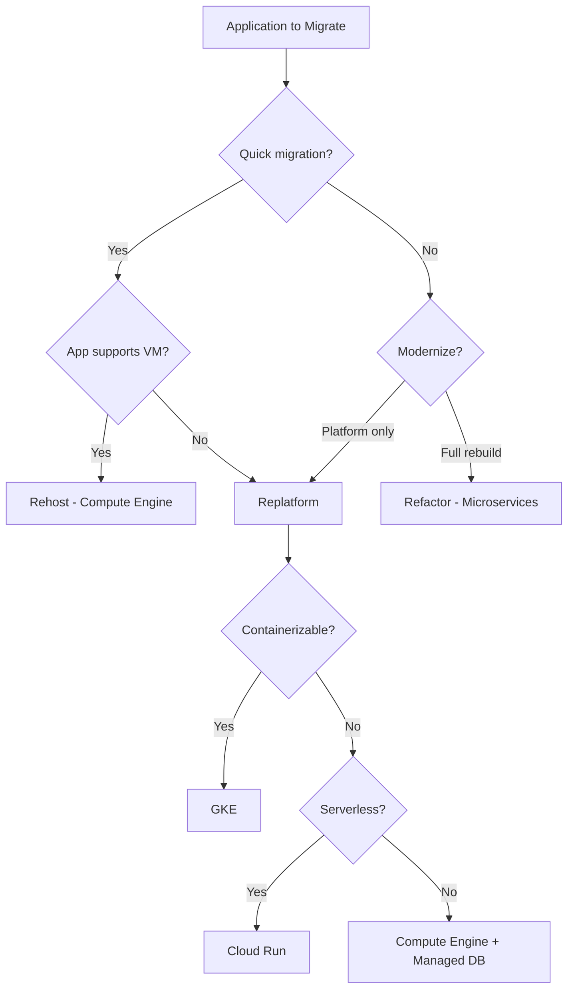
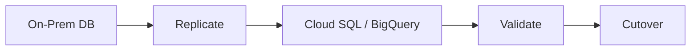
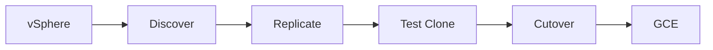
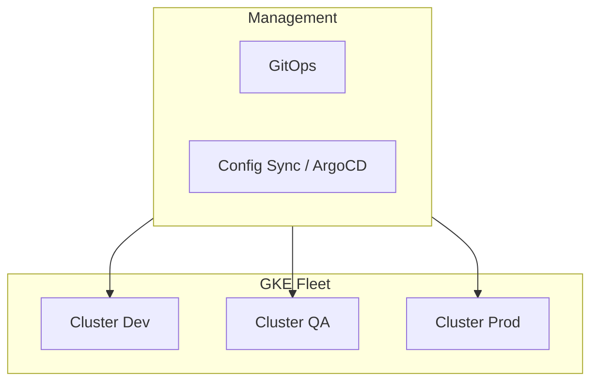
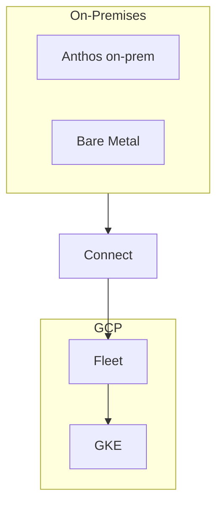
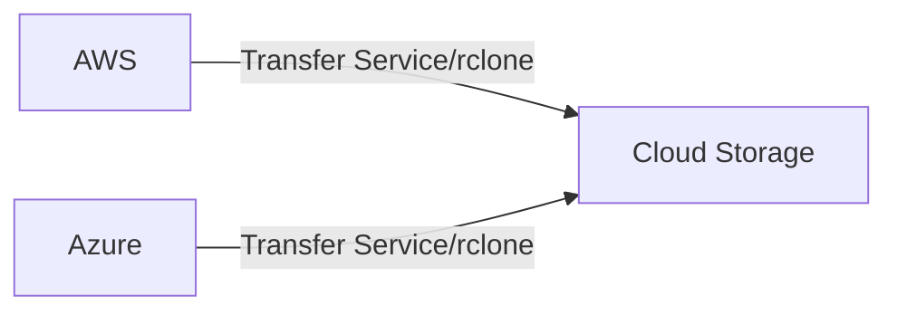

# GCP Migration Solution (Data, Application, Server, VMware)

End-to-end migration design for on-prem to GCP: data, application, server, and VMware migrations. Decision points, discovery, cutover, and cloud-native target options.

---

## 1. Migration Strategy Decision Framework

### 1.1 Rehost vs Replatform vs Refactor (6R-Aligned)

| Strategy | Description | Downtime | Effort | Use When |
|----------|-------------|----------|--------|-----------|
| **Rehost (Lift & Shift)** | VM → Compute Engine; minimal change | Low–Medium | Low | Legacy; quick migration; no app changes |
| **Replatform** | Same app; managed services (Cloud SQL, GKE) | Medium | Medium | Want managed DB, containers; some optimization |
| **Refactor** | Rebuild for cloud-native (microservices) | High | High | Strategic apps; modernize; scale |
| **Repurchase** | Replace with SaaS | Low | Low–Medium | CRM, ERP available as SaaS |
| **Retire** | Decommission | None | Low | Unused apps |
| **Retain** | Keep on-prem | — | — | Not ready; compliance |

### 1.2 Decision Tree

---

## 2. Pre-Migration Discovery

### 2.1 What to Discover Beforehand

| Category | Items | Tools / Method |
|----------|-------|----------------|
| **Inventory** | VMs, apps, dependencies | Migrate for Compute Engine discovery; manual |
| **Network** | IPs, DNS, firewall rules | Network scan; firewall export |
| **Storage** | Disk size, IOPS, growth | VM disk metrics |
| **Database** | Type, size, connections | Native tools; migration assessment |
| **Dependencies** | App-to-app, DB, external APIs | Dependency mapping; APM |
| **Compliance** | PCI, HIPAA, retention | Audit; compliance team |
| **Licensing** | OS, middleware | License inventory |
| **DNS** | Records, zones, internal resolution | DNS export; dig/nslookup |
| **Reachability** | On-prem ↔ cloud paths | Traceroute; connectivity test |

### 2.2 DNS Considerations

| Item | Action |
|------|--------|
| **Internal DNS** | Cloud DNS private zones; or hybrid (on-prem DNS forward to Cloud DNS) |
| **Record migration** | Export; import to Cloud DNS; update TTL before cutover |
| **Split-horizon** | Devise strategy for same name resolving differently pre/post cutover |
| **Cutover** | Lower TTL days before; switch delegation at cutover |

### 2.3 IP and Reachability

| Item | Action |
|------|--------|
| **IP addressing** | Plan VPC CIDR; avoid overlap with on-prem |
| **Reachability on-prem → cloud** | Interconnect/HA VPN; firewall allow cloud CIDR |
| **Reachability cloud → on-prem** | Firewall allow cloud CIDR; route propagation |
| **Private endpoints** | PSC for Google APIs; PSA for Cloud SQL; no public IP |
| **Testing** | Connectivity test from on-prem to cloud VPC before migration |

---

## 3. Data Migration

### 3.1 Database Migration Strategies

| Source | Target | Tool | Downtime |
|--------|--------|------|----------|
| **Oracle / SQL Server** | Cloud SQL | Database Migration Service (DMS) | Minimal (CDC) |
| **MySQL / PostgreSQL** | Cloud SQL | DMS; pg_dump/mysqldump | Low |
| **MongoDB** | Atlas / self-managed on GCE | mongodump; Datastream | Low |
| **Files / NAS** | Cloud Storage | Transfer Service; rsync | Low |
| **SAP** | Cloud SQL / BigQuery | DMS; SAP tools | Medium |

### 3.2 Data Migration Flow

### 3.3 Cutover Checklist

- [ ] Replication lag &lt; acceptable threshold
- [ ] Data validation (row count, checksum)
- [ ] Application config updated (connection string, DNS)
- [ ] DNS cutover planned
- [ ] Rollback plan documented
- [ ] Private endpoint / PSA configured for Cloud SQL

---

## 4. Application Migration

### 4.1 Target Options (Refactor / Replatform)

| Target | Use When | Considerations |
|--------|----------|----------------|
| **GKE** | Microservices; need orchestration | Network policy; Workload Identity; Ingress |
| **Cloud Run** | Stateless; HTTP/gRPC; scale to zero | VPC connector for private DB |
| **GCE (VM)** | Lift & shift; legacy app | Managed instance groups; load balancer |
| **App Engine** | Web apps; PaaS | Less control; simpler ops |

### 4.2 Refactor to Microservices

| Step | Action |
|------|--------|
| **Decompose** | Identify bounded contexts; extract services |
| **API** | API Gateway or GKE Ingress; OpenAPI |
| **Data** | Per-service DB or shared with clear boundaries |
| **Deploy** | GKE or Cloud Run per service |
| **Migrate** | Strangler fig; migrate service by service |

### 4.3 Ingress / Egress for Migrated Apps

| Direction | Control |
|----------|---------|
| **Ingress** | Global/Regional LB; Cloud Armor; IAP for admin |
| **Egress** | Cloud NAT; PSC for Google APIs; firewall rules |
| **On-prem** | Interconnect; firewall allow both directions |

### 4.4 Compliance During Migration

- **Data in transit**: TLS; Interconnect private path
- **Data at rest**: CMEK for regulated data
- **Access**: IAM; audit logs to central logging project
- **Retention**: Lifecycle rules; BigQuery TTL

---

## 5. Server Migration (VM)

### 5.1 Migrate for Compute Engine (Velostrata)

| Phase | Action |
|------|--------|
| **Discovery** | Agent or agentless; inventory VMs |
| **Replicate** | Continuous sync; minimal downtime |
| **Test** | Clone in GCP; validate |
| **Cutover** | Stop source; final sync; start in GCE |

### 5.2 Minimum Downtime Strategy

| Step | Action |
|------|--------|
| **1. Replicate** | Run replication; sync until lag minimal |
| **2. Pre-cutover** | Update DNS TTL; prepare runbook |
| **3. Cutover window** | Stop app; final sync; start in GCE; update DNS |
| **4. Validate** | Smoke test; monitor |
| **5. Rollback** | If fail; revert DNS; restart on-prem |

### 5.3 What to Discover for Server Migration

| Item | Why |
|------|-----|
| **VM specs** | Right-size in GCE |
| **Disks** | Size; type (SSD vs HDD) |
| **Network** | IP; firewall; dependencies |
| **Boot order** | Multi-disk VMs |
| **Licensing** | BYOL vs license-included image |
| **Agents** | Antivirus; backup; remove before migration |

### 5.4 Private Endpoints for Migrated Servers

- **PSC**: For Google APIs (Storage, Pub/Sub) from GCE
- **PSA**: For Cloud SQL if app connects to DB
- **No public IP**: GCE with only private IP; access via IAP tunnel

---

## 6. VMware Migration

### 6.1 Migrate for Compute Engine (VMware)

| Capability | Description |
|------------|-------------|
| **Source** | VMware vSphere (on-prem or VMware Cloud) |
| **Process** | Replicate → Cutover |
| **Network** | Preserve or remap IPs |
| **Storage** | Convert to persistent disks |

### 6.2 Discovery and Tools

| Tool | Purpose |
|------|---------|
| **Migrate for Compute Engine** | Discovery; replication; cutover |
| **Stratosphere** | Assessment; dependency mapping |
| **Manual** | Network diagram; firewall rules; DNS |

### 6.3 VMware Migration Flow

### 6.4 VMware Discovery Checklist

| Item | Tool / Method |
|------|---------------|
| **vCenter inventory** | Migrate for Compute Engine connector |
| **VM config** | vCPU, RAM, disk, NIC |
| **Storage layout** | Datastore; thin vs thick |
| **Network** | vSwitch; port group; VLAN |
| **Dependencies** | vMotion history; app mapping |
| **Snapshots** | Consolidate before migration |
| **Tools** | Migrate for Compute Engine; Stratosphere (assessment) |

### 6.5 Considerations

| Item | Action |
|------|--------|
| **vMotion / DRS** | Not applicable in GCE; use managed instance groups |
| **vCenter** | No equivalent; use GCP Console / Terraform |
| **Storage** | vmdk → persistent disk |
| **Network** | VPC; subnets; firewall; no vSwitch |

---

## 7. Cutover Planning

### 7.1 Cutover Checklist

- [ ] Connectivity verified (on-prem ↔ cloud)
- [ ] DNS updated or ready to switch
- [ ] Firewall rules allow required traffic
- [ ] Private endpoints (PSC, PSA) configured
- [ ] Replication lag acceptable
- [ ] Rollback plan documented
- [ ] Stakeholders notified

### 7.2 Cutover Sequence (Example)

1. **T-1 week**: Lower DNS TTL; final discovery
2. **T-1 day**: Freeze changes; final replication
3. **T-0**: Stop app; final sync; start in GCP; update DNS
4. **T+1 hour**: Validate; monitor
5. **T+24 hours**: Decommission on-prem if stable

---

## 8. GKE Fleet Management

### 8.1 GKE Fleet Architecture

### 8.2 Fleet Management

| Capability | Tool |
|------------|------|
| **Multi-cluster** | GKE; separate clusters per env |
| **GitOps** | Config Sync; ArgoCD; Flux |
| **Policy** | Policy Controller; Gatekeeper |
| **Upgrade** | Release channel; node upgrade |

---

## 9. On-Prem & Anthos

### 9.1 Anthos Architecture

### 9.2 Anthos Use Cases

- Run GKE on-prem; hybrid; multi-cloud
- Unified management; policy

### 9.3 On-Prem Connectivity

| Option | Use Case |
|--------|----------|
| **Interconnect** | High throughput |
| **HA VPN** | Backup |
| **Anthos** | GKE on-prem |

---

## 10. Data Transfer from Other Clouds

### 10.1 AWS → GCP

| Data Type | Tool |
|-----------|------|
| **S3 → Cloud Storage** | Transfer Service; rclone |
| **RDS** | DMS; export/import |
| **EC2** | Export AMI; import to GCE |

### 10.2 Azure → GCP

| Data Type | Tool |
|-----------|------|
| **Blob → Cloud Storage** | Transfer Service; rclone |
| **Azure SQL** | DMS; export/import |
| **Azure VM** | Export VHD; import to GCE |

### 10.3 Cross-Cloud Data Flow

---

## 11. Server & Application Migration from Other Clouds

### 11.1 AWS → GCP

| Source | Target | Tool |
|--------|--------|------|
| **EC2** | GCE | Export VM; Migrate for Compute Engine |
| **EKS** | GKE | Containerize; redeploy |

### 11.2 Azure → GCP

| Source | Target | Tool |
|--------|--------|------|
| **Azure VM** | GCE | Export VHD; import to GCE |
| **AKS** | GKE | Containerize; redeploy |

### 11.3 Application Migration from Cloud

- Export containers; push to Artifact Registry; deploy to GKE
- Database: DMS or export/import

---

## 12. Component Summary

| Migration Type | GCP Tool / Service | Key Consideration |
|----------------|--------------------|-------------------|
| **Data** | Database Migration Service, Transfer Service | CDC; validation; PSA for Cloud SQL |
| **Application** | Migrate for Compute Engine, GKE, Cloud Run | Target choice; VPC connector |
| **Server** | Migrate for Compute Engine | Replicate; cutover; right-size |
| **VMware** | Migrate for Compute Engine | vSphere source; discovery |
| **Fleet** | GKE; Config Sync; Fleet | Multi-cluster; GitOps |
| **On-prem** | Anthos; Interconnect | Hybrid; GKE on-prem |
| **Cross-cloud** | Transfer Service; rclone | AWS/Azure → GCP |
