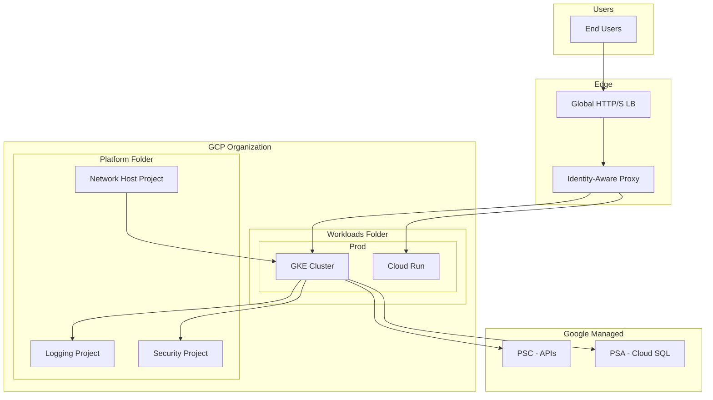
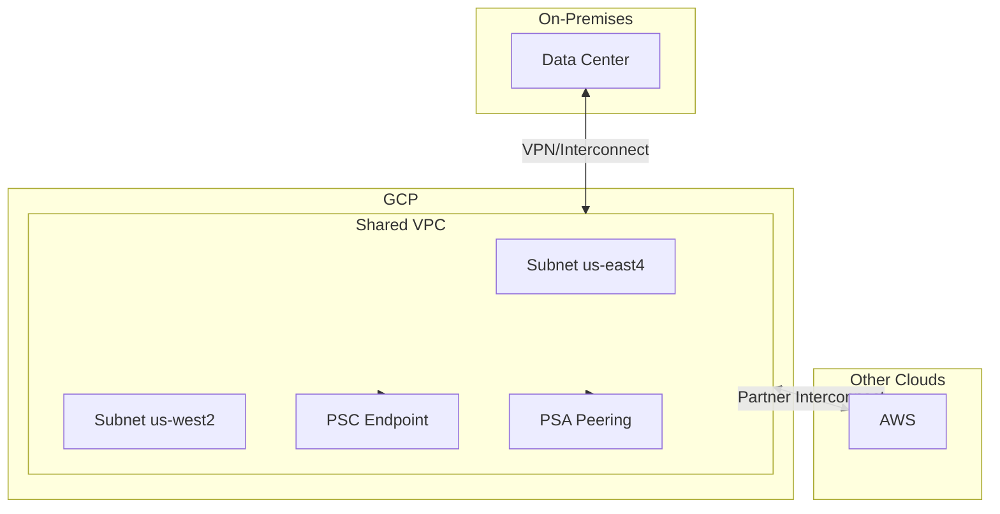
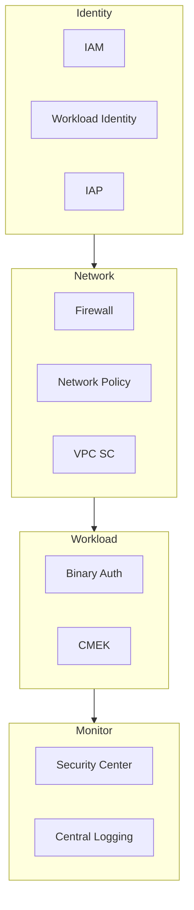
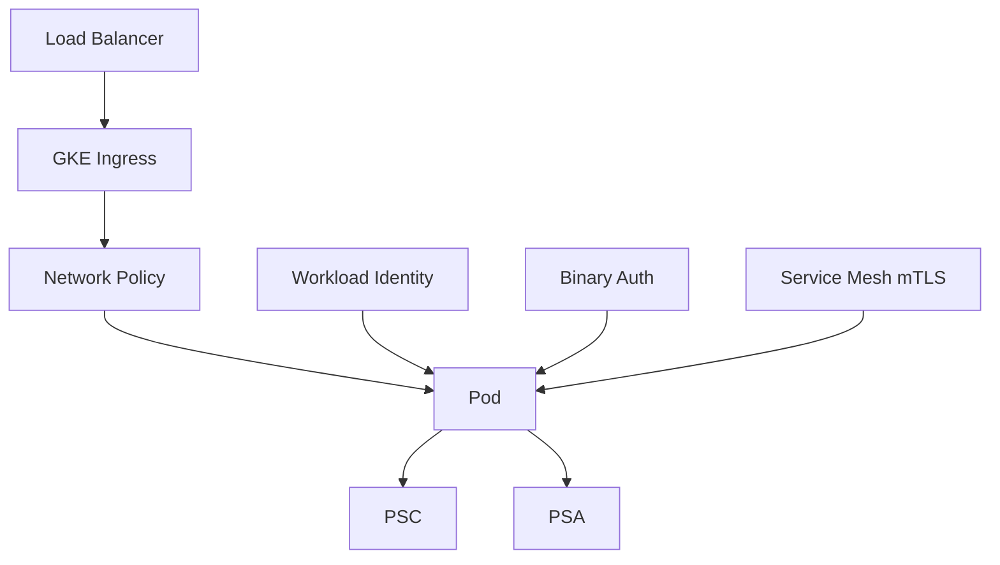

# Master Architecture Diagrams

## End-to-End GCP Landing Zone

```mermaid
flowchart TB
    subgraph Users["Users"]
        U[End Users]
    end
    
    subgraph Edge["Edge"]
        LB[Global HTTP/S LB]
        IAP[Identity-Aware Proxy]
    end
    
    subgraph Org["GCP Organization"]
        subgraph Platform["Platform Folder"]
            Log[Logging Project]
            Sec[Security Project]
            Net[Network Host Project]
        end
        
        subgraph Workloads["Workloads Folder"]
            subgraph Prod["Prod"]
                GKE[GKE Cluster]
                Run[Cloud Run]
            end
        end
    end
    
    subgraph Google["Google Managed"]
        PSC[PSC - APIs]
        PSA[PSA - Cloud SQL]
    end
    
    U --> LB
    LB --> IAP
    IAP --> GKE
    IAP --> Run
    GKE --> PSC
    GKE --> PSA
    GKE --> Log
    GKE --> Sec
    Net --> GKE
```

---

## Connectivity Overview

```mermaid
flowchart TB
    subgraph OnPrem["On-Premises"]
        DC[Data Center]
    end
    
    subgraph GCP["GCP"]
        subgraph VPC["Shared VPC"]
            Sub1[Subnet us-east4]
            Sub2[Subnet us-west2]
            PSC[PSC Endpoint]
            PSA[PSA Peering]
        end
    end
    
    subgraph Cloud["Other Clouds"]
        AWS[AWS]
    end
    
    DC <-->|VPN/Interconnect| VPC
    VPC <-->|Partner Interconnect| AWS
    VPC --> PSC
    VPC --> PSA
```

---

## Security Layers

```mermaid
flowchart TB
    subgraph Identity["Identity"]
        IAM[IAM]
        WI[Workload Identity]
        IAP[IAP]
    end
    
    subgraph Network["Network"]
        FW[Firewall]
        NP[Network Policy]
        VPCSC[VPC SC]
    end
    
    subgraph Workload["Workload"]
        BinAuth[Binary Auth]
        CMEK[CMEK]
    end
    
    subgraph Monitor["Monitor"]
        SCC[Security Center]
        Log[Central Logging]
    end
    
    Identity --> Network
    Network --> Workload
    Workload --> Monitor
```

---

## GKE Zero Trust Stack

```mermaid
flowchart TB
    LB[Load Balancer] --> Ingress[GKE Ingress]
    Ingress --> NP[Network Policy]
    NP --> Pod[Pod]
    
    WI[Workload Identity] --> Pod
    BinAuth[Binary Auth] --> Pod
    Mesh[Service Mesh mTLS] --> Pod
    
    Pod --> PSC[PSC]
    Pod --> PSA[PSA]
```
