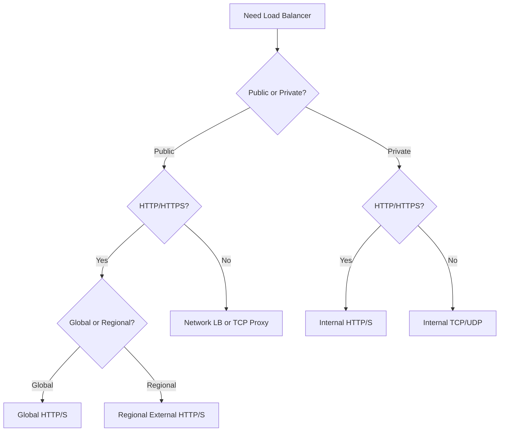
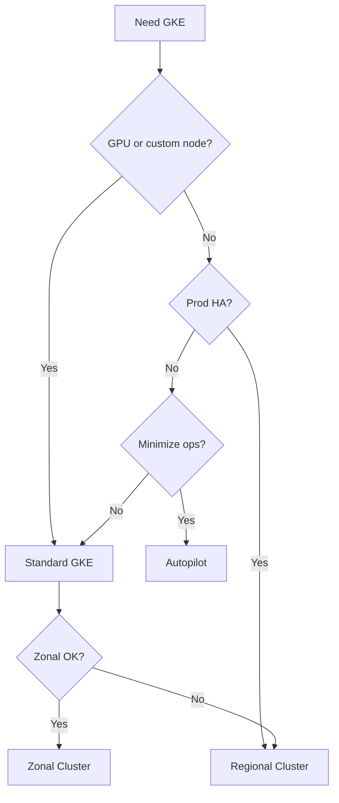
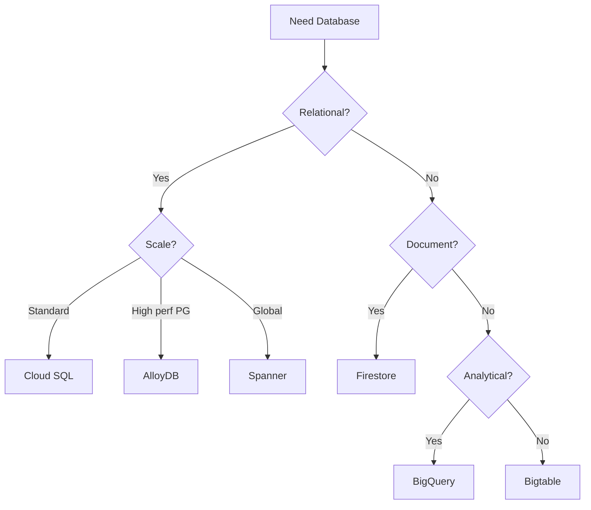
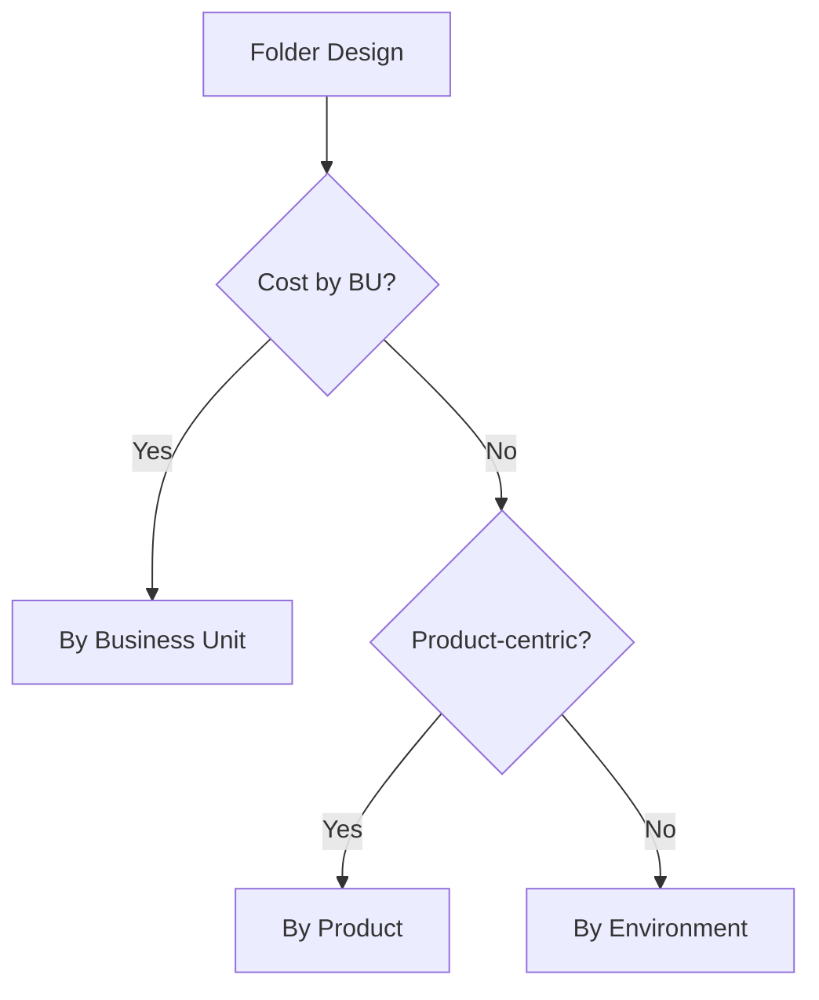
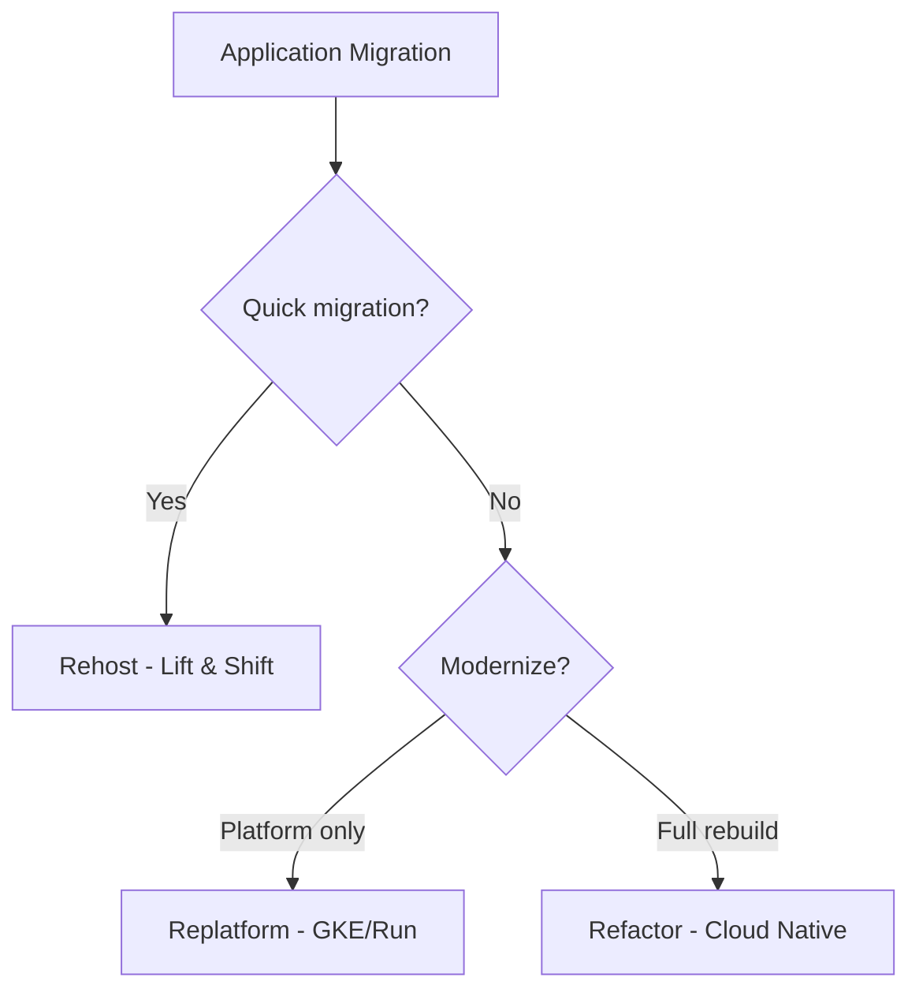

# Decision Trees

## Load Balancer Selection

```mermaid
flowchart TD
    Start[Need Load Balancer]
    Start --> Q1{Public or Private?}
    Q1 -->|Public| Q2{HTTP/HTTPS?}
    Q1 -->|Private| Q3{HTTP/HTTPS?}
    
    Q2 -->|Yes| Q4{Global or Regional?}
    Q2 -->|No| NetLB[Network LB or TCP Proxy]
    
    Q4 -->|Global| GH[Global HTTP/S]
    Q4 -->|Regional| RE[Regional External HTTP/S]
    
    Q3 -->|Yes| IH[Internal HTTP/S]
    Q3 -->|No| IT[Internal TCP/UDP]
```

---

## GKE Cluster Type

```mermaid
flowchart TD
    Start[Need GKE]
    Start --> Q1{GPU or custom node?}
    Q1 -->|Yes| Std[Standard GKE]
    Q1 -->|No| Q2{Prod HA?}
    
    Q2 -->|Yes| Reg[Regional Cluster]
    Q2 -->|No| Q3{Minimize ops?}
    
    Q3 -->|Yes| Auto[Autopilot]
    Q3 -->|No| Std
    
    Std --> Q4{Zonal OK?}
    Q4 -->|Yes| Zonal[Zonal Cluster]
    Q4 -->|No| Reg
```

---

## Database Selection

```mermaid
flowchart TD
    Start[Need Database]
    Start --> Q1{Relational?}
    Q1 -->|Yes| Q2{Scale?}
    Q1 -->|No| Q3{Document?}
    
    Q2 -->|Standard| CloudSQL[Cloud SQL]
    Q2 -->|High perf PG| AlloyDB[AlloyDB]
    Q2 -->|Global| Spanner[Spanner]
    
    Q3 -->|Yes| Firestore[Firestore]
    Q3 -->|No| Q4{Analytical?}
    
    Q4 -->|Yes| BQ[BigQuery]
    Q4 -->|No| Bigtable[Bigtable]
```

---

## Folder Structure

```mermaid
flowchart TD
    Start[Folder Design]
    Start --> Q1{Cost by BU?}
    Q1 -->|Yes| BU[By Business Unit]
    Q1 -->|No| Q2{Product-centric?}
    
    Q2 -->|Yes| Prod[By Product]
    Q2 -->|No| Env[By Environment]
```

---

## Migration Strategy

```mermaid
flowchart TD
    Start[Application Migration]
    Start --> Q1{Quick migration?}
    Q1 -->|Yes| Rehost[Rehost - Lift & Shift]
    Q1 -->|No| Q2{Modernize?}
    
    Q2 -->|Platform only| Replatform[Replatform - GKE/Run]
    Q2 -->|Full rebuild| Refactor[Refactor - Cloud Native]
```
